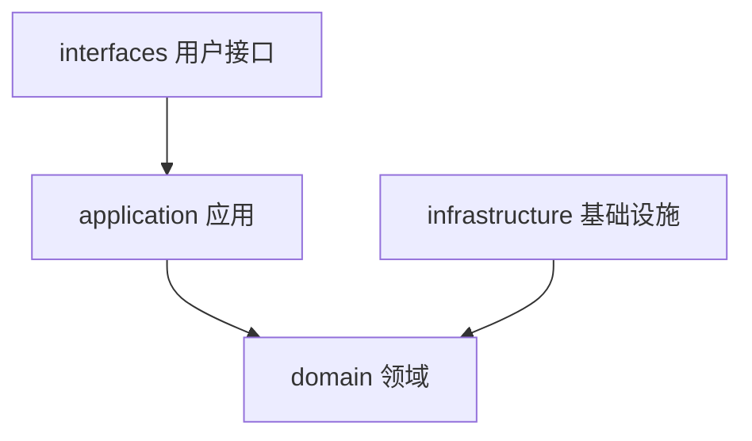
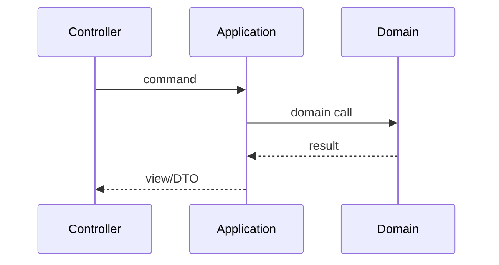

本文用于一次性冒烟：**标准 Markdown**、**GFM 扩展**、**代码块（含高亮行）**、**Mermaid fence**、**数学公式**，以及本站常用的 **Solitude shortcode**。改主题或自定义 CSS 后，打开本页扫一眼即可。


这是站点本地测试文，路径：`content/posts/其它/01-Markdown特性完整测试.md`。部署时由 `sync_notes.py` 保留，不会被 Notes 同步冲掉。


## 1. 标题层级

下面从 `##` 到 `######`（页面标题已占用 `h1`）。

### 1.1 三级标题 H3

#### 1.1.1 四级标题 H4

##### 五级标题 H5

###### 六级标题 H6

## 2. 段落与行内强调

普通段落。同一段内可以混排 **粗体**、*斜体*、***粗斜体***、~~删除线~~，以及 `行内代码`。

还可以组合：`**` 里不该再套代码；正确写法是 **bold with `code`** 或 *italic with `code`*。

硬换行（行尾两个空格）会变成  
下一行（同一段落内的强制换行）。

软换行（单个换行）在 Markdown 里通常仍并成同一段。

## 3. 链接与图片

### 3.1 链接

- 行内链接：[撷时录首页](/)
- 带标题的链接：[Hugo](https://gohugo.io/ "The world’s fastest framework")
- 自动链接：<https://jiangbyte.github.io/>
- 参考式链接：[Solitude 主题][solitude-repo]

[solitude-repo]: https://github.com/everfu/hugo-solitude "everfu/hugo-solitude"

站内锚点：[跳到表格](#8-表格) · [跳到 Mermaid](#11-mermaid)

### 3.2 图片

标准 Markdown 图片（远程）：


主题静态资源：


行内小图：Solitude  logo。

带说明的块级图：



## 4. 列表

### 4.1 无序列表

- 苹果
- 香蕉
  - 芭蕉（嵌套）
  - 皇帝蕉
- 樱桃

### 4.2 有序列表

1. 先判断是不是 bundle
2. 不是 bundle，而且图片路径是相对路径——就用 `.Page.File.Dir` 拼绝对路径
3. 试着找一下图片资源，找不到就直接用绝对路径当 src

长文换行悬挂缩进测试：Leaf page 没有图片优化。Page bundle 的图片会被主题做 responsive resize（生成多尺寸 + srcset），leaf page 的图不会。如果对图片体积有要求，还是推荐 bundle。

### 4.3 任务列表（GFM）

- [x] 写完厨房水槽文
- [x] 同步 / 构建不报错
- [ ] 人工肉眼过一遍暗色模式
- [ ] 确认移动端 TOC 可读

### 4.4 混排

1. 有序第一项
   - 无序子项 A
   - 无序子项 B
2. 有序第二项
   1. 有序子项 2.1
   2. 有序子项 2.2

## 5. 引用

> 一级引用：分层是为了改需求时知道改哪一层。
>
> > 二级引用：依赖只能向内，不要让基础设施倒灌领域。
>
> 回到一级。引用里也可以有 **粗体** 和 `code`。

## 6. 分隔线

上一段。

---

下一段（中间是 `---`）。

***

再一段（中间是 `***`）。

## 7. 代码

### 7.1 行内

安装：`hugo version`，配置键：`params.solitude.theme_color`。

### 7.2 围栏代码（无高亮语言）

```
plain fence
line two
```

### 7.3 带语言

```go
package main

import "fmt"

func main() {
	fmt.Println("hello solitude")
}
```

```yaml
params:
  solitude:
    mermaid: true
    katex:
      enable: true
```

```bash
hugo server --bind 127.0.0.1 --port 1313
```

### 7.4 高亮行（Chroma `hl_lines`）

```go {hl_lines=[3,"5-6"]}
package demo

func Add(a, b int) int {
	return a + b
}

func main() {}
```

```html {linenos=false}

<!-- 期待：路径按 File.Dir 纠正 -->
```

## 8. 表格

| 对齐 | 左对齐 | 居中 | 右对齐 |
| :--- | :--- | :---: | ---: |
| 文本 | foo | bar | 12 |
| 代码 | `a` | `b` | 34 |
| 强调 | **粗** | *斜* | ~~删~~ |

宽表横向滚动检查：

| 维度 | Page Bundle | Leaf Page + render hook | 备注 |
| --- | --- | --- | --- |
| 图片优化 | responsive + srcset | 原图直出 | bundle 更适合大图 |
| 改造成本 | 每篇建目录 | 配置一次 | leaf 存量友好 |
| 路径稳定性 | 相对路径自然 | 绝对路径兜底 | 深层 permalink 必测 |

## 9. 脚注

这里引用一个脚注[^note-1]，再引用同一个[^note-1]，以及另一个[^note-2]。

[^note-1]: 脚注正文支持 **Markdown** 与 `code`。
[^note-2]: 第二个脚注：用于检查列表编号与返回链接。

## 10. HTML（`unsafe: true`）

<details>
<summary>原生 details / summary</summary>

里面可以继续写 Markdown 风格段落，但作为 HTML 块时以渲染器行为为准。

</details>

键盘：<kbd>Ctrl</kbd> + <kbd>K</kbd> · 高亮：<mark>mark 文本</mark> · 上标 H<sub>2</sub>O / E=mc<sup>2</sup>

缩写：<abbr title="Domain-Driven Design">DDD</abbr>

## 11. Mermaid

### 11.1 Fence（` ```mermaid `）





### 11.2 Shortcode


flowchart LR
  Markdown --> Hugo
  Hugo --> HTML
  HTML --> Browser


## 12. 数学公式（KaTeX）

行内：勾股定理 \(a^2 + b^2 = c^2\)，以及质能 \(E = mc^2\)。

块级：

\[
\int_{-\infty}^{\infty} e^{-x^2}\,dx = \sqrt{\pi}
\]

$$
\begin{aligned}
\nabla \cdot \mathbf{E} &= \frac{\rho}{\varepsilon_0} \\
\nabla \cdot \mathbf{B} &= 0
\end{aligned}
$$

## 13. Solitude Shortcode：文本与状态

蓝色段落提示：用于较强的段落级强调。

正文里的 红色重点 与普通文字并列。

已完成
信息
注意
扩展
危险

info：解释前置条件或补充背景。
success / modern：构建检查通过类提示。
warning / simple：改配置后请重新构建。
danger：需要立刻注意的问题。
subnote：紧跟主提示的次级提醒。

已完成事项
尚未完成
已选中
未选中

快捷键 ⌘ K · 剧透 答案在这里气泡

## 14. 折叠 / 隐藏 / 标签页


折叠内支持 **Markdown** 与 `code`。



默认展开，方便检查焦点与间距。


行内隐藏：答案是 hideInline。

块级隐藏内容可以包含 **Markdown**。

hideToggle：带标题的切换区域。


{}
```go
fmt.Println("tab: go")
```
{}
{}
```yaml
theme: solitude
```
{}
{}
标签页用于并排对比配置或代码。
{}


## 15. 按钮、链接卡、内容卡








简洁层级，不依赖本地 demo 封面。

使用主题默认图作封面。

## 16. 时间线



定分层与用例边界。


竖切用户注册 / 登录。


打开本页做 Markdown 冒烟。



## 17. 图表与动态文字


{"type":"line","data":{"labels":["一","二","三"],"datasets":[{"label":"构建次数","data":[2,5,3],"borderColor":"#4f4a45","backgroundColor":"rgba(79,74,69,0.15)"}]},"options":{"plugins":{"legend":{"display":true}},"scales":{"y":{"beginAtZero":true}}}}


TypeIt：用于检查动态文字与主题色是否协调。

## 18. 仓库卡





## 19. 乐谱（ABC）


X:1
T:Kitchen Sink
M:4/4
K:C
C D E F | G A B c |


## 20. 回归检查清单

打开本页时建议确认：

1. **目录**：非当前项无模糊，当前项高亮清晰
2. **列表**：有序圆点与首行文字垂直对齐；多行悬挂缩进
3. **代码块**：语言标、复制按钮、`hl_lines` 高亮、展开按钮
4. **Mermaid**：流程图 / 时序图为 SVG，而不是 `mermaid` 代码框
5. **公式**：行内与块级 KaTeX 已排版
6. **Shortcode**：note / tabs / fold / timeline / chart / typeit 无报错样式
7. **暗色模式**：切换后文字对比度与代码块仍可读
8. **移动端**：TOC 浮层、宽表、代码块横向滚动

---

测试文结束。若某段未渲染，优先查对应 render hook、CDN 脚本或 shortcode 是否成对闭合。
