先说结论：分层是为了**改需求时知道改哪一层**。

实体、仓储接口、仓储实现、应用服务、Controller 都有了之后，工程里马上会碰到一串实际问题：

- Controller 能不能直接调 Mapper？
- 领域模型要不要直接塞进 HTTP 响应？
- 基础设施能不能反过来依赖 Web？
- 错误码放哪，才能让入口和用例共用，又不把契约层拖进领域模型？

本文用的是一套六层工程拆法：`types` / `api` / `trigger` / `domain`（内含 `application` 包）/ `infrastructure` / `app`。完整可运行代码在 [hei-ddd-lite](https://github.com/jiangbyte/hei-ddd-lite)。下面就按这套工程，用**用户管理**（注册、登录、登出、公开资料、后台启停）把每一层怎么协作走一遍。

---

## 本节重点

1. 说清六层各自放什么、不放什么，以及依赖为什么只能单向走  
2. 对照用户注册 / 登录 / 登出 / 后台管理，看一次请求怎么穿过各层  
3. 用 Maven 模块依赖把「内层不依赖外层」钉死，而不是靠口头约定  
4. 知道 Command / Query / View、Assembler、端口与实现分别解决什么问题  
5. 本地跑通注册 / 登录 / 鉴权，并用负面用例验证分层纪律

---

## 一、六层是怎么来的：在四层上多拆两步

先从四层说起。下面这张图对应「用户接口 / 应用 / 领域 / 基础设施」的依赖方向：

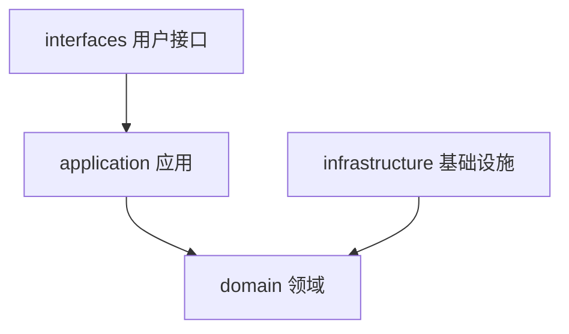

本仓库在此基础上再拆模块，收紧依赖，做成六层：

| 工程做法 | 对应意图 |
|----------|----------|
| 独立 **api（契约）** 模块 | 只放 `I*Service` + Request/Response + `R`，无 Spring、无领域类型 |
| 独立 **trigger（入口）** 模块 | Controller / Assembler / JWT / 全局异常，做入口适配 |
| 用例放在 domain 模块的 `application` 包 | 仍叫「应用服务」，负责编排与事务，不必单独占一个 Maven 模块 |
| 跨层异常进 **types** | api / domain / trigger 都能用，且 types 不带业务模型 |

为啥这么拆，原因很具体：

1. **契约与入口分开**：前端、OpenAPI、甚至别的服务可以只依赖契约 JAR，不必带上 Spring Web、JWT。  
2. **用例紧贴领域模型**：编排几乎总要碰聚合；单独再拆一个 application 模块，收益常常不大，编译图却更碎。  
3. **错误码跨层共享**：登录失败、用户名占用这类码，入口与用例都要用；放进 types，契约层就不必依赖领域模型。

和四层相比，名字可以换，但职责要对上。六层是同一族原则（依赖向内、端口与适配器、仓储接口在领域侧）在 Maven 多模块上的**一种**打包方式：物理上六个模块，逻辑上仍有「用例编排」。不是唯一标准。

---

## 二、一张图看清模块树与依赖方向

本仓库目录长这样：

```text
hei-ddd-lite/
├── hei-ddd-lite-types/
├── hei-ddd-lite-api/
├── hei-ddd-lite-trigger/
├── hei-ddd-lite-domain/          # 包：domain.* + application.*
├── hei-ddd-lite-infrastructure/
├── hei-ddd-lite-app/
├── web/
│   ├── apps/portal/              # @hei/portal
│   ├── apps/admin/               # @hei/admin
│   └── packages/shared/          # @hei/shared
└── docs/                         # SQL、架构图
```

依赖方向（箭头表示 Maven / 编译依赖）：

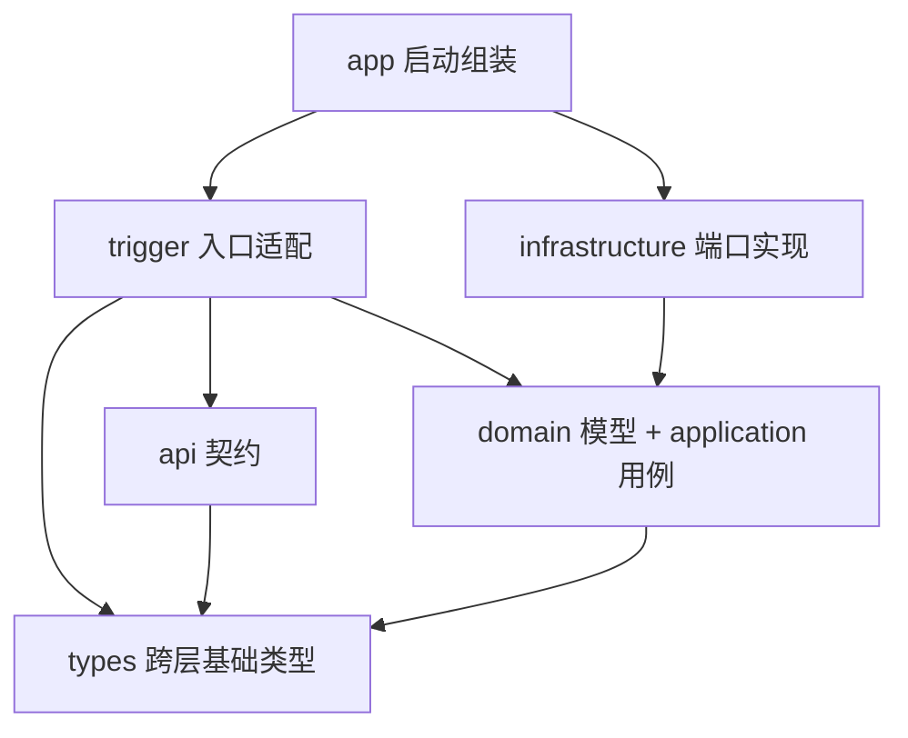

六层在一次请求里的协作关系可以再看成：

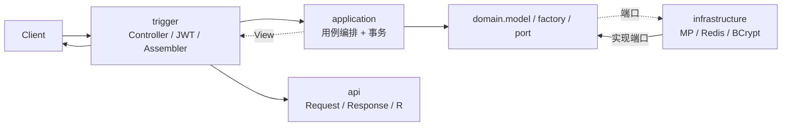

可以这样记：

- **app**：组装启动，依赖 trigger + infrastructure，配置组件扫描  
- **trigger**：入口适配，调应用服务，实现 api 契约并返回 Response  
- **api**：依赖 types + jackson-annotations  
- **infrastructure**：只依赖 domain（实现仓储、密码哈希、Token 黑名单等端口）  
- **domain**：依赖 types（如 `BizException`），不依赖 Spring Web / MyBatis  

父 POM 用统一 artifact 前缀管理内部模块，模块名与根包名对齐，读起来更顺。

**不做会怎样？** 一旦 infrastructure 开始 import Controller，或 api 开始 import `User`，依赖方向就垮了——编译期拦不住的话，后面全靠 Code Review 人肉盯，业务一大必漏。

---

## 三、每一层放什么

按「外层到内层」说职责；需要对照时再点名用户管理里的类型。

### 1）types：跨层共享的基础类型

模块：`hei-ddd-lite-types`。

**放**：业务可预期异常 `BizException`、通用错误码 `ResponseCode`（`SUCCESS`、`UNAUTHORIZED`、`FORBIDDEN_CLIENT`、`USERNAME_TAKEN` 等）。

**不放**：`User`、仓储、HTTP DTO、Spring 注解。

为什么单独抽？登录失败、用户名占用这类错误，trigger 的全局异常处理和 application 服务都要抛/捕。如果 `BizException` 住在 domain，api 模块为了在契约里提到错误码，也容易被迫依赖 domain。types 是「零业务模型」的共享底座。

`ResponseCode` 用字符串常量而不是枚举，与 JSON 里的 `R.code` 对齐。本仓库约定成功码为 `"0"`。和 HTTP 状态码分工：`GlobalExceptionHandler` 对 `BizException` / `DomainException` 返回 HTTP 200 + body.code；`MethodArgumentNotValidException` / `BindException` 返回 HTTP 400；未捕获异常返回 HTTP 500 + `SYSTEM_ERROR`。前端按 `code !== '0'` 处理业务失败即可。

### 2）api：对外契约

模块：`hei-ddd-lite-api`，仅依赖 types。

代表类型：

- [`IAuthService`](https://github.com/jiangbyte/hei-ddd-lite/blob/main/hei-ddd-lite-api/src/main/java/io/github/jiangbyte/hei/api/IAuthService.java)：注册 / 登录 / 登出 / me  
- `IUserService`：公开用户资料  
- `IAdminUserService`：后台分页、创建、启停  
- `api.dto.*`：`AuthRequest`、`CreateUserRequest`、`ChangeEnabledRequest`  
- `api.response.*`：`R`、`AuthTokenResponse`、`UserProfileResponse`、`PageResponse` 等  

契约长这样（节选）：

```java
public interface IAuthService {
    R<AuthRegisterResponse> register(AuthRequest request);
    R<AuthTokenResponse> login(AuthRequest request);
    R<Void> logout();
    R<UserProfileResponse> me();
}
```

注意返回类型全是 **api.response**，没有 `User`、没有 `UserProfileView`。契约层描述的是「对外形状」，不是领域对象快照。

**不放**：`@RestController`、JWT、Assembler、`@Transactional`、MyBatis。

Controller 为什么还要 `implements IAuthService`？

1. **编译期对齐**：接口改了方法签名，Controller 必须改，避免文档与实现漂移。  
2. **契约优先**：先定 api，再写 trigger；前后端或双端（portal/admin）可以并行。  
3. **可替换入口**：将来加 RPC 或消息消费，也可以有另一套适配器实现同一契约。  

api 模块依赖里只有 types 和 jackson-annotations，体积很小，甚至可以被别的 JVM 客户端当「契约 JAR」引用——这是拆出 api 模块的额外好处。

### 3）trigger：入口适配，实现契约

模块：`hei-ddd-lite-trigger`，依赖 domain + api + types，以及 WebMVC / JJWT / Knife4j。

**放**：

- `trigger.web.*Controller`：`AuthController`、`UserController`、`AdminUserController`，**implements** 对应 `I*Service`  
- `trigger.assembler.UserAssembler`：`*View` → `*Response`  
- `trigger.security.*`：JWT 签发解析、`@RequireLogin` / `@RequireAdmin`、拦截器、CORS  
- `trigger.exception.GlobalExceptionHandler`：把 `BizException` / `DomainException` 映射成 `R`  

**不放**：SQL、密码哈希算法细节、聚合不变式（那些属于 domain / infra）。

Controller 的职责可以压成三步：校验/适配入参 → 调应用服务 → Assembler 或 Builder 出契约响应。签发 JWT 放在 trigger 也合理：Token 是传输层凭证，不是领域概念；领域只返回「这个用户登录成功了」。

### 4）domain：模型 + 用例编排（application 包）

模块：`hei-ddd-lite-domain`，依赖 types + 少量 Spring（`spring-context` / `spring-tx`，给 `@Service` / `@Transactional` 用）。

包结构（均在 `hei-ddd-lite-domain` 模块内）：

```text
domain.core          # AggregateRoot / Repository / DomainEvent / Factory / Specification ...
domain.model         # User / Username / UserType
domain.factory       # UserFactory
domain.specification # UsernameFormatSpecification
domain.service       # UserClientAccessPolicy
domain.port          # PasswordHasher / TokenDenylist
domain.repository    # UserRepository
domain.event         # UserCreatedEvent / UserEnabledChangedEvent
application.core     # ApplicationService 标记
application.command  # RegisterUserCommand / LoginCommand / ...
application.query    # GetMyProfileQuery / ListUsersQuery / ...
application.dto      # AuthResultView / UserProfileView / PageResult / ...
application          # AuthApplicationService / AdminUserApplicationService / UserDomainConfiguration
```

**放**：聚合行为、工厂、规约、领域服务、仓储端口、用例编排与事务边界、应用读模型（`*View`）。

**不放**：HTTP、JWT、MyBatis、Redis API、对外 `*Response`。

`domain.core` 里通常还有一组基础抽象，用户类竖切都会间接用到：

- `AggregateRoot`：维护领域事件列表，`registerEvent` / `pullDomainEvents`  
- `Repository<T, ID>`：按聚合根存取的端口骨架  
- `DomainEvent` / `DomainEventPublisher`：事件与发布端口  
- `Factory` / `Specification` / `DomainService`：标记型接口，统一命名与扩展点  
- `DomainException`：领域不变式被破坏时抛出，尚未映射成对外业务码  

对照代码时，建议先看这些抽象，再看聚合如何继承 `AggregateRoot`、仓储如何扩展端口。接口是给后续竖切复用的槽位。

这里有个容易误解的点：**application 包不是「另一层 Maven 模块」**，而是领域模块里的用例编排区。`AuthApplicationService` 用 `@Transactional` 框住「工厂创建 → 查重 → save → markCreated → publish」，这是应用服务该做的编排，不是 Controller 该做的。应用层要薄，事务以用例为单位；业务规则留在领域模型 / 领域服务里。

### 5）infrastructure：端口实现与可选自动配置

模块：`hei-ddd-lite-infrastructure`，**只依赖 domain**。仓储接口定义在领域侧、实现落在基础设施侧——这是依赖倒置落到工程上的标准姿势；数据库等是外围适配器。

用户管理相关实现：

- `persistence.UserRepositoryImpl` + `UserMapper` + `UserPo`：MyBatis-Plus 落表 `sys_user`  
- `auth.BcryptPasswordHasher`：实现 `PasswordHasher`  
- `auth.RedisTokenDenylist`：实现 `TokenDenylist`  
- `event.SpringDomainEventPublisher` / `UserDomainEventListener`  
- `tx.DataSourceTransactionConfiguration`：真实数据源事务  
- `config.*`：Druid / MyBatis / Redis 等 AutoConfiguration（走 `META-INF/spring/...AutoConfiguration.imports`，避免可选依赖被组件扫描硬拉起来）  

对象存储可以是可选能力；用户管理竖切通常只需关系库 + 缓存（如 MySQL + Redis）。

### 6）app：启动组装与扫描边界

模块：`hei-ddd-lite-app`。

启动类只扫业务组件包，**不**把整个 `infrastructure.config` 扫进去：

```java
@SpringBootApplication(scanBasePackages = {
        "io.github.jiangbyte.hei.app",
        "io.github.jiangbyte.hei.trigger",
        "io.github.jiangbyte.hei.application",
        "io.github.jiangbyte.hei.infrastructure.persistence",
        "io.github.jiangbyte.hei.infrastructure.auth",
        "io.github.jiangbyte.hei.infrastructure.event",
        "io.github.jiangbyte.hei.infrastructure.tx"
})
public class HeiDddLiteApplication { ... }
```

这是细节，但很重要：AutoConfiguration 用 imports 条件装配；仓储、哈希、事件发布用组件扫描。混在一起会导致「没引 Redis 也想注册黑名单 Bean」之类的启动失败。

启动模块的 `application.yml` 负责数据源、Redis、JWT、CORS、OpenAPI 等运行配置。建表脚本示例见 [schema-user.sql](https://github.com/jiangbyte/hei-ddd-lite/blob/main/docs/sql/schema-user.sql)。

---

## 四、用户管理竖切：把一次请求走通

本仓库用**用户管理**把六层串起来：

| 类型 | 含义 |
|------|------|
| `PORTAL` | 前台用户，公开注册；只能登录 Portal |
| `ADMIN` | 后台管理员，种子或后台创建；只能登录 Admin |

表结构（与 `docs/sql/schema-user.sql` 一致，节选）：

```sql
CREATE TABLE IF NOT EXISTS sys_user (
    id            BIGINT       NOT NULL AUTO_INCREMENT COMMENT '主键',
    username      VARCHAR(64)  NOT NULL COMMENT '用户名',
    password_hash VARCHAR(100) NOT NULL COMMENT 'BCrypt 密码哈希',
    user_type     VARCHAR(16)  NOT NULL DEFAULT 'PORTAL' COMMENT 'PORTAL|ADMIN',
    enabled       TINYINT(1)   NOT NULL DEFAULT 1 COMMENT '是否启用',
    create_time   DATETIME     NOT NULL DEFAULT CURRENT_TIMESTAMP COMMENT '创建时间',
    update_time   DATETIME     NOT NULL DEFAULT CURRENT_TIMESTAMP ON UPDATE CURRENT_TIMESTAMP COMMENT '更新时间',
    PRIMARY KEY (id),
    UNIQUE KEY uk_sys_user_username (username),
    KEY idx_sys_user_type (user_type)
) ENGINE=InnoDB DEFAULT CHARSET=utf8mb4 COMMENT='系统用户';
```

种子管理员：`admin` / `admin123`（BCrypt 哈希写在 SQL 里）。当前竖切不含 RBAC / 角色表，鉴权主链路是 JWT + 端类型校验。

### 1）领域模型：`User` 聚合根

[`User`](https://github.com/jiangbyte/hei-ddd-lite/blob/main/hei-ddd-lite-domain/src/main/java/io/github/jiangbyte/hei/domain/model/User.java) 继承 `AggregateRoot<Long>`，字段用值语义表达（用户名、哈希、类型、启用态、时间）。几个行为值得对照分层：

1. **`User.create`**：创建时 id 为空，由持久化分配；不在构造时直接发领域事件。  
2. **`markCreated`**：必须已有 id 才登记 `UserCreatedEvent`——因为事件里要带聚合标识，常见做法是「先 save 再登记」，避免无 id 事件。  
3. **`changeEnabled`**：状态未变则返回自身，避免无意义写库；变更时登记 `UserEnabledChangedEvent`，并返回**新状态对象**（不可变风格）。  
4. **`authenticate`**：聚合自己校验启用态 + 调用端口 `PasswordHasher`，不直接依赖 BCrypt 类。  

密码哈希通过端口注入，而不是 `new BCryptPasswordEncoder()` 写死在领域里——这是依赖倒置的最小例子：内层声明端口，外层实现。

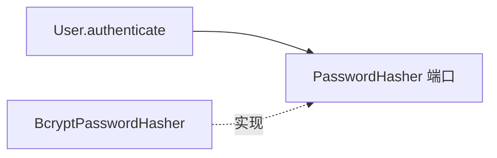

用户名用值对象 `Username` + 规约 `UsernameFormatSpecification`；工厂 [`UserFactory`](https://github.com/jiangbyte/hei-ddd-lite/blob/main/hei-ddd-lite-domain/src/main/java/io/github/jiangbyte/hei/domain/factory/UserFactory.java) 把「空白 / 长度 / 字符集 / 密码至少 6 位 / 哈希」收拢在一处：

```java
public User create(String username, String rawPassword, UserType userType) {
    Username name = Username.of(username);
    if (!usernameSpec.isSatisfiedBy(name)) {
        throw new DomainException("用户名不满足格式规约");
    }
    // ... 密码长度校验 ...
    return User.create(name, passwordHasher.hash(rawPassword), userType);
}
```

工厂实现 `Factory` 标记，本身无 Spring 注解；应用服务里 `new UserFactory(passwordHasher)` 即可。领域服务 `UserClientAccessPolicy` 由 `application.UserDomainConfiguration` 用 `@Bean` 注册。

### 2）值对象、规约与入参校验怎么分工

本仓库的 api DTO（如 `AuthRequest`）**没有**加 Jakarta Bean Validation 注解；协议侧校验主要在 Controller（例如 `clientType` 解析）和应用服务入参检查里完成，领域不变式放在值对象 / 规约 / 工厂里。

[`Username.of`](https://github.com/jiangbyte/hei-ddd-lite/blob/main/hei-ddd-lite-domain/src/main/java/io/github/jiangbyte/hei/domain/model/Username.java) 约束：非空、trim 后长度 3～64、仅字母数字下划线。

这保证：无论入口是前台注册、后台创建，还是以后加批量导入、命令行种子脚本，只要走工厂/值对象，规则一致。

`UsernameFormatSpecification` 再包一层，是为了示范 Specification 模式：工厂里可以组合多个规约。实践中规约与值对象校验可以有重叠：值对象保证最小合法，规约表达可复用判定；本仓库两者并存。

密码长度下限在 `UserFactory`（至少 6 位），哈希在端口实现。明文密码不进入 `User` 字段，聚合只持有 `passwordHash`。

### 3）注册链路：trigger → application → factory → repository → event

HTTP：`POST /auth/register`，body 为 `AuthRequest`（username / password）。

[`AuthController.register`](https://github.com/jiangbyte/hei-ddd-lite/blob/main/hei-ddd-lite-trigger/src/main/java/io/github/jiangbyte/hei/trigger/web/AuthController.java)：

```java
@Override
@PostMapping("/register")
public R<AuthRegisterResponse> register(@RequestBody AuthRequest request) {
    AuthResultView result = authApplicationService.register(
            new RegisterUserCommand(request.getUsername(), request.getPassword()));
    return R.ok(AuthRegisterResponse.builder()
            .userId(result.getUserId())
            .username(result.getUsername())
            .userType(result.getUserType().name())
            .build());
}
```

注意：注册**不发 Token**。契约上注册成功只回用户标识与类型；登录才签发 JWT。这避免「注册即登录」和前后端会话策略绑死。

[`AuthApplicationService.register`](https://github.com/jiangbyte/hei-ddd-lite/blob/main/hei-ddd-lite-domain/src/main/java/io/github/jiangbyte/hei/application/AuthApplicationService.java) 的步骤：

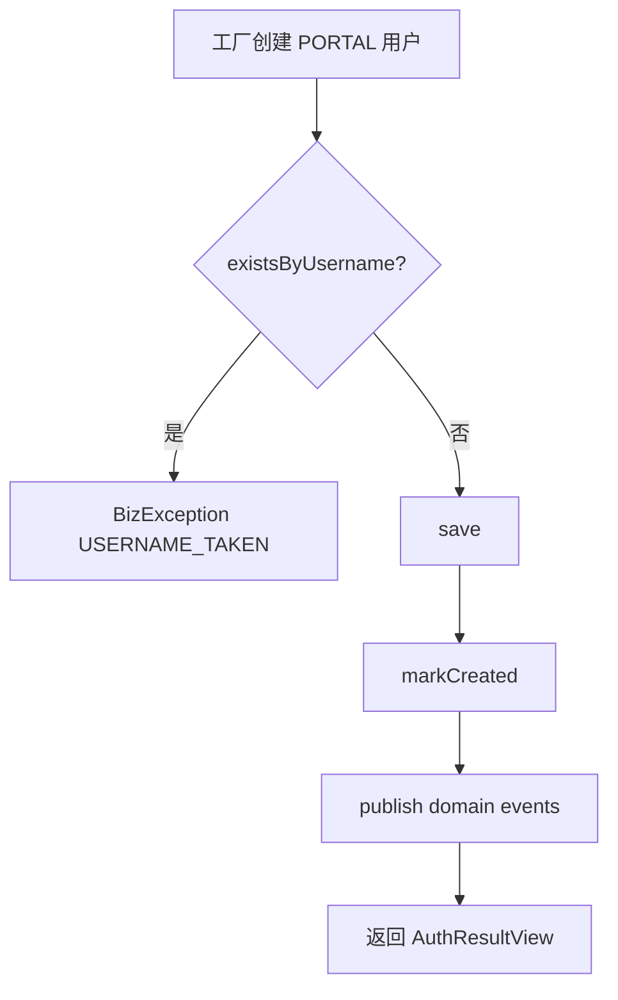

事务边界在应用服务方法上：`@Transactional`。事件默认同步 Spring 发布；infra 里 `UserDomainEventListener` 可做日志或后续副作用。要上 Outbox / MQ 时，改发布实现即可，聚合与应用服务调用方式不用变。

### 4）登录链路：端类型策略 + JWT

HTTP：`POST /auth/login`。body 可带 `clientType`：`PORTAL` 或 `ADMIN`；**缺省或空白时按 `PORTAL` 处理**（见 `AuthController.parseClientType`）；非法值返回 `VALIDATION_ERROR`。

Controller 解析端类型后构造 `LoginCommand`，应用服务：

1. 校验用户名密码非空（应用层入参校验）  
2. 按用户名加载；口令失败与用户不存在统一 `INVALID_CREDENTIALS`（防枚举）  
3. `user.authenticate(raw, passwordHasher)`  
4. `userClientAccessPolicy.assertCanAccess(user, expected)`——PORTAL 账号不能登 Admin，反之亦然；领域异常映射为 `FORBIDDEN_CLIENT`  
5. 返回读模型；**由 Controller 调用** `jwtTokenProvider.createToken(userId, username, userType)` **签发 JWT**（`jti` 在签发器内部生成）  

策略类本身很短，但把「跨端访问规则」从 Controller if-else 里抽了出来：

```java
public void assertCanAccess(User user, UserType expectedClient) {
    if (user.getUserType() == expectedClient) {
        return;
    }
    if (expectedClient == UserType.ADMIN) {
        throw new DomainException("非后台账号，无法登录管理端");
    }
    throw new DomainException("非前台账号，无法登录用户端");
}
```

JWT 内容包含：`sub`（userId）、`username`、`userType`、`jti`（登出黑名单用）、过期时间。签发器在 `trigger.security.JwtTokenProvider`。前端 portal / admin 分端存 Token，互不串号——这与后端 `clientType` 校验是一套的。

### 5）登出：jti + Redis 黑名单

登出不是「前端删掉 Token 就完事」。JWT 无状态，服务端要让已签发令牌提前失效，一种常见做法是 **jti 黑名单**：

1. `@RequireLogin` 拦截器解析 Token，检查 `TokenDenylist.isDenied(jti)`  
2. `POST /auth/logout` 取当前 `LoginUser.jti`，按 Token 剩余 TTL 写入 Redis  
3. infra：`RedisTokenDenylist` 前缀 `auth:token:deny:`  

端口在 domain，实现在 infra：

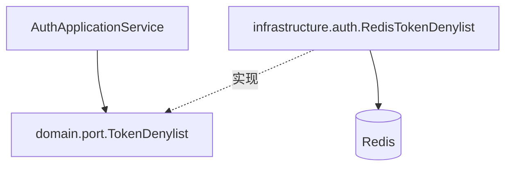

应用服务 `logout(jti, ttl)` 不关心 Redis API；换内存实现或集中式会话存储时，只改 infra。

### 6）拦截器：登录与管理员如何卡在 trigger

[`LoginAuthInterceptor`](https://github.com/jiangbyte/hei-ddd-lite/blob/main/hei-ddd-lite-trigger/src/main/java/io/github/jiangbyte/hei/trigger/security/LoginAuthInterceptor.java) 的逻辑可以念成清单：

1. 非 `HandlerMethod`（静态资源等）直接放行  
2. 读方法或类上的 `@RequireLogin` / `@RequireAdmin`；有 `@RequireAdmin` 则隐含需要登录  
3. 无注解 → 放行（公开接口如注册、登录、公开资料）  
4. 从 `Authorization` 头解析 Bearer Token；没有 → `UnauthorizedException`  
5. `parseToken` 得到 `LoginUser`（含 userId、username、userType、jti、过期时间）  
6. `tokenDenylist.isDenied(jti)` → 已登出的令牌拒绝  
7. 需要 Admin 但 `!loginUser.isAdmin()` → `BizException(FORBIDDEN)`  
8. `AuthContext.set(loginUser)`，请求结束后 `clear()`，避免线程复用脏数据  

这里有一个分层点：拦截器依赖的是 **domain 端口** `TokenDenylist`，不是 RedisTemplate。trigger 可以知道「要查黑名单」，但不知道 Redis key 长什么样。Bean 由 infra 提供，app 扫描 `infrastructure.auth` 把实现装进来。

`AdminUserController` 类级别打 `@RequireAdmin`，列表、创建、启停全部自动保护。公开的 `UserController.getPublic` 不加登录注解，只靠应用服务过滤「启用中的 PORTAL」。

### 7）公开资料与后台管理

- `GET /users/public?userId=`：`UserController` implements `IUserService`；应用服务只返回**启用中的 PORTAL**；Assembler 转 `PublicUserResponse`。  
- `GET/POST /admin/users`、`POST /admin/users/change-enabled`：类上 `@RequireAdmin`；列表走 `ListUsersQuery` + 分页；创建走 `CreateUserCommand`（可指定 PORTAL/ADMIN）；启停走 `User.changeEnabled` 再 save 并发布事件。  

[`UserAssembler`](https://github.com/jiangbyte/hei-ddd-lite/blob/main/hei-ddd-lite-trigger/src/main/java/io/github/jiangbyte/hei/trigger/assembler/UserAssembler.java) 专门做 View → Response，避免 api 模块 import `application.dto`：

```java
public UserProfileResponse toProfileResponse(UserProfileView view) {
    return new UserProfileResponse(
            view.getUserId(),
            view.getUsername(),
            view.getUserType().name(),
            view.isEnabled(),
            view.getCreateTime(),
            view.getUpdateTime());
}
```

如果应用服务直接返回 `UserProfileResponse`，api 就要依赖 application，或者 application 依赖 api——两种都会把契约层和用例层焊死。Assembler 多写几行，边界更干净。

[`AdminUserApplicationService`](https://github.com/jiangbyte/hei-ddd-lite/blob/main/hei-ddd-lite-domain/src/main/java/io/github/jiangbyte/hei/application/AdminUserApplicationService.java) 三条用例：

**分页 `listUsers`**

- 规范化 `pageNo ≥ 1`，`pageSize` 夹在 1～100，防止前端传 999999 打爆数据库  
- `username` 空白转 null；`userType` 可选过滤  
- `count` + `findPage`，映射为 `UserProfileView` 列表，包进 `PageResult`  
- trigger 再用 Assembler 变成 `PageResponse<UserProfileResponse>`  

**创建 `createUser`**

- 与注册几乎同构：工厂 → 查重 → save → markCreated → publish  
- 差别是 `userType` 可由后台指定（PORTAL 或 ADMIN），注册则写死 PORTAL  
- 这避免「任何人注册出管理员」；管理员只能由已有 ADMIN 在受保护接口创建  

**启停 `changeEnabled`**

- 按 id 加载；不存在 → `USER_NOT_FOUND`  
- `user.changeEnabled(enabled)`；若返回同一引用，说明状态未变，直接返回读模型，不再写库  
- 有变更则 `save`，并 `publish(changed.pullDomainEvents())`。注意事件在变更后的聚合实例上  

后台 HTTP 路径与契约：

| 方法 | 路径 | 契约方法 |
|------|------|----------|
| GET | `/admin/users` | `IAdminUserService.list` |
| POST | `/admin/users` | `create` |
| POST | `/admin/users/change-enabled` | `changeEnabled` |

### 8）持久化：端口在 domain，实现在 infra

`UserRepository` 继承通用 `Repository<User, Long>`，并扩展 `findByUsername` / `existsByUsername` / `findPage` / `count`。

[`UserRepositoryImpl.save`](https://github.com/jiangbyte/hei-ddd-lite/blob/main/hei-ddd-lite-infrastructure/src/main/java/io/github/jiangbyte/hei/infrastructure/persistence/UserRepositoryImpl.java)：id 为空则 insert，否则 updateById；返回的是 `toDomain(po)`，带上数据库生成的 id 与时间字段。

应用服务注册流程依赖这一点：`save` 之后的 `User` 才有 id，`markCreated()` 才合法。如果有人改成「先 markCreated 再 save」，会在领域层直接抛「尚未持久化」。用代码强制顺序，比文档约定更硬。

`findByUsername` / `existsByUsername` 都对入参做 blank 防护。分页用 MyBatis-Plus `Page` + `LambdaQueryWrapper`，过滤条件在 `buildWrapper` 集中构造，application 层不出现 Wrapper 类型——否则用例编排就绑死 MP API 了。

`UserPo` 使用 `@TableName("sys_user")`；领域 `User` 无任何表注解。换 JPA 或手工 JDBC 时，聚合代码可以不动，只换 infra。

密码端口同理：实现类可用 `spring-security-crypto` 的 BCrypt，这里只需哈希能力，不必拉完整 Spring Security 过滤器链。

### 9）从注册到登出的时序

注册：

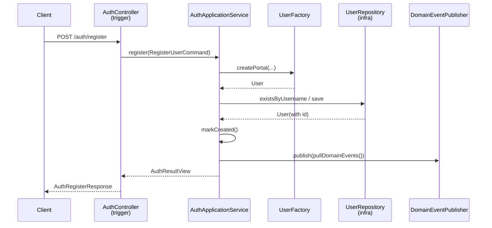

登录：

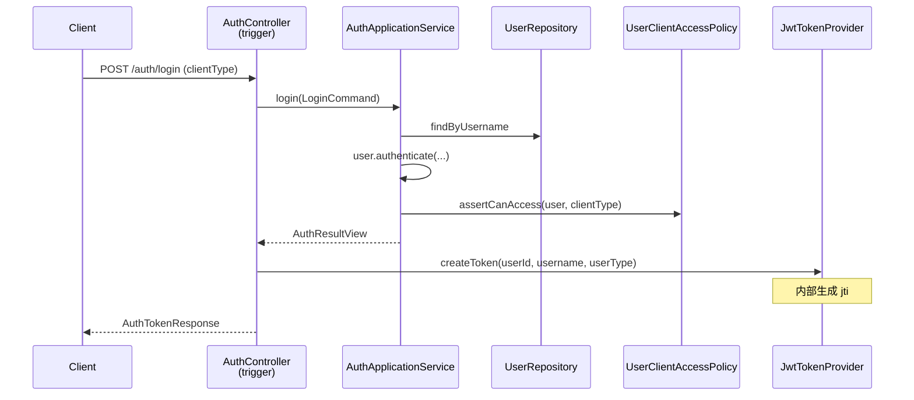

访问受保护接口：

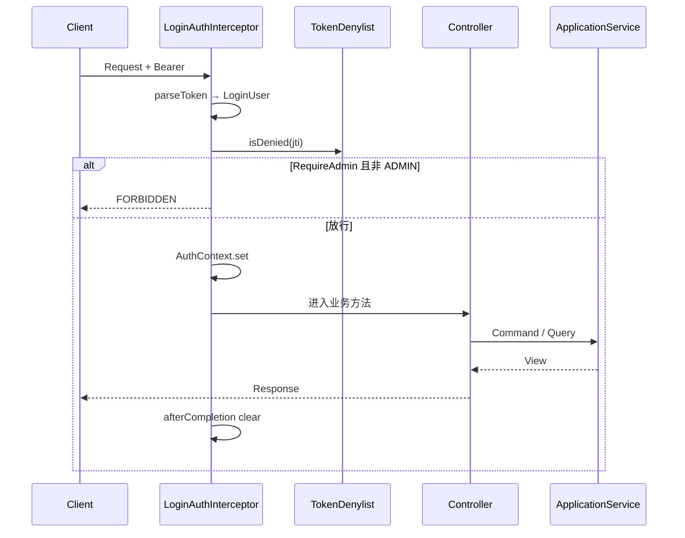

登出：

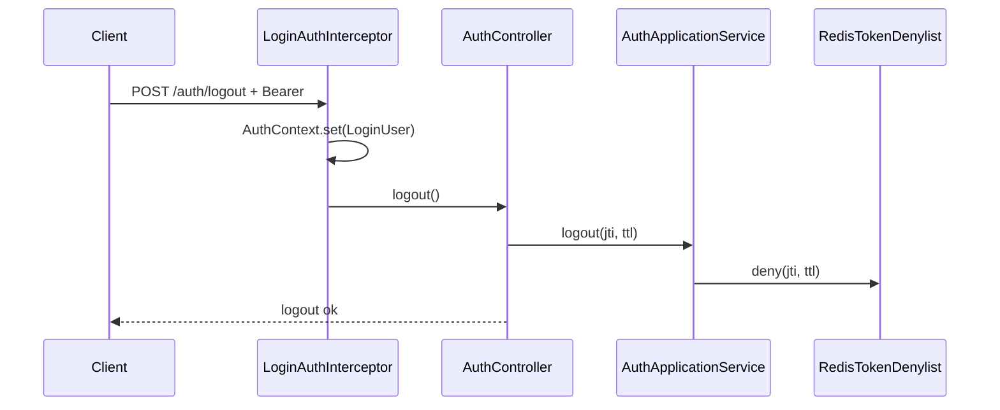

把这四张时序图对照代码看一遍，六层各自出现在哪一段就清楚了。

---

## 五、依赖方向怎么用 Maven 钉住

分层能不能稳住，关键看**依赖方向能不能被编译约束住**。

### 1）Maven 模块依赖

| 模块 | 允许依赖 |
|------|----------|
| types | （无业务依赖） |
| api | types、jackson-annotations |
| domain | types、Spring context/tx |
| trigger | domain、api、types、Web/JWT… |
| infrastructure | domain、Druid/MP/Redis/crypto… |
| app | trigger、infrastructure |

自检时可以扫 import：

- `hei-ddd-lite-api` 下不出现 `import ...application` / `...domain`  
- `hei-ddd-lite-infrastructure` 下不出现 `import ...trigger` / `...api`  

### 2）对象放在哪一层

| 对象 | 所在层 | 谁可以持有 |
|------|--------|------------|
| `User` | domain.model | application / domain / infra 实现 |
| `*View` / `PageResult` | application.dto | application、trigger Assembler |
| `*Response` / `R` | api.response | api 契约、trigger 返回 |
| `UserPo` | infra.persistence | 仅 infra |

一次写用例里的对象流转：

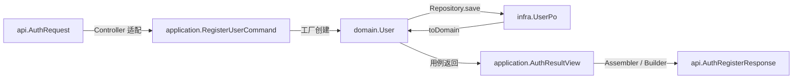

实践里让 Controller `implements I*Service`，返回类型就钉在契约上，Assembler 负责 View → Response。

### 3）异常怎么分层

- 领域不变式 → `DomainException`  
- 用例可预期失败（占用、未登录、端类型不对）→ `BizException(code, message)`  
- trigger `GlobalExceptionHandler` 统一成 `R.fail(code, message)`  
- 未捕获异常 → `SYSTEM_ERROR`，日志打详情，响应对外模糊  

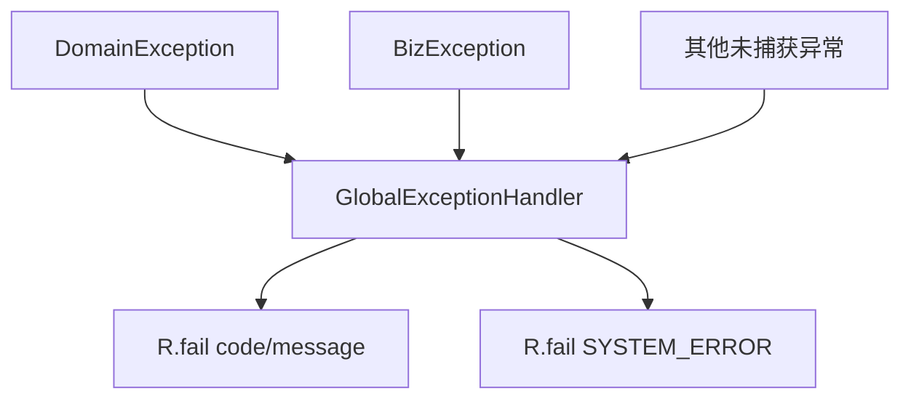

前端只认 `code` 即可。

### 4）扫描与自动配置

JWT 拦截器装配在 trigger 的 `JwtAuthConfiguration`；Token 黑名单 Bean 在 infra。app 同时扫 `infrastructure.auth` 与 trigger，启动后拦截器才能注入 `TokenDenylist`。扫描范围要和组装意图一致，少扫 `auth` 包时鉴权相关 Bean 装不齐。

### 5）几个容易放错的地方

| 写法 | 更稳妥的做法 |
|------|----------------|
| Controller 直接注入 `UserMapper` | 只注入 ApplicationService，由用例编排事务与仓储 |
| ApplicationService 返回 `User` | 返回 `*View`，trigger 再 Assembler 成 Response |
| api 模块引用 `UserType` 枚举类（domain） | 契约用 String，Assembler/Controller 负责解析 |
| infra 依赖 `R` 或 Controller | infra 只依赖 domain |
| 把 JWT 校验写进 ApplicationService | 鉴权留在 trigger，用例收 Command |
| 注册接口直接发 Token | 注册与登录分离，会话策略更灵活 |

领域枚举（如 `UserType`）留在 domain；HTTP JSON 用字符串，在 trigger 解析。若希望 OpenAPI 枚举更严，也可以在 api 模块自建平行枚举，与领域枚举分开维护。

---

## 六、Command / Query / View：用例入参为什么不直接用 Request

application 包里建议坚持三套对象：

- **Command**：写用例入参，如 `RegisterUserCommand`、`LoginCommand`、`CreateUserCommand`、`ChangeUserEnabledCommand`  
- **Query**：读用例入参，如 `GetMyProfileQuery`、`GetPublicUserQuery`、`ListUsersQuery`  
- **View**：用例输出读模型，如 `AuthResultView`、`UserProfileView`、`PublicUserView`、`PageResult`  

trigger 的 `AuthRequest` 不会直接传进应用服务深处，而是先 `new RegisterUserCommand(...)`。好处是：

1. Web 表单字段改名时，只改 Controller 适配，不必改应用服务方法签名  
2. 非 Web 入口（定时任务、消息）可以构造同一 Command，复用用例  
3. 读模型 View 可以裁剪字段：公开资料与后台资料字段策略可以不同，而不必暴露聚合  

这不是强制 CQRS 总线：没有 CommandBus，没有事件溯源。只是命名上把读写意图分开，降低「一个 God Service 方法吃所有 Map」的概率。你在 `AuthApplicationService` 与 `AdminUserApplicationService` 里能看到，每个公开方法基本对应一个 Command 或 Query，阅读成本线性，而不是网状。

---

## 七、事件发布：同步语义与演进方向

当前 `SpringDomainEventPublisher` 在事务内同步 `ApplicationEventPublisher.publishEvent`。含义是：

- 监听器异常可能导致事务回滚（取决于监听器配置），调试简单  
- 没有投递保证、没有重试、没有跨进程消费  

对多数 Demo / 中小系统足够；对生产订单、积分等场景通常要演进到 Outbox：同一事务写业务表 + out 箱，异步转发 MQ。重要的是：**聚合仍只 `registerEvent`，应用服务仍 `pull` + `publish`**，变的是 `DomainEventPublisher` 的实现。用户管理里的 `UserCreatedEvent` / `UserEnabledChangedEvent` 已预留监听点（`UserDomainEventListener`），你可以把「同步打日志」换成「投递消息」而不改 Controller。

这也是六层里 infrastructure 存在的核心理由之一——技术演进应落在实现替换，而不是改领域故事。

领域事件约定固定成五步；事务在应用服务，发布实现可替换：

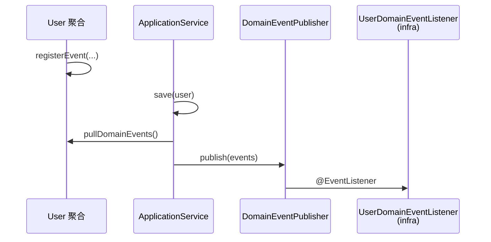

---

## 八、和前端怎么对齐

若前后台分离，前端也可按端拆包（示意见 [web/](https://github.com/jiangbyte/hei-ddd-lite/tree/main/web)）：

| 包路径 | npm 名 | 端口 | 登录 clientType |
|--------|--------|------|-----------------|
| `web/apps/portal` | `@hei/portal` | 5173 | `PORTAL`（可缺省） |
| `web/apps/admin` | `@hei/admin` | 5174 | `ADMIN` |
| `web/packages/shared` | `@hei/shared` | — | http / auth / 主题 |

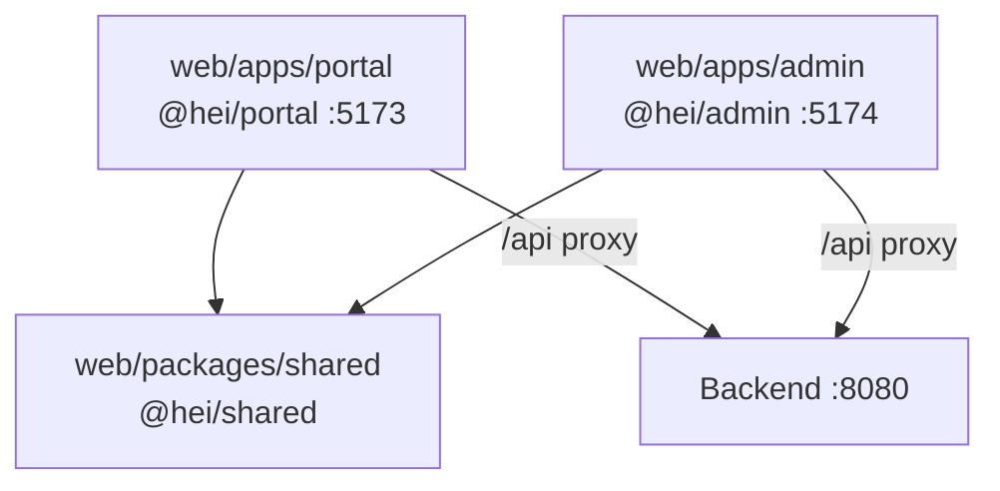

硬约定：portal 与 admin **互不引用**源码，复用只走 shared。Vite 把 `/api/**` 代理到 `8080`。后端 CORS 默认放开，本地联调成本低。

前端分端存 Token，和后端 `UserClientAccessPolicy` 是同一业务规则的两端实现：一端挡 UI，一端挡 API。

对应后端竖切，前端职责可以这样记：

- **Portal**：注册、PORTAL 登录、我的资料、公开用户页、登出；Token 存 portal 侧  
- **Admin**：ADMIN 登录、仪表盘占位、用户分页/筛选、新建用户、启用禁用、登出；Token 存 admin 侧  

共享包负责 axios 封装、把 `R.code` 转成可抛错的业务异常、Token 读写与主题色。登录协议以 api 契约为准，shared 的 `authApi` 是 TypeScript 侧的瘦客户端。

这样前后端都在讲同一张「账户体系」故事：类型分 PORTAL/ADMIN，端类型登录，JWT 鉴权，后台管人。

---

## 九、本地怎么跑

完整步骤见仓库 [README](https://github.com/jiangbyte/hei-ddd-lite/blob/main/README.md)，这里留最短路径。

**硬门槛**：JDK 21；MySQL 库 `hei`；Redis；执行 `docs/sql/schema-user.sql`。可选 `./start-infra.sh` 拉起本机 docker 里的 mysql / redis。

后端：

```bash
mvn install -DskipTests
mvn -pl hei-ddd-lite-app spring-boot:run
```

注意：带 `-am` 直接 `spring-boot:run` 时，父 POM 可能抢执行导致找不到 mainClass；稳妥做法是先 `install`，再 `-pl hei-ddd-lite-app spring-boot:run`。

冒烟：

```bash
curl -X POST http://localhost:8080/auth/register \
  -H 'Content-Type: application/json' \
  -d '{"username":"alice","password":"alice123"}'

TOKEN=$(curl -s -X POST http://localhost:8080/auth/login \
  -H 'Content-Type: application/json' \
  -d '{"username":"admin","password":"admin123","clientType":"ADMIN"}' \
  | sed -n 's/.*"token":"\([^"]*\)".*/\1/p')

curl -H "Authorization: Bearer $TOKEN" http://localhost:8080/auth/me
```

前端：`cd web && pnpm install && pnpm dev:portal` / `pnpm dev:admin`  
Knife4j：`http://localhost:8080/doc.html`

默认口令示例与 yml 一致（如库密码 `infra123!`），按环境改，不要原样上生产。

联调时建议固定一组**负面用例**，否则只测 happy path 看不出分层是否生效：

1. 用 PORTAL 账号登录却传 `clientType=ADMIN` → 应 `FORBIDDEN_CLIENT`  
2. 用 PORTAL Token 访问 `/admin/users` → 应 `FORBIDDEN`  
3. 错误密码 → `INVALID_CREDENTIALS`（且不提示用户是否存在）  
4. 重复用户名注册 → `USERNAME_TAKEN`  
5. 登出后原 Token 再调 `/auth/me` → `UNAUTHORIZED`  
6. 禁用用户后登录 → 认证失败（`authenticate` 对 disabled 直接 false）  

这些码都来自 types / 应用服务映射，前端可以做统一 toast。若发现某个码从 Controller 字符串字面量临时 return，而不是走 `BizException`，就是纪律松动的信号。

---

## 十、按层怎么测

分层方便按层补测试：

1. **domain 纯单测**：`Username.of`、`UserFactory`（PasswordHasher 用假实现）、`UserClientAccessPolicy`、`User.changeEnabled` 事件是否登记——无 Spring  
2. **application 单测**：mock `UserRepository` / `PasswordHasher` / `TokenDenylist` / `DomainEventPublisher`，测注册冲突、登录端类型拒绝  
3. **infra 集成测**：Testcontainers MySQL/Redis，测 `UserRepositoryImpl` 与黑名单 TTL  
4. **trigger 切片测**：`@WebMvcTest` + mock ApplicationService，测状态码与 `R.code`  
5. **端到端**：curl 或前端联调，覆盖第九节冒烟命令，并测「PORTAL Token 打 `/admin/users`」「登出后再 me」  

领域规则挂了不必起 Tomcat；Web 契约挂了不必起数据库。

---

## 十一、按同一竖切扩展新业务

建议严格按顺序：

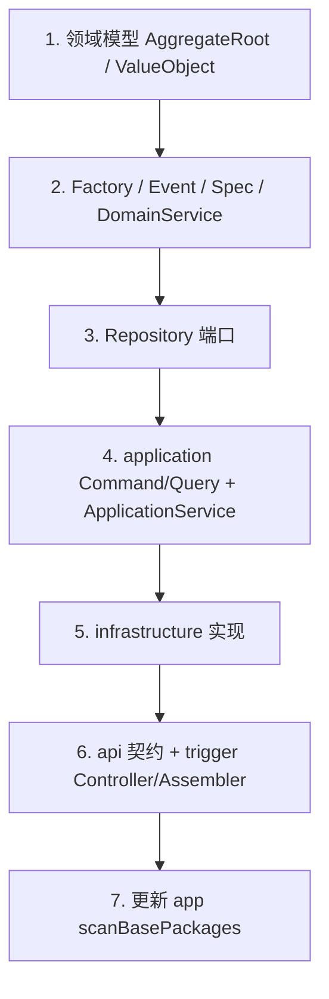

1. **领域模型**：新聚合继承 `AggregateRoot`，值对象实现 `ValueObject`（参考 `Username`）  
2. **Factory / Event / Spec / DomainService**：创建校验、登记事件、跨聚合规则  
3. **Repository 端口**：`XxxRepository extends Repository<Xxx, ID>`  
4. **用例编排**（domain 模块 `application` 包）：Command/Query + ApplicationService；无 Spring 的领域服务用 `@Bean`  
5. **基础设施**：`XxxRepositoryImpl`、事件监听、需要的端口实现  
6. **契约 + 触发器**：api 定义 `IXxxService`；trigger Controller implements + Assembler  
7. **启动**：新 infra 包若需组件扫描，更新 `HeiDddLiteApplication` 的 `scanBasePackages`  

改需求时落点也就更清楚：协议变了改 trigger/api，业务规则变了改 domain，数据库变了改 infrastructure，错误码约定变了改 types。要加「登录失败次数限制」，多半是 application 编排 + 缓存端口；要加「用户昵称」，多半是领域模型 + 表字段 + Response；要加「企微扫码登录」，多半是新的 trigger 适配器。

---

## 十二、六层各自解决什么问题

| 层 | 解决的问题 | 用户管理中的例子 |
|----|------------|------------------|
| types | 跨层错误语义统一，且不拖领域模型 | `BizException` / `FORBIDDEN_CLIENT` |
| api | 对外形状稳定，可独立演进 | `IAuthService`、`AuthTokenResponse` |
| trigger | 协议与安全适配 | JWT、`@RequireAdmin`、Assembler |
| domain | 业务不变式与用例事务 | `User`、`UserFactory`、`AuthApplicationService` |
| infrastructure | 技术实现可替换 | MyBatis、BCrypt、Redis 黑名单 |
| app | 组装与运行配置 | 扫描包、`application.yml` |

当前工程覆盖六层职责与用户管理主链路。Event Sourcing / Saga / 强制 CQRS 总线、细粒度 RBAC、多限界上下文拆分等，可在同一竖切习惯上继续加。

分层的本质是让每一层只关心自己该关心的事：**契约进 api，入口进 trigger，业务进 domain；用例编排可以住在 domain 模块的 application 包；基础设施实现端口、不反向定义业务。**

完整实现见 [hei-ddd-lite](https://github.com/jiangbyte/hei-ddd-lite)。
---

## 参考链接

1. 仓库：[hei-ddd-lite](https://github.com/jiangbyte/hei-ddd-lite)  
2. 建表脚本：[schema-user.sql](https://github.com/jiangbyte/hei-ddd-lite/blob/main/docs/sql/schema-user.sql)  
3. 腾讯云开发者社区：[吃透 3 大核心架构模式：分层、六边形、整洁架构](https://cloud.tencent.com/developer/article/2654658)  
4. 腾讯云开发者社区：[DDD 领域驱动设计如何进行工程化落地](https://cloud.tencent.com/news/918855)  
5. InfoQ 中文：[领域驱动设计实现之路](https://www.infoq.cn/article/implementation-road-of-domain-driven-design)  
6. 美团技术团队：[领域驱动设计在互联网业务开发中的实践](https://tech.meituan.com/2017/12/22/ddd-in-practice.html)  
