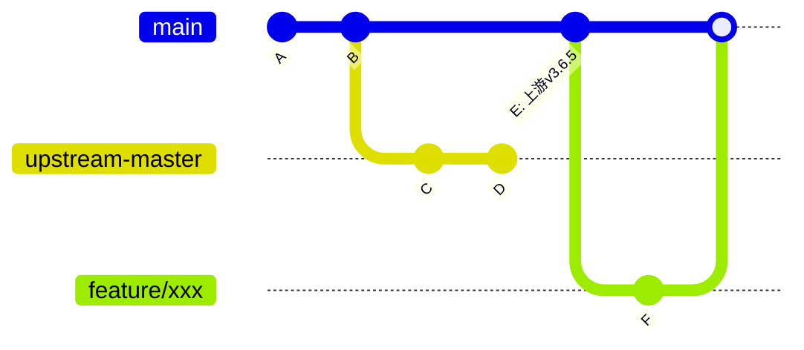
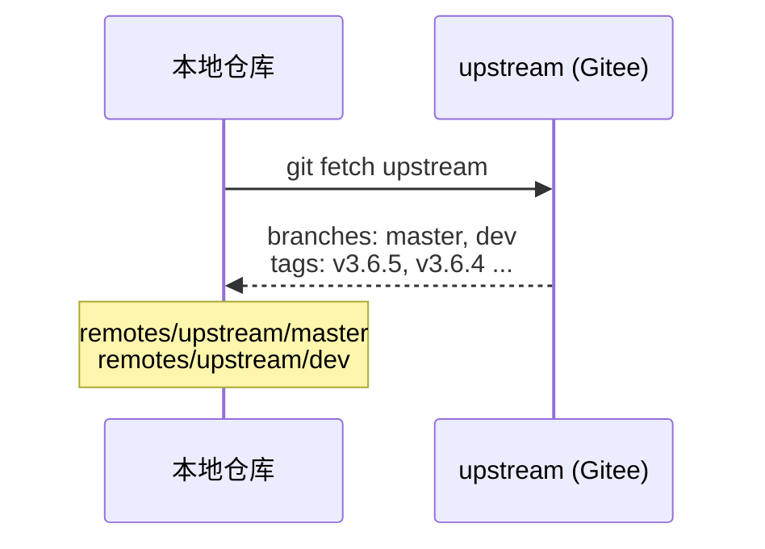
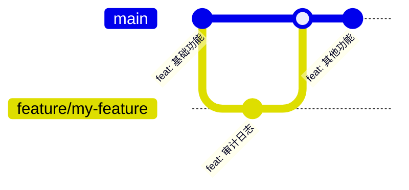
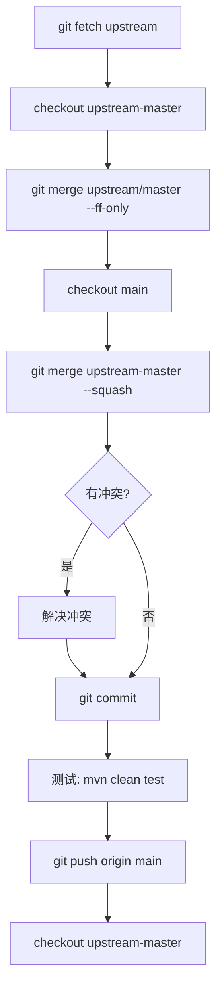
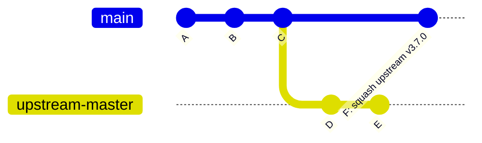
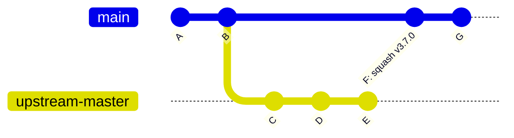
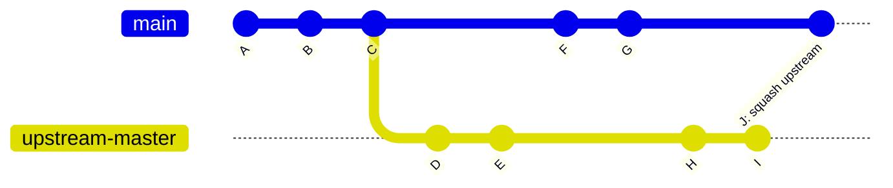

## 场景

最近团队基于 Snowy 这个开源项目做二次开发，在它上面加了很多自己的业务功能。但 Snowy 也在持续更新——修 Bug、加新特性、升级依赖版本。

问题来了：**自己的代码和上游代码混在一起，怎么才能既自由修改，又能定期拉取上游的最新更新？**

这就是我写这篇文章要分享的。

## 思路

我的核心思路是**双远程 + 上游镜像分支**：

- `origin` → 团队自己的远程仓库（日常开发用）
- `upstream` → 开源项目的远程仓库（只读，仅用来拉取更新）
- `upstream-master` 分支 → 上游代码的纯净镜像，绝不直接提交
- `main` 分支 → 团队开发主分支，包含所有自定义代码



## 初始化仓库

### 进入项目目录

```bash
cd /your/project
```

### 初始化 Git

```bash
git init
```

### 配置两个远程仓库（以codeup和gitee为例）

```bash
git remote add origin git@codeup.aliyun.com:your-team/your-project.git
git remote add upstream git@gitee.com:xiaonuobase/snowy.git
```

`origin` 是团队日常用的仓库，`upstream` 是 Snowy 的仓库（只拉取，不推送）。


### 拉取上游代码

```bash
git fetch upstream
```

这样就把 Snowy 的所有分支和标签拉到本地了。



### 创建上游镜像分支

我基于 `upstream/master` 创建了一个本地分支，用来纯净地跟踪上游代码：

```bash
git checkout -b upstream-master upstream/master
```

这个分支的作用：
- `upstream-master` 是本地分支名
- 这个分支**永远只做 fast-forward 更新**，我绝不在上面直接提交代码
- 它是后续合并到 `main` 的桥梁

### 创建主开发分支

`main` 不能带上上游的 commit 历史，否则将来 merge 会把上游的 commit 全部混进团队仓库。我用 orphan 分支创建一个干净的起点：

```bash
git checkout --orphan main upstream-master
```

这样 `main` 和 `upstream-master` 虽然文件内容一样，但**没有共同的 commit 历史**。`main` 只包含一个独立的根提交，积累团队的修改；`upstream-master` 保持纯净。

然后 squash 合并上游代码作为一个提交：

```bash
git merge upstream-master --squash --allow-unrelated-histories
git commit -m "chore: squash merge upstream v3.6.5"
```

第一步初始化完成后，本地仓库应该是这样的：


### 切回上游镜像分支

提交完切回 `upstream-master`，保持它在纯净状态：

```bash
git checkout upstream-master
```

## 日常开发



日常开发我直接在 `main` 上或从 `main` 切出功能分支：

```bash
git checkout main
git pull origin main
git checkout -b feature/my-feature

# 开发、提交
git add .
git commit -m "feat: 增加用户操作审计日志"

# 推送到 origin
git push -u origin feature/my-feature
```

在 Codeup / Gitee / GitHub 上创建合并请求（MR/PR），合入 `main`（或者本地合并提交也可，看团队情况）。

## 定期从上游同步（核心流程）

这是最关键的操作——把 Snowy 的最新代码合并到我的项目里。



### 拉取上游最新代码

```bash
git fetch upstream
```

### 更新上游镜像分支

切到 `upstream-master`，用 fast-forward 方式追赶上源：

```bash
git checkout upstream-master
git merge upstream/master --ff-only
```

`--ff-only` 确保只做快进合并——如果这个分支上有任何直接提交，合并会失败（这正是我想要的保护）。



### 将上游更新合并到主分支

关键区别在这里：我用 `--squash` 把上游的更新压成一个提交，而非逐条合并上游的 commit 历史。

```bash
git checkout main
git merge upstream-master --squash
```

**为什么不直接用 `git merge upstream-master`？**

默认 merge 会把上游仓库的所有 commit 历史都带到 `main` 上。几次同步之后，`main` 的提交图上就混杂着上游的几百个 commit 和团队的 commit，分不清哪些是团队写的。使用 `--squash` 后，每一次上游同步在 `main` 上只产生一个提交：

```
commit 2f3a1b8 (HEAD -> main)
     feat: squash merge upstream (同步上游 v3.7.0 的更新)

commit 8938cf4
     chore: initial team snapshot based on snowy v3.6.5
```

**这里有可能产生冲突。** 有冲突说明上游和团队改了同一个文件的同一段代码。需要逐文件手动确认，不能自动偏向某一方，才能确保合并后的代码逻辑正确。

### 解决冲突

用 `git status` 查看冲突文件：

```bash
git diff --name-only --diff-filter=U
```

对每个冲突文件：
- 打开文件，找到 `<<<<<<<`、`=======`、`>>>>>>>` 标记
- 理解双方改了什么，手动合并
- 保存文件，`git add` 标记已解决

所有冲突解决完后：

```bash
git commit -m "feat: squash merge upstream (同步上游 v3.7.0 的更新)"
```

> squash merge 不会自动生成合并提交，需要手动 commit。建议在提交信息里注明上游版本号，方便日后排查。

### 测试并推送

```bash
# 运行测试确保一切正常
mvn clean test

# 推送到 origin
git push origin main
```

### 切回上游镜像分支

```bash
git checkout upstream-master
```

同步完成后，提交历史看起来像这样：



## 完整命令速查

| 场景 | 命令 |
|------|------|
| **初始化** | |
| 初始化仓库 | `git init` |
| 添加 origin | `git remote add origin <团队仓库地址>` |
| 添加 upstream | `git remote add upstream <开源仓库地址>` |
| 拉取上游 | `git fetch upstream` |
| 创建上游镜像 | `git checkout -b upstream-master upstream/master` |
| 创建主分支（orphan） | `git checkout --orphan main upstream-master` |
| 首次 squash 上游 | `git merge upstream-master --squash --allow-unrelated-histories && git commit` |
| **日常开发** | |
| 切功能分支 | `git checkout -b feature/xxx main` |
| 推送功能分支 | `git push -u origin feature/xxx` |
| **定期同步上游** | |
| 拉取上游 | `git fetch upstream` |
| 更新镜像 | `git checkout upstream-master && git merge upstream/master --ff-only` |
| 合并到主分支 | `git checkout main && git merge upstream-master --squash && git commit` |
| 推送到 origin | `git push origin main` |

## 提交时间线

每次同步就是：
1. 把 `upstream-master` 快进到 `upstream/master` 的最新提交
2. 用 `--squash` 把 `upstream-master` 合并到 `main`



## 需要注意的事

- **`upstream-master` 上绝对不要提交**，这是整个方案的基础。一旦提交了，`--ff-only` 会阻止合并，你就需要处理本不该出现的冲突
- `main` 是 orphan 分支（无共同祖先），首次 merge 必须加 `--allow-unrelated-histories`
- 合并冲突时，逐文件手动审查，不要偷懒用 `-X ours` 或 `-X theirs` 自动解决——自动策略不了解业务逻辑，可能引入隐性 Bug
- 同步后务必**跑一遍测试**（`mvn test`），确认功能正常再推送
- 多人协作时，同步上游前先确保 `main` 分支是干净的，没有未合并的 MR
