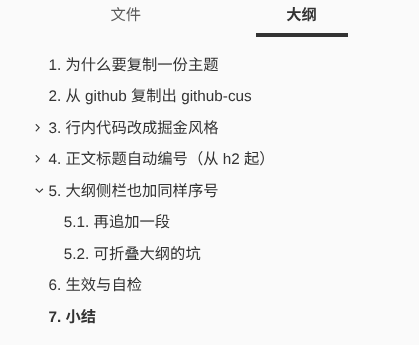
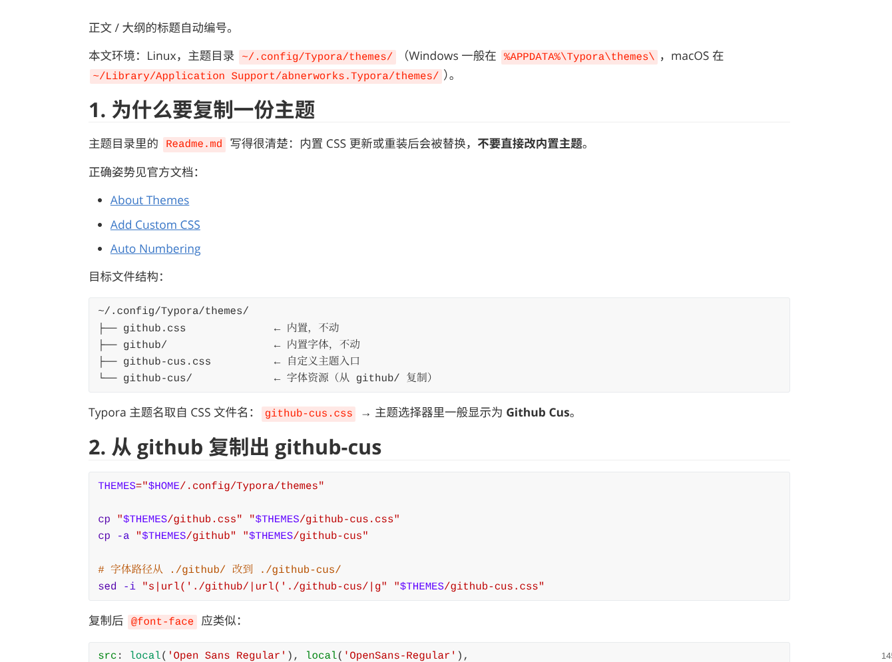

Typora 自带主题升级会覆盖，直接改 `github.css` 不稳妥。做法是复制一份自定义主题 `github-cus`，在上面改行内代码颜色，以及正文 / 大纲的标题自动编号。

本文环境：Linux，主题目录 `~/.config/Typora/themes/`（Windows 一般在 `%APPDATA%\Typora\themes\`，macOS 在 `~/Library/Application Support/abnerworks.Typora/themes/`）。

## 为什么要复制一份主题

主题目录里的 `Readme.md` 写得很清楚：内置 CSS 更新或重装后会被替换，**不要直接改内置主题**。

正确姿势见官方文档：

- [About Themes](https://support.typora.io/About-Themes/)
- [Add Custom CSS](https://support.typora.io/Add-Custom-CSS/)
- [Auto Numbering](https://support.typora.io/Auto-Numbering/)

目标文件结构：

```text
~/.config/Typora/themes/
├── github.css              ← 内置，不动
├── github/                 ← 内置字体，不动
├── github-cus.css          ← 自定义主题入口
└── github-cus/             ← 字体资源（从 github/ 复制）
```

Typora 主题名取自 CSS 文件名：`github-cus.css` → 主题选择器里一般显示为 **Github Cus**。

## 从 github 复制出 github-cus

```bash
THEMES="$HOME/.config/Typora/themes"

cp "$THEMES/github.css" "$THEMES/github-cus.css"
cp -a "$THEMES/github" "$THEMES/github-cus"

# 字体路径从 ./github/ 改到 ./github-cus/
sed -i "s|url('./github/|url('./github-cus/|g" "$THEMES/github-cus.css"
```

复制后 `@font-face` 应类似：

```css
src: local('Open Sans Regular'), local('OpenSans-Regular'),
     url('./github-cus/open-sans-v17-latin-ext_latin-regular.woff2') format('woff2');
```

然后在 Typora：**主题 → Github Cus**。后面所有改动都只动 `github-cus.css`。

## 行内代码改成掘金风格

### 目标效果

正文里的 `` `Integer` `` 一类行内代码：

- 字色：`#ff502c`（橙红）
- 背景：`rgba(255, 80, 44, 0.1)`（淡橙红底）
- 无边框、小圆角、左右略留白

围栏代码块（\`\`\`）继续用原来的灰底，不要跟行内代码混成同一种颜色。

### 原主题怎么写的

github 主题里行内代码和围栏代码块绑在一起：

```css
.md-fences,
code,
tt {
    border: 1px solid #e7eaed;
    background-color: #f8f8f8;
    border-radius: 3px;
    padding: 2px 4px 0px 4px;
    font-size: 0.9em;
}

code {
    background-color: #f3f4f4;
    padding: 0 2px 0 2px;
}
```

问题在于：改 `code` 会连带影响 `.md-fences` 里的 `code`，所以必须拆开，并给围栏内部做还原。

### 替换成下面这段

在 `github-cus.css` 里，把上面那段改成：

```css
/* Inline code — Juejin style */
code,
tt {
    margin: 0 2px;
    padding: 2px 4px;
    border: none;
    border-radius: 2px;
    background-color: rgba(255, 80, 44, 0.1);
    color: #ff502c;
    font-size: 0.9em;
    font-family: Consolas, Monaco, "Courier New", monospace;
}

.md-fences {
    margin-bottom: 15px;
    margin-top: 15px;
    padding: 8px 4px 6px;
    border: 1px solid #e7eaed;
    border-radius: 3px;
    background-color: #f8f8f8;
    font-size: 0.9em;
    color: inherit;
}

.md-fences code,
.md-fences tt {
    margin: 0;
    padding: 0;
    border: none;
    border-radius: 0;
    background-color: transparent;
    color: inherit;
    font-size: inherit;
}
```

要点：

1. 只给裸 `code` / `tt` 上掘金色
2. `.md-fences` 单独保留灰底围栏样式
3. `.md-fences code` 清掉颜色和背景，避免代码块里每个 token 都变橙红

改完后重选一次主题，或重启 Typora。

## 正文标题自动编号（从 h2 起）

### 需求

文章一般是「一级标题当文题，正文从二级开始分节」：

| Markdown | 显示 |
| --- | --- |
| `# 文题` | 不编号 |
| `## 第一节` | `1. 第一节` |
| `### 小节` | `1.1. 小节` |
| `## 第二节` | `2. 第二节` |

编号只出现在显示层，**不会写进 Markdown 源文件**。

### 原理

用 CSS counters：上级标题 `counter-reset` 下级，`:before` 里 `counter-increment` 并拼出 `1.` / `1.1.`。官方方案从 h1 起算，这里改成从 h2 起。

### 追加到 github-cus.css 末尾

```css
/* Auto-number headings from h2 (h1 is document title) */
#write {
    counter-reset: h2;
}

h2 {
    counter-reset: h3;
}

h3 {
    counter-reset: h4;
}

h4 {
    counter-reset: h5;
}

h5 {
    counter-reset: h6;
}

#write h2:before {
    counter-increment: h2;
    content: counter(h2) ". ";
}

#write h3:before,
h3.md-focus.md-heading:before {
    counter-increment: h3;
    content: counter(h2) "." counter(h3) ". ";
}

#write h4:before,
h4.md-focus.md-heading:before {
    counter-increment: h4;
    content: counter(h2) "." counter(h3) "." counter(h4) ". ";
}

#write h5:before,
h5.md-focus.md-heading:before {
    counter-increment: h5;
    content: counter(h2) "." counter(h3) "." counter(h4) "." counter(h5) ". ";
}

#write h6:before,
h6.md-focus.md-heading:before {
    counter-increment: h6;
    content: counter(h2) "." counter(h3) "." counter(h4) "." counter(h5) "." counter(h6) ". ";
}

/* 覆盖聚焦态默认左边浮动样式，避免编辑时编号错位 */
#write > h3.md-focus:before,
#write > h4.md-focus:before,
#write > h5.md-focus:before,
#write > h6.md-focus:before,
h3.md-focus:before,
h4.md-focus:before,
h5.md-focus:before,
h6.md-focus:before {
    color: inherit;
    border: inherit;
    border-radius: inherit;
    position: inherit;
    left: initial;
    float: none;
    top: initial;
    font-size: inherit;
    padding-left: inherit;
    padding-right: inherit;
    vertical-align: inherit;
    font-weight: inherit;
    line-height: inherit;
}
```

说明：

- `#write` 是正文编辑区根节点，计数器挂在这里
- **不要**给 `#write h1:before` 写编号
- `h3.md-focus.md-heading:before` 等是为了压过 Typora 聚焦标题时的默认伪元素样式

## 大纲侧栏也加同样序号

正文有编号、左侧「大纲」没有，对不上。侧栏用另一套选择器：`.outline-h2`、`.outline-label` 等。

### 再追加一段

```css
/* Auto-number outline panel from h2（与正文一致） */
.sidebar-content {
    counter-reset: h2;
}

.outline-h2 {
    counter-reset: h3;
}

.outline-h3 {
    counter-reset: h4;
}

.outline-h4 {
    counter-reset: h5;
}

.outline-h5 {
    counter-reset: h6;
}

.outline-h2 > .outline-item > .outline-label:before {
    counter-increment: h2;
    content: counter(h2) ". ";
}

.outline-h3 > .outline-item > .outline-label:before {
    counter-increment: h3;
    content: counter(h2) "." counter(h3) ". ";
}

.outline-h4 > .outline-item > .outline-label:before {
    counter-increment: h4;
    content: counter(h2) "." counter(h3) "." counter(h4) ". ";
}

.outline-h5 > .outline-item > .outline-label:before {
    counter-increment: h5;
    content: counter(h2) "." counter(h3) "." counter(h4) "." counter(h5) ". ";
}

.outline-h6 > .outline-item > .outline-label:before {
    counter-increment: h6;
    content: counter(h2) "." counter(h3) "." counter(h4) "." counter(h5) "." counter(h6) ". ";
}
```

### 可折叠大纲的坑

官方说明：大纲自动编号建议先关掉「可折叠大纲」，改用扁平大纲，否则折叠后 DOM/计数可能对不齐。

路径大致是：**偏好设置 → 大纲 / Outline → 关闭可折叠大纲（Collapsible Outline）**。

大纲面板空白处右键，有时也能切换扁平 / 折叠视图。

## 生效与自检

1. 主题选中 **Github Cus**
2. 改完 CSS 后重选主题或重启 Typora
3. 打开一篇有 `##` / `###` 的文档：
   - 正文标题前应出现 `1.` / `1.1.`
   - 左侧大纲对应项也应有同样序号
   - 行内 `` `code` `` 为橙红字 + 淡橙底
   - \`\`\` 代码块仍是灰底，块内文字不是橙红

效果如下：





## 小结

| 步骤 | 做什么 |
| --- | --- |
| 复制主题 | `github.css` + `github/` → `github-cus.css` + `github-cus/`，改字体路径 |
| 行内代码 | 拆开 `code` 与 `.md-fences`，行内用 `#ff502c` |
| 正文编号 | `#write` 上从 h2 起的 CSS counter + 聚焦态覆盖 |
| 大纲编号 | `.sidebar-content` / `.outline-hN` 同样从 h2 起；必要时关可折叠大纲 |

完整主题文件就在本机：

```text
~/.config/Typora/themes/github-cus.css
~/.config/Typora/themes/github-cus/
```

以后要再调颜色或编号格式，只改这一份即可，不会被 Typora 升级冲掉内置 `github`。
