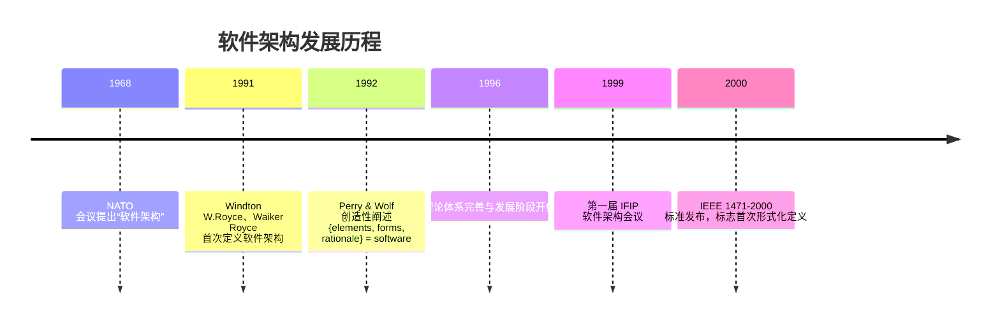
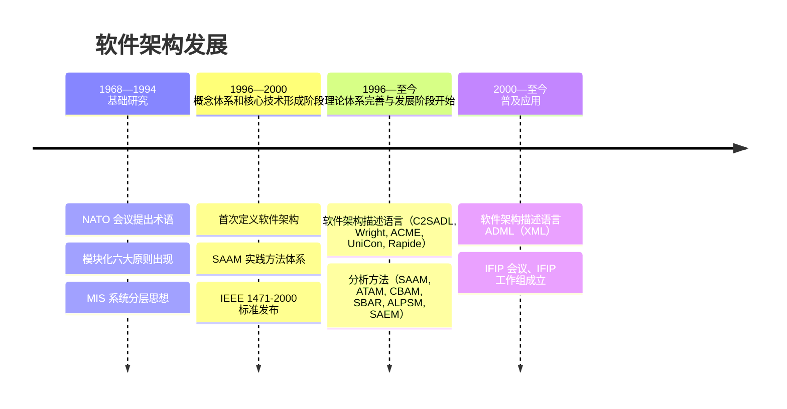
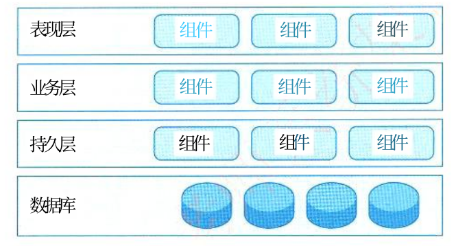
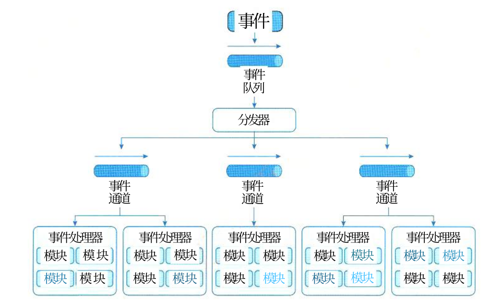
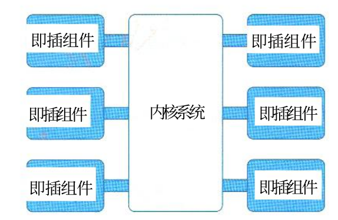
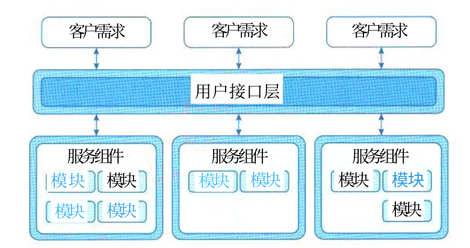
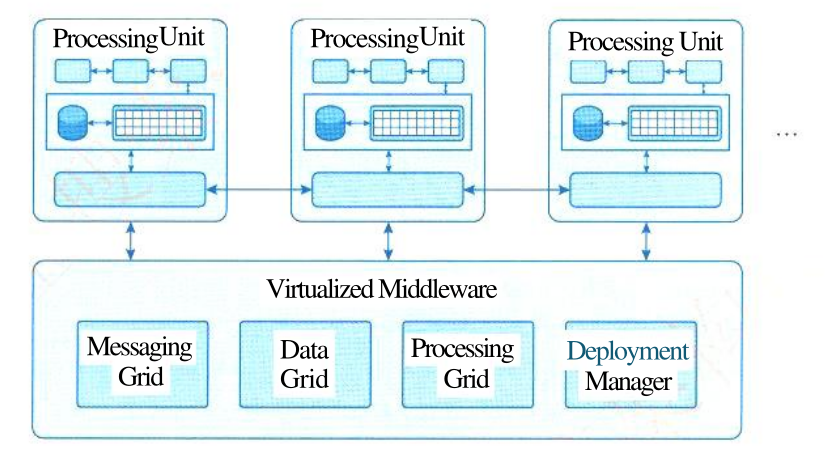

## 系统架构概述

诺依曼系统计算机

- 计算机硬件
- 计算机软件

## 系统架构定义

定义：IEEE 1471-2000 标准

> 架构是体现在**组件**中的一个系统的基本组织、它们彼此的**关系**与**环境**的关系及指导它的设计和发展的**原则**。

架构设计的作用：

1. 解决相对复杂的需求分析问题
2. 解决非功能属性在系统中占据重要位置的设计问题
3. 解决生命周期长、扩展性需求高的系统整体结构问题
4. 解决系统基于组件需要的集成问题
5. 解决业务流程再造难的问题

## 软件架构发展历程

## 模块化开发六大原则

1. 最高模块内聚。也就是在一个模块内部的元素最大限度地关联，只实现一种功能的模块是高内聚的，具有三种以上功能的模块则是低内聚的。
2. 最低耦合。也就是不同模块之间的关系尽可能弱，以利于软件的升级和扩展。
3. 模块大小适度。颗粒过大会造成模块内部维护困难，而颗粒过小又会导致模块间的耦合增加。
4. 模块调用链的深度（嵌套层次）不可过多。
5. 接口简单、精炼（扇入扇出数不宜太大），具有信息隐蔽能力。
6. 尽可能地复用已有模块

## 软件架构常用分类

### 分层架构

- 四层结构：表现层、业务层、持久层、数据库层
- 最常见的软件架构，事实标准架构；用户的请求将依次通过这四层的处理，不能跳过其中任何一层

### 事件驱动架构

- 四个部分：事件队列（入口）、分发器（分发）、事件通道（联系渠道）、事件处理器（实现业务逻辑）
- 异步处理、解耦的系统

### 微核架构（插件架构）

- 内核相对较小，主要功能和业务逻辑都通过插件实现

### 微服务架构

- 服务导向架构（SOA）的升级，每一个服务就是一个独立的部署单元，单元都是分布式
  的，互相解耦
- 三种实现模式：RESTful API 模式、RESTful 应用模式、集中消息模式

### 云架构

- 数据都复制到内存中，变成可复制的内存数据单元，处理单元按需启停，没有中央数据库
- 两部分成：处理单元 + 虚拟中间件（消息中间件 (Messaging Grid)、数据中间件 (Data Grid)、处理中间件 (Processing Grid)、部署中间件 (Deployment Manager)）

## 常用建模方法与"4+1"视角模型

### 4 种建模方法（怎么描述架构）

| 建模方法 | 一句话解释                 | 关注什么               |
| -------- | -------------------------- | ---------------------- |
| 结构模型 | 系统由哪些零件组成、怎么连 | 构件、连接件、配置     |
| 框架模型 | 只看整体框架，不看细节     | 整体结构、针对特定问题 |
| 动态模型 | 系统运行时怎么动、怎么变   | 重配置、演化、通信过程 |
| 过程模型 | 系统是怎么一步步建出来的   | 构造步骤、过程脚本     |

> 记忆口诀：**结构看组成，框架看整体，动态看行为，过程看步骤。**

### 4+1 视角模型（从哪些角度看架构）

> 1995年 Philippe Kruchten 提出

| 视角     | 一句话解释                     | 给谁看               |
| -------- | ------------------------------ | -------------------- |
| 逻辑视角 | 系统有哪些功能                 | 用户、设计人员       |
| 过程视角 | 系统运行时并发、性能怎么样     | 集成人员、性能工程师 |
| 物理视角 | 软件装在哪台机器上             | 运维、系统工程师     |
| 开发视角 | 代码怎么分模块、怎么开发       | 开发人员、项目经理   |
| 场景视角 | 用几个关键场景验证前面四个视角 | 所有人               |

> 记忆口诀：**逻辑看功能，过程看运行，物理看部署，开发看组织，场景做验证。**

### 两者关系

| 问题               | 答案               |
| ------------------ | ------------------ |
| 建模方法解决什么？ | 用什么方式描述架构 |
| 视角模型解决什么？ | 从哪些角度描述架构 |

**一句话：建模方法是“怎么写”，视角模型是“从哪看”。**

## 架构设计师的角色与素质

### 架构师定义

**系统架构师是负责系统架构的人、团队或组织。**

> 系统架构师是系统或产品线的设计责任人，负责理解、管理、确认和评估非功能性系统需求，给出开发规范，搭建系统实现的核心架构，对整个软件架构、关键构件和接口进行总体设计，并澄清关键技术细节的高级技术人员。
>
> 这个定义包含几个关键点：
>
> 1. **责任主体**：可以是个人，也可以是团队或组织。
> 2. **核心职责**：对系统架构负责，而不仅仅是写代码或做模块设计。
> 3. **关注重点**：不仅是功能需求，更强调非功能性需求，如可维护性、性能、复用性、可靠性、有效性和可测试性等。
> 4. **产出物**：架构设计、开发规范、核心架构、关键构件与接口设计、关键技术决策。
> 5. **技术层级**：通常是高级技术人员，是系统开发中的核心角色。

### 系统架构师的角色定位（任务与组成）

1. 领导与协调整个项目中的技术活动（分析、设计和实施等）。
2. 推动主要的技术决策并最终表达为系统架构。
3. 确定系统架构，并促使其架构设计的文档化，这里的文档化应包括需求、设计、实施
   和部署等“视图”。

### 8 项专业素质

| 序号 | 专业素质         | 一句话解释                           | 关键点                                           |
| ---- | ---------------- | ------------------------------------ | ------------------------------------------------ |
| 1    | 掌握业务领域知识 | 懂业务，才能设计出满足用户需求的架构 | 预见可能的变化，做出更全面的决策                 |
| 2    | 掌握技术知识     | 懂技术，但不必是技术专家             | 关注关键技术，不必抠 API 细节；要跟上技术发展    |
| 3    | 掌握设计技能     | 设计是架构设计的核心                 | 能识别关键设计决策，设计能力靠多年经验积累       |
| 4    | 具备编程技能     | 懂代码，才能和开发人员有效沟通       | 不必亲自写代码，但要跟上技术；最好参与一定开发   |
| 5    | 具备沟通能力     | 软技能中最重要的                     | 口头+书面表达；与利益相关方沟通、激励团队        |
| 6    | 具备决策能力     | 该拍板时能拍板                       | 信息不明确时也要决策；决策不一定总对，但要会纠正 |
| 7    | 知道组织策略     | 懂政治、懂组织权力                   | 与恰当的人沟通，确保项目获得支持                 |
| 8    | 应是谈判专家     | 会谈判、会折中                       | 尽早降低风险；让利益相关方达成一致               |

专业知识结构：

| 序号 | 知识能力                                           | 简单解释                           |
| ---- | -------------------------------------------------- | ---------------------------------- |
| 1    | 战略规划能力                                       | 能从全局和长远角度规划系统方向     |
| 2    | 业务流程建模能力                                   | 能梳理和建模业务流程               |
| 3    | 信息数据架构能力                                   | 能设计数据架构和信息模型           |
| 4    | 技术架构设计和实现能力                             | 能做技术架构设计并落地实现         |
| 5    | 应用系统架构的解决和实现能力                       | 能解决应用系统架构问题并实现       |
| 6    | 基础 IT 知识及基础设施、资源调配能力               | 懂 IT 基础，会调配基础设施和资源   |
| 7    | 信息安全技术支持与管理保障能力                     | 能保障信息安全，提供技术和管理支持 |
| 8    | IT 审计、治理与基本需求的分析和获取能力            | 懂 IT 审计治理，能分析和获取需求   |
| 9    | 面向软件系统可靠性与系统生命周期的质量保障服务能力 | 能保障系统可靠性和全生命周期质量   |
| 10   | 对新技术与新概念的理解、掌握和分析能力             | 能快速理解和掌握新技术、新概念     |

### 6 种角色特质

> Pat Kua 提出的

| 序号 | 角色特质               | 一句话解释                           | 关键做法                             |
| ---- | ---------------------- | ------------------------------------ | ------------------------------------ |
| 1    | 作为领导者             | 像导师一样带领团队朝同一技术愿景前进 | 讲故事、影响力、引导冲突、构建信任   |
| 2    | 作为开发者             | 架构师同时也要是好的开发人员         | 多与开发人员待在一起、花时间看代码   |
| 3    | 作为系统综合者         | 不只关注代码，还要关注系统整体质量   | 考虑部署、测试、性能、安全、可支持性 |
| 4    | 具备企业家思维         | 技术选型要看成本和收益，敢承担风险   | 收集真实成本信息，关注隐性成本       |
| 5    | 权衡战略思维与战术思维 | 既看长远，也看当下；平衡敏捷与一致   | 建立技术雷达，持续关注新技术         |
| 6    | 具备良好沟通能力       | 用对方熟悉的语言沟通，建立信任和影响 | 用风险回报、成本收益等业务术语交流   |

## 从工程师到系统架构设计师的演化

### 6 个成长阶段

| 阶段           | 时间        | 典型特征                   | 核心积累                                                     |
| -------------- | ----------- | -------------------------- | ------------------------------------------------------------ |
| 工程师         | 1～3年      | 在别人指导下完成开发       | 基础技能：编程语言、数据结构、开发环境、操作系统、数据库、开发流程 |
| 高级工程师     | 3～5年      | 独立完成开发               | 方案设计经验；知道 How，还要知道 Why；掌握成熟设计理论       |
| 技术专家       | 4～8年      | 某个领域的专家             | 拓展技术宽度；理解每个技术的原理、优缺点、应用场景           |
| 初级架构设计师 | 5～8年      | 独立完成一个系统的架构设计 | 形成自己的架构设计方法论                                     |
| 中级架构设计师 | 8～10年以上 | 完成复杂系统的架构设计     | 技术深度和技术理论的积累                                     |
| 高级架构设计师 | 10年以上    | 创造新的架构模式           | 创造性；开创新的技术潮流                                     |

## 论文素材

### 片段一

架构设计师的专业素质可从**硬技能**和**软技能**两个维度展开。硬技能包括业务领域知识、技术知识、设计技能和编程技能；软技能包括沟通能力、决策能力、组织策略意识和谈判能力。

素材：

- 架构师**不必是技术专家**，但必须关注技术的重要因素，而非细节。需要理解像 Java EE 或 .NET 这类平台上的关键框架，但不必理解每个 API 的细节。
- 设计能力**不可能在短时间内获得**，而是多年经验积累的结果。
- 在架构设计师相关的所有软技能中，**沟通最重要**。架构师不是简单地将信息传达给团队，还要激励团队，使系统愿望为大家共享。
- 决策能力体现在**信息不明确、时间不充足**的情况下仍需果断决策。决策不一定总是正确，但架构师必须学会纠正错误决策。
- 优秀的架构师应具备**企业家思维**：所有技术选型都有成本和收益，需要从两个角度考虑，并关注工具背后的隐性成本

## 参考

1. https://mp.weixin.qq.com/s/clEcpeV8YMmQpNgTKgw0wg
2. 系统架构设计师教程(第2版)