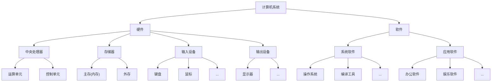
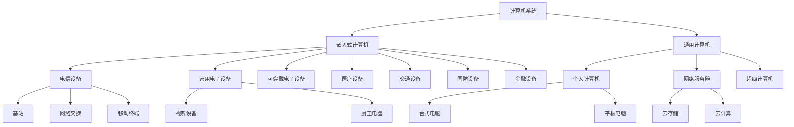
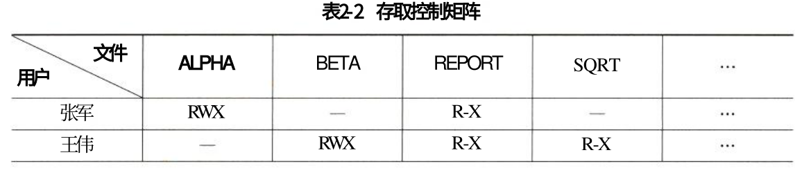
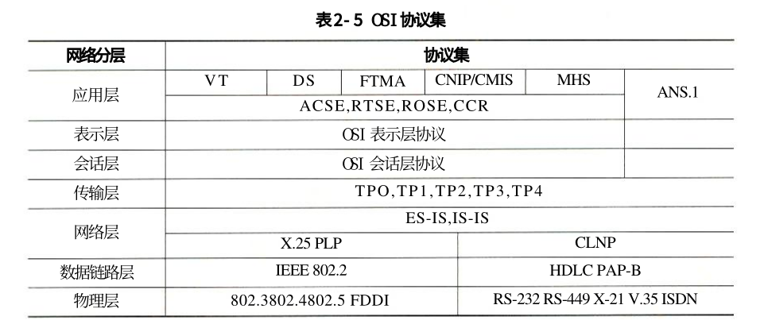
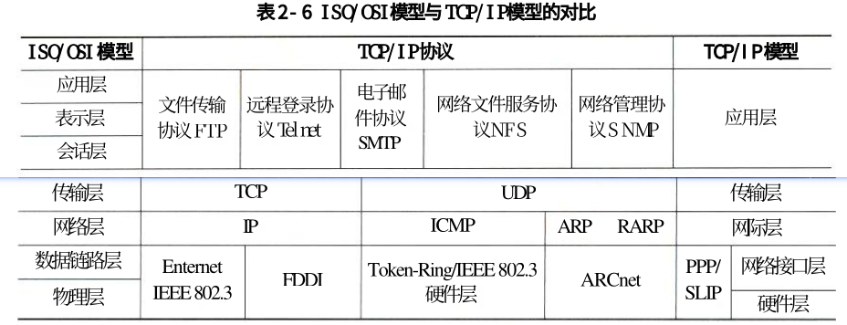
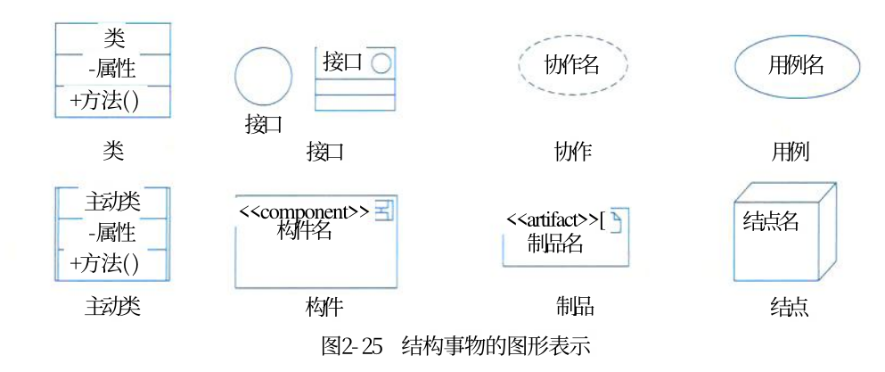
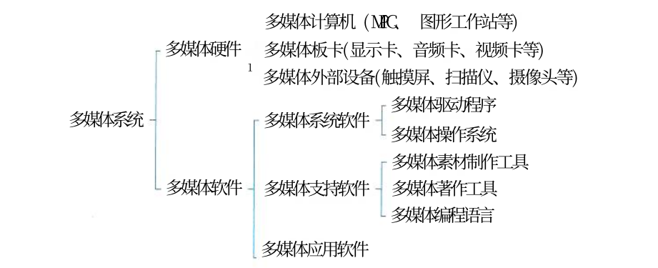

## 计算机系统概述

**计算机系统 = 硬件 + 软件**



系统分类维度：



## 计算机硬件

### 计算机硬件组成

冯·诺依曼体系结构是现代计算机的基础，由数学家约翰·冯·诺依曼于1945年提出。它的核心思想可以概括为一句话：

> **程序和数据都存储在同一个存储器中，计算机按照存储的程序顺序自动执行指令。**

**冯·诺依曼体系结构的五大部件**

| 部件 | 英文 | 功能 |
| -------- | ------ | ---------------------------- |
| 运算器 | ALU | 完成算术运算和逻辑运算 |
| 控制器 | CU | 控制指令执行、协调各部件工作 |
| 存储器 | Memory | 存放程序和数据 |
| 输入设备 | Input | 将外部信息送入计算机 |
| 输出设备 | Output | 将计算结果送出计算机 |

其中，**运算器 + 控制器 = 中央处理器（CPU）**。

**工作流程（简化）**

```
取指令 → 分析指令 → 执行指令 → 取下一条指令 → ...
```

具体步骤：

1. **取指令**：控制器从存储器中取出指令
2. **分析指令**：译码，判断要做什么操作
3. **执行指令**：运算器或其他部件完成操作
4. **写回结果**：将结果写回存储器或寄存器
5. **重复以上步骤**，直到程序结束

**冯·诺依曼体系结构 = 存储程序 + 程序控制 + 五大部件（运算器、控制器、存储器、输入、输出）。**

核心是：**程序和数据都存在存储器里，计算机自动按顺序取指令并执行。**

现代计算机里这些部件已经高度集成：

- **运算器+控制器 → CPU**（还包含多级缓存、通信总线等）
- **输入设备+输出设备 → 总线/接口/外部设备**

### 处理器

**指令集分类**

| 指令集类型 | 英文缩写 | 代表产品 | 特点/趋势 |
| ---------- | -------- | --------------------- | --------------------------------------- |
| 复杂指令集 | CISC | Intel、AMD 的 x86 CPU | 因历史原因仍存在 |
| 精简指令集 | RISC | ARM、Power | 已成为发展趋势，后期指令集几乎均为 RISC |

**专用处理器芯片**

| 类型 | 英文缩写 | 特点 | 应用领域 |
| -------------------- | -------- | ------------------------------------------------------------ | ------------------ |
| 图形处理器 | GPU | 数百或数千内核，优化并行计算 | 深度学习、机器学习 |
| 信号处理器 | DSP | 饱和算法处理溢出，乘积累加提高矩阵运算效率，专用傅里叶变换指令 | 高速信号采集设备 |
| 现场可编程逻辑门阵列 | FPGA | 可编程逻辑 | 专用目的处理 |

市场占有率和知名度较高的产品包括：**龙芯、飞腾、申威、兆芯、国微、国芯、华睿、翔腾微、景嘉微**。

### 存储器

**存储器分层体系**

| 层次 | 位置 | 典型结构 | 容量范围 | 特点 |
| ------------ | ----------------------------------- | -------- | -------------- | ---------------------------------- |
| 片上缓存 | 处理器核心内直接集成 | SRAM | 16KB～512KB | 速度最快，容量最小，可分一级或二级 |
| 片外缓存 | 处理器核心外，经交换互联开关访问 | SRAM | 256KB～4MB | 称 L2/L3 Cache 或平台 Cache |
| 主存（内存） | 独立部件/芯片，通过总线与处理器连接 | DRAM | 数百MB～数十GB | 需不断充电维持数据 |
| 外存 | 磁带、磁盘、光盘、Flash 等 | 多种介质 | MB～TB 级 | 速度慢、容量大、掉电可保持 |

存储器按与处理器距离分 4 层——片上缓存、片外缓存、主存、外存；越靠近处理器越快越小，越远越慢越大，外存掉电可保持数据。

**外存介质保存年限**

| 介质 | 保存年限 |
| ----- | ------------ |
| Flash | 约10年 |
| 光盘 | 数年至数十年 |
| 磁盘 | 10年以上 |
| 磁带 | 30年以上 |

### 总线

**分类（按位置）**

| 类型 | 别名 | 连接范围 | 说明 |
| -------- | ------------------ | ---------------------------------------- | ----------------------------------------------------- |
| 内总线 | 片上总线、片内总线 | 各类芯片内部互连 | 芯片内部使用 |
| 系统总线 | — | CPU、主存、I/O 接口 | 狭义指 CPU 与主存、通信桥连接的总线；广义还含局部总线 |
| 外部总线 | 通信总线 | 计算机板与外部设备之间，或计算机系统之间 | 用于系统间互联 |

> 总线之间通过**桥（Bridge）**连接，桥是一种特殊外设，主要实现总线协议间的转换。

**常见总线类型**

| 分类 | 常见总线 |
| -------- | ----------------------------------------------- |
| 并行总线 | PCI、PCIe、ATA（IDE） |
| 串行总线 | USB、SATA、CAN、RS-232、RS-485、RapidIO、以太网 |

**专业领域总线**

| 领域 | 总线 |
| -------- | ------------------------------------------- |
| 航空 | ARINC429、ARINC659、ARINC664、MIL-STD-1553B |
| 工业控制 | CAN、IEEE1394、PCI、PCIe、VME |

**一句话总结：** 总线按位置分内总线、系统总线、外部总线；靠桥连接转换；**性能看带宽、QoS、时延、抖动**；常见有并行和串行两类，各专业领域还有专用总线。

### 接口、外部设备

| 分类 | 常见接口 |
| -------------- | ---------------------------------------- |
| 显示类 | HDMI、DVI 等 |
| 音频输入输出类 | TRS、RCA、XLR 等 |
| 网络类 | RJ45、FC 等 |
| 通用类 | PS/2、USB、SATA、LPT 打印接口、RS-232 等 |
| 非标准接口 | 离散量接口、A/D 转换接口等（随需求设计） |

> 一种总线可能有多种接口：以太网可通过 RJ-45 或同轴电缆连接；PCIe 有多种形态接口。

**外部设备定义：** 外部设备也称外围设备，是计算机的非必要设备，包括所有输入输出设备以及部分存储设备（外存）。

| 应用场景 | 常见外部设备 |
| ------------------------ | ------------------------------------------------------------ |
| 通用计算机 | 键盘、鼠标、显示器、扫描仪、摄像头、麦克风、打印机、光驱、网卡、存储卡/盘 |
| 移动和穿戴设备 | 加速计、GPS、陀螺仪、感光设备、指纹识别设备 |
| 工业控制、航空航天、医疗 | 测温仪、测速仪、轨迹球、操作面板、红外/NFC 感应设备、场强测量设备、功率驱动装置、机械臂、液压装置、油门杆、驾驶杆 |

> 各型外部设备种类多样，但都通过**接口**与计算机主体连接，并通过指令、数据实现预期功能。

**一句话总结：** 接口是同一计算机不同功能层之间的通信规则，分显示、音频、网络、通用和非标准等类；外部设备是计算机的非必要设备，通过接口与主机连接实现功能。

## 计算机软件软件分类

| 大类 | 定义 | 作用 | 细分 |
| -------- | ---------------------------------------------------- | ---------------------------------------------------------- | ---------------------------------------------------------- |
| 系统软件 | 为整个计算机系统配置的、不依赖特定应用领域的通用软件 | 控制和管理硬件与软件资源，为用户和其他应用软件运行提供服务 | 操作系统、程序设计语言翻译系统、数据库管理系统、网络软件等 |
| 应用软件 | 为某类应用需要或解决某个特定问题而设计的软件 | 承担各类计算任务，如人事管理、财务管理、图书管理等 | 专用应用软件、通用应用软件 |

## 操作系统

操作系统是计算机系统的资源管理者，包含对系统软硬件资源实施管理的一组程序。它的首要作用是通过 CPU 管理、存储管理、设备管理和文件管理对各种资源进行合理分配，改善资源共享和利用程度，提高系统效率。

操作系统是配置在计算机硬件上的第 1 层软件：
- **向下**：管理裸机及其中的文件
- **向上**：为其他系统软件（汇编程序、编译程序、数据库管理系统等）和大量应用软件提供支持，并为用户提供方便使用系统的接口

### **操作系统的组成**

| 组成 | 说明 |
| -------------- | ------------------------------------------------------------ |
| 内核（Kernel） | 提供进程管理、存储管理、文件管理和设备管理等功能，是操作系统中最基本的部分 |
| 配套软件 | 图形用户界面程序、常用应用程序、实用程序、支持应用开发运行的软件构件 |

**内核的特点：**

- 对硬件设备进行抽象，为应用软件提供系统调用接口/API
- 通常驻留在内存中
- 以 CPU 最高优先级运行
- 能执行特权指令，可直接访问外设和全部主存空间

### **操作系统的 3 大作用**

1. **管理计算机中运行的程序和分配各种软硬件资源**：包括处理器管理、存储管理、文件管理、I/O 设备管理等。

2. **为用户提供友善的人机界面**：几乎所有操作系统都提供图形用户界面（GUI），通过窗口、图标、菜单、鼠标/触摸屏操作，让用户直观、灵活、有效地使用计算机。

3. **为应用程序的开发和运行提供高效率平台**：操作系统屏蔽物理设备细节，以系统调用、库函数等方式向应用程序提供支持，呈现给用户一台“虚拟计算机”。

> 此外还有：帮助功能、处理软硬件错误、监控系统性能、保护系统安全等。

### **操作系统的 4 大特征**

| 特征 | 说明 |
| -------- | ------------------------------------------------------------ |
| 并发性 | 一段时间内宏观上多个程序同时运行；单 CPU 下微观上交替轮流执行 |
| 共享性 | 资源可被多个并发执行的进程共同使用，分同时共享和互斥共享 |
| 虚拟性 | 把物理上一个实体变成逻辑上多个对应物，或反之 |
| 不确定性 | 进程走走停停，何时执行、暂停、推进速度、完成时间都不可预知 |

### **操作系统的分类**

| 类型 | 核心特点 |
| ------------------ | ------------------------------------------------ |
| 批处理操作系统 | 分单道批处理和多道批处理 |
| 分时操作系统 | CPU 时间划分为很短的时间片，轮流为各终端用户服务 |
| 实时操作系统 | 快速处理、快速反应，可靠性要求高 |
| 网络操作系统 | 使联网计算机共享网络资源 |
| 分布式操作系统 | 多台计算机无主次之分，是网络操作系统的更高级形式 |
| 微型计算机操作系统 | 常用 Windows、Mac OS、Linux |
| 嵌入式操作系统 | 运行在嵌入式智能设备中 |

**需要展开说明的几类：**

**批处理操作系统**
- 单道批处理：一次只有一个作业装入内存执行，作业运行结束后自动调入下一个，节省人工干预时间。
- 多道批处理：允许多个作业装入内存执行，主机与外设工作由串行改为并行。特点：多道、宏观上并行、微观上串行。

**分时操作系统**
- 将 CPU 工作时间划分为很短的时间片，轮流为各终端用户服务。
- 特点：多路性、独立性、交互性、及时性。

**实时操作系统**
- 分实时控制系统（如武器控制、飞机自动驾驶）和实时信息处理系统（如飞机订票、情报检索）。
- 对交互能力要求不高，但要求可靠性有保障。

**网络操作系统**
- 功能：网络通信、共享资源管理、电子邮件/文件传输等服务、网络安全管理、互操作能力。
- 特征：硬件独立性、多用户支持、支持网络实用程序及管理功能、多种客户端支持、目录服务、多种增值服务。

**分布式操作系统**
- 能直接对各类资源进行动态分配和调度、任务划分、信息传输协调。
- 为用户提供统一界面与标准接口。
- 保持网络系统全部功能，同时具有透明性、可靠性和高性能。

**嵌入式操作系统**

**主要特点：**

- **微型化**：占用资源少、代码量少、内存少、字长短、能耗低
- **可定制**：能运行在不同微处理器平台上，可针对硬件变化配置
- **实时性**：用于需要迅速响应的场合
- **可靠性**：构件、模块、体系结构达到应有可靠性，关键应用要容错防故障
- **易移植性**：采用硬件抽象层（HAL）和板级支撑包（BSP）

**常见嵌入式实时操作系统：** VxWorks、μClinux、PalmOS、Windows CE、μC/OS-II、eCos 等。

## 数据库

### 数据库基本概念

数据库（DB）是指长期存储在计算机内、有组织的、统一管理的相关数据的集合。它不仅描述数据本身，还包括数据之间的联系。

**特点：** 冗余度小、数据独立性高、易扩展、可为多个用户共享。

**早期种类：** 层次式数据库、网络式数据库、关系型数据库。

**目前常见：** 关系型数据库、非关系型数据库。

### 数据库分类

按存储体系分类：

- **关系型数据库**：最传统，把复杂数据结构归结为简单二元关系，操作建立在关系表格上，通过分类、合并、连接、选取等运算实现管理。
- **键值数据库**：非关系型，用键值对存储数据，键是唯一标识符。
- **列存储数据库**：相对于行式存储而言，区别在于表中数据的存储形式。
- **文档数据库**：可存放 XML、JSON、BSON 等格式文档，具自述性，呈分层树状结构；可视为值可查的键值数据库。
- **搜索引擎数据库**：用于搜索引擎领域，爬取大量数据并以特定格式存储，保证检索性能最优。

### 关系数据库

#### 数据模型三要素

| 要素 | 说明 |
| -------------- | -------------- |
| 数据结构 | 数据特征的抽象 |
| 数据操作 | 对数据的操作 |
| 完整性约束条件 | 保证数据正确性 |

#### 关系示例

- 学生（<u>学号</u>，姓名，年龄，系别）
- 课程（<u>课程号</u>，课程名，学分）
- 选课（<u>学号</u>，<u>课程号</u>，分数）

> 带下画线的属性为主码，能唯一确定某个实体。

#### 关系数据库设计特点

- 从数据结构即数据模型开始，并以数据模型为核心展开
- 静态结构设计与动态行为设计分离
- 试探性
- 反复性和多步性

#### 数据库设计方法

- 直观设计法
- 规范设计法
- 计算机辅助设计法
- 自动化设计法

常用方法：基于 3NF 的设计方法、基于 E-R 模型的方法、基于视图概念的方法、面向对象的关系数据库设计方法、计算机辅助设计方法、敏捷数据库设计方法等。

#### 关系数据库设计 6 个阶段

| 阶段 | 主要任务 |
| ------------ | ------------------------------------------------------------ |
| 需求分析 | 调查现实对象，收集基础数据及处理方法，明确数据需求和业务处理需求 |
| 概念结构设计 | 分类、聚集、概括用户信息，建立信息模型；最常用 E-R 方法，分局部 E-R、全局 E-R、优化三步 |
| 逻辑结构设计 | 确定数据模型，将 E-R 图转换为指定数据模型，确定完整性约束和用户视图 |
| 物理结构设计 | 设计存储结构与存取方法，选较优存储结构和存取路径、合理存放位置及存储分配 |
| 应用程序设计 | 选择设计方法、制订开发计划、选择系统架构、设计安全性策略 |
| 运行维护 | 转储和恢复、安全性和完整性控制、性能监督分析改造、重组和重构 |

### 分布式数据库

**定义：** 针对地理上分散、管理上需不同程度集中管理的需求而提出的数据管理信息系统。

**完全分布式数据库系统需满足：** 分布性、逻辑相关性、场地透明性、场地自治性。

**特点：**

- 数据的集中控制性
- 数据独立性
- 数据冗余可控性
- 场地自治性
- 存取的有效性

### 4 层结构模式

| 层次 | 说明 |
| ---------- | -------------------------------- |
| 全局外层 | 全局视图 |
| 全局概念层 | 全局概念模式、分片模式、分配模式 |
| 局部概念层 | 局部概念模式 |
| 局部内层 | 局部内模式 |

> 适用于同构型和异构型分布式数据库系统。

**应用领域：** 分布式计算、Internet 应用、数据仓库、数据复制、全球联网查询等。

### 常用数据库管理系统

| 系统 | 特点 |
| -------------------- | ------------------------------------------------------------ |
| Oracle | 适用于大、中、微型机；结构包括内部结构、外存储、内存储、进程结构；用 PL/SQL；8 以上支持面向对象；产品分数据库服务器、开发工具、连接产品 |
| IBM DB2 | 分布式数据库解决方案；支持多用户在同一条 SQL 中查询不同 Database 甚至不同 DBMS 数据；多进程多线索体系结构 |
| Sybase | 世界上第一个真正基于 C/S 结构的 RDBMS；由 SQL Server、SQL Toolset、OpenClient/OpenServer 三部分组成 |
| Microsoft SQL Server | 典型关系型数据库；用 Transact-SQL；基本组件包括 Open Data Services、MS SQL Server、SQL Server Agent、MSDTC |

**大型数据库管理系统的 7 个特点**

1. 基于网络环境，可用于 C/S 和 B/S 结构
2. 支持大规模应用：数千并发用户、上百万事务、数百 GB 数据
3. 自动锁功能，保证并发用户安全高效访问
4. 保证系统高度安全性
5. 提供方便灵活的数据备份、恢复方法及设备镜像功能，可利用操作系统容错
6. 提供多种维护数据完整性的手段
7. 提供方便易用的分布式处理功能

**一句话总结：** 数据库是统一管理的数据集合，分关系型和非关系型（键值、列存储、文档、搜索引擎）；关系数据库设计分 6 阶段，以数据模型为核心；分布式数据库有 4 层结构；常用 DBMS 有 Oracle、DB2、Sybase、SQL Server；大型 DBMS 具网络化、大规模、自动锁、高安全、易备份、完整性、分布式 7 大特点。

## 文件与文件系统

**文件**：具有符号名的、在逻辑上具有完整意义的一组相关信息项的集合。

**作用**：隐藏硬件和实现细节，提供将信息保存在外存上并便于以后读取的手段。

**组成**：

- 文件体：真实内容
- 文件说明：文件名、内部标识、类型、存储地址、长度、访问权限、建立/访问时间等

**文件系统**：操作系统中实现文件统一管理的一组软件和相关数据的集合，专门负责管理和存取文件信息。

**文件系统功能：**

- 按名存取（不是按地址存取）
- 统一的用户接口（不同设备上提供同样接口）
- 并发访问和控制
- 安全性控制（不同用户对同一文件可有不同权限）
- 优化性能（提高存储效率、检索和读写性能）
- 差错恢复（验证正确性，具一定恢复能力）

### 文件的类型

| 分类方式 | 类型 |
| -------------- | ------------------------------------------- |
| 按性质和用途 | 系统文件、库文件、用户文件 |
| 按信息保存期限 | 临时文件、档案文件、永久文件 |
| 按保护方式 | 只读文件、读/写文件、可执行文件、不保护文件 |
| UNIX 系统 | 普通文件、目录文件、设备文件（特殊文件） |

> 常用文件系统类型：FAT、VFAT、NTFS、Ext2、HPFS 等。

### 文件的结构和组织

#### 逻辑结构

| 类型 | 特点 |
| ------------ | ------------------------------------------------------------ |
| 有结构记录式 | 由一个以上记录构成（所有记录通常描述一个实体集，有着相同或不同数目的数据项）；分定长和不定长 |
| 无结构流式 | 字节流，不划分记录；顺序访问；读/写指针指定下一个字符 |

#### 物理结构

| 类型 | 机制 | 特点 |
| ----------------- | ------------------------------------- | ----------------------------- |
| 连续结构（顺序） | 逻辑连续信息依次存于连续编号物理块 | 起始块号+长度即可存取 |
| 链接结构（串联） | 不连续物理块，每块设指针指向下一块 | 只需第 1 个块号可查找整个文件 |
| 索引结构 | 为每个文件建立索引表（逻辑→物理映射） | 索引起始地址存于文件目录项 |
| 多重索引/链接文件 | 多物理块的两种组织方式 | 适应不同文件大小 |

### 文件存取方法与存储空间管理

#### 存取方法

- **顺序存取**：按顺序依次读/写
- **随机存取**：可按任意次序随机读/写

#### 外存空闲空间管理

| 方法 | 机制 | 适用场景/特点 |
| ------------------ | -------------------------------------------------- | ------------------------ |
| 空闲区表 | 登记连续未分配区域：序号/首块号/块数/状态 | 适用于连续文件结构 |
| 位示图（Bitmap） | n 字长表示 n 个物理块，0=空闲，1=占用；描述能力强 | 适合各种物理结构 |
| 空闲块链 | 每空闲块含下一空闲块指针构成链表，头指针存于管理块 | 节省空间，不需磁盘分配表 |
| 成组链接法（UNIX） | 每组 100 块，首块登记下组信息；末组首块号=0 | UNIX 系统专用 |

### 文件共享

- **硬链接**：不同文件名指向同一索引结点。不利于文件主删除它拥有的共享文件，因为必须首先关闭所有硬链接，否则会造成共享该文件的用户的目录表目指针悬空。
- **符号链接**：建立新目录项与原路径映射，可跨文件系统/网络访问。

### 文件保护

| 方式 | 说明 |
| ----------------- | ------------------------------------------------------------ |
| 存取控制矩阵 | 二维：行=用户、列=文件；元素 Aij = 第 i 用户对第 j 文件的权限（R/W/X） |
| 存取控制表（ACL） | UNIX 三类用户：文件主/同组用户/其他用户，每类 RWX 组合 |
| 用户权限表 | 按用户汇总可访问文件（矩阵一行的简化） |
| 密码 | 创建时加密、读取时解密 |



**一句话总结：** 文件系统负责按名存取、统一接口、并发控制、安全保护、性能优化和差错恢复；文件逻辑结构分记录式和流式，物理结构分连续、链接、索引和多重索引；外存空闲管理有空闲区表、位示图、空闲块链和成组链接法；共享分硬链接和符号链接；保护有存取控制矩阵、存取控制表、用户权限表和密码。

## 网络协议

**协议**：网络中的计算机与计算机进行通信时，为了能够实现数据的正常发送与接收，必须要遵循的一些事先约定好的规则（标准或约定）。

**内容**：明确规定通信时的数据格式、数据传送时序以及相应的控制信息和应答信号等。

**常用网络协议：**
- 局域网协议（LAN）
- 广域网协议（WAN）
- 无线网协议
- 移动网协议

> 互联网使用的是 TCP/IP 协议簇。

## 中间件

**定义**：应用软件与各种操作系统之间使用的标准化编程接口和协议，起承上启下的作用，使应用软件开发相对独立于计算机硬件和操作系统，并能在不同系统上运行，实现相同的应用功能。

**地位**：基础软件的一大类，属于可复用软件范畴。处在操作系统、网络和数据库之上，应用软件的下层。

**层次关系：**
应用 → 中间件（分布式系统服务）→ 操作系统 → 网络、数据库

### 中间件分类

| 类型 | 说明 |
| ---------------------- | ------------------------------------------------------------ |
| 通信处理（消息）中间件 | 保证分布式系统中可靠、高效、实时的跨平台数据传输；市面上销售额最大；代表：BEA eLink、IBM MQSeries、TongLINK |
| 事务处理（交易）中间件 | 处理大量事务，保证高可靠性运行；代表：BEA Tuxedo |
| 数据存取管理中间件 | 为网络上虚拟缓冲存取、格式转换、解压等带来方便 |
| Web 服务器中间件 | 对浏览器界面进行修改和扩充；代表：SilverStream |
| 安全中间件 | 解决安全保密问题，适应灵活多变的要求 |
| 跨平台和架构的中间件 | 集成不同平台上的构件；代表：CORBA、JavaBeans、COM+ |
| 专用平台中间件 | 为特定应用领域设计参考模式、建立架构、配置构件库 |
| 网络中间件 | 包括网管、接入、网络测试、虚拟社区和虚拟缓冲等 |

### 主流中间件产品

**IBM MQSeries**

- IBM 的消息处理中间件
- 提供具有工业标准、安全、可靠的消息传输系统
- 基本由一个信息传输系统和一个应用程序接口组成，资源是消息和队列
- 关键功能之一是确保信息的可靠传输，即使在网络通信不可靠或出现异常时也能保证信息传输
- 异步消息处理技术保证系统之间信息不会丢失，也不会阻塞
- 支持所有主要计算平台和通信模式，支持先进技术（如 Internet 和 Java），拥有连接 Lotus Notes 和 SAP/R3 等产品的接口

**BEA Tuxedo**
- BEA 公司的电子商务交易平台，属于交易中间件
- 允许客户机和服务器参与涉及多个数据库协调更新的交易，确保数据完整性
- 特色功能：保证对电子商务应用系统的不间断访问，持续监视系统构件，出现故障时从逻辑上排除故障构件并进行恢复
- 根据系统负载指示，自动开启和关闭应用服务，均衡所有可用系统的负载
- 借助 DDR（数据依赖路由），可按消息上下文选择消息路由
- 交易队列功能可使分布式应用系统以异步“少连接”方式协同工作
- LLE 安全机制确保用户数据保密性
- 应用/交易管理接口为 50 多种硬件平台和操作系统提供一致的 API
- 基于网络的图形界面管理可简化电子商务管理

## 软件构件

**定义**：构件又称组件，是一个自包容、可复用的程序集，整体向外提供统一的访问接口，外部只能通过接口访问，不能直接操作内部。

**两个最重要的特性：** 自包容、可重用。

### 软件构件的组装模型

**开发过程：** 设计构件组装 → 建立构件库 → 构建应用软件 → 测试与发布

**优点：**

- 构件自包容，系统扩展更容易
- 设计良好的构件易被重用，降低开发成本
- 构件粒度比整个系统小，开发任务安排更灵活，可分若干组并行独立开发

**缺点：**

- 对构件设计要求经验丰富的架构设计师，设计不良难以实现构件优点
- 考虑重用时往往要在其他方面让步，如性能
- 使用构件组装应用程序要求程序员熟练掌握构件，增加学习成本
- 第三方构件库质量影响软件质量，且开发团队难以控制

### 商用构件标准规范

#### CORBA

**三个层次：**

- 对象请求代理（ORB）：规定分布对象定义（接口）和语言映射，实现对象间通信和互操作，是分布对象系统中的"软总线"
- 公共对象服务：提供并发、名字、事务、安全等服务
- 公共设施：定义构件框架，规定业务对象协作协定规则

**CORBA CCM 构件模型包括三项内容：**

1. 抽象构件模型：描述服务器端构件结构及构件间互操作
2. 构件容器结构：提供通用构件运行和管理环境，支持安全、事务、持久状态等服务集成
3. 构件的配置和打包规范：用打包技术管理构件二进制、多语言版本可执行代码和配置信息

#### J2EE

- SUN 给出的基于 Java 语言开发面向企业分布的应用规范
- 分布式互操作协议：同时支持 RMI 和 IIOP
- 服务器端构造形式：Java Servlet、JSP、EJB 等
- 跨平台特性，在发布计算领域快速发展
- EJB：服务器端分布构件规范，包括构件、构件容器接口规范及构件打包、配置标准
- EJB 是业务逻辑层的中间件技术，提供事务处理能力
- EJB 中的 Bean 分会话 Bean 和实体 Bean：前者维护会话，后者处理事务
- 通常由 Servlet 负责与客户端通信，访问 EJB，并通过 JSP 产生页面传回客户端

#### DNA 2000

- Microsoft 在 Windows 2000 基础上，扩展分布计算模型、改造 BackOffice 系列服务器端产品后发布的分布计算架构和规范
- 服务器端提供 ASP、COM、Cluster 等应用支持
- 融合事务处理、可伸缩性、异步消息队列和集群等内容
- 可开发基于 Microsoft 平台的服务器构件应用
- DCOM/COM/COM+ 技术展现全新的分布构件应用模型
- COM 最初作为桌面系统构件技术，主要服务 OLE
- 随 Windows NT 和 DCOM 发布，COM 通过底层远程支持延伸到分布应用领域
- DCOM/COM/COM+ 扩充为面向服务器端分布应用的业务逻辑中间件
- 通过 COM+ 相关服务设施（负载均衡、内存数据库、对象池、构件管理与配置等），将 COM、DCOM、MTS 功能统一在一起，形成强大的构件应用架构

## 应用软件

**定义**：为了利用计算机解决某类问题而设计的程序的集合，是为满足用户不同领域、不同问题的应用需求而提供的软件。

**分类：** 通用应用软件、定制应用软件

### 通用软件

| 类别 | 功能 | 流行软件举例 |
| ---------------- | ------------------------------------- | ---------------------------------- |
| 文字处理软件 | 文本编辑、文字处理、桌面排版等 | WPS、Word、Adobe、FrontPage |
| 电子表格软件 | 表格设计、数值计算、制表、绘图 | Excel |
| 图形图像软件 | 图像处理、几何图形绘制、动画制作等 | AutoCAD、Photoshop、3DMAX、Flash |
| 媒体播放软件 | 播放各种数字音频和视频文件 | Microsoft Media Player、RealPlayer |
| 网络通信软件 | 电子邮件、聊天、IP 电话、微博、微信等 | Outlook、Express、MSN、QQ、ICQ |
| 演示软件 | 投影片制作与播放 | PowerPoint |
| 信息检索软件 | 在因特网中查找需要的信息 | 百度、Google、天网 |
| 个人信息管理软件 | 记事本、日程安排、通信录 | Notepad、Lotus Notes |
| 游戏软件 | 游戏和娱乐 | 下棋、扑克、休闲游戏、角色游戏等 |

### 专用软件

按照不同领域用户的特定应用要求而专门设计开发，如超市销售管理和市场预测系统、汽车制造厂集成制造系统、大学教务管理系统、医院信息管理系统、酒店客房管理系统等。

**特点：** 专用性强，设计和开发成本相对较高，主要由机构用户购买，价格比通用应用软件贵得多。

### 应用软件的共同特点

- 能替代现实世界已有的工具，而且使用起来比已有工具更方便、有效
- 能完成已有工具很难完成甚至完全不可能完成的任务，扩展了人们的能力

## 嵌入式系统及软件

### 定义与组成

**定义**：面向特定应用，将信息处理过程和物理过程紧密结合为一体，软硬件集成一体的专用计算机系统。需满足功能、可靠性、成本、体积、功耗的严格要求。

**五大组成：** 嵌入式处理器 + 支撑硬件 + 嵌入式操作系统 + 支撑软件 + 应用软件

**工作原理**：通过外部接口采集输入信息或人机接口输入命令，对输入数据加工计算，将结果通过外部接口输出，控制受控对象。

### 嵌入式系统的八大特点

| # | 特点 | 说明 |
| ---- | -------------------------------------------- | ------------------------------------------------------------ |
| 1 | 专用性强 | 面向特定应用；通用 CPU 板卡任务集成到芯片 → 小型化 |
| 2 | 技术融合 | 计算机 + 通信 + 半导体 + 微电子 + 语音图像 + 数据传输 + 传感器多学科交叉 |
| 3 | 软硬一体、软件为主 | 有 IP 核；软硬件量体裁衣，去除冗余 |
| 4 | 比通用计算机资源少 | 只完成少数任务 → 成本低、结构简单 |
| 5 | 代码固化在非易失存储器中 | Flash/单片机内部，非磁盘；提高速度和可靠性 |
| 6 | 需专门开发工具和环境 | 自身不具备开发能力 |
| 7 | 体积小、价格低、工艺先进、性价比高、实时性强 | — |
| 8 | 对安全性和可靠性要求高 | — |

### 嵌入式系统的分类

**按用途划分：**

- 嵌入式系统
 - 实时系统（RTS）
 - 强实时（Hard Real-Time）
 - 弱实时（Weak Real-Time）
 - 非实时系统

**实时系统核心：** 计算正确性不仅取决于逻辑正确，也取决于结果产生的时间；时间约束不满足 = 系统错误。

**按安全性划分：**

- 安全攸关系统（Safety-Critical / Life-Critical）：不正确功能或失效会导致人员伤亡、财产损失等严重后果
- 非安全攸关系统

### 嵌入式软件五层架构

从底层到顶层：

| 层次 | 内容 |
| ------------------- | ------------------------------------------------------------ |
| 第 5 层：应用层 | 工业控制、军事、物联网、移动设备等具体应用 |
| 第 4 层：中间件层 | DDS/CORBA、OpenGL、JAVA 虚拟机、数据库、Hadoop 等 |
| 第 3 层：操作系统层 | 嵌入式（实时）操作系统 + 可配置组件（文件系统、GUI、TCP/IP、Agent 等） |
| 第 2 层：抽象层 | HAL（硬件抽象层）+ BSP（板级支持包） |
| 第 1 层：硬件层 | 微嵌入式处理器、ROM、SDRAM、Flash、I/O、总线、电源、时钟等 |

> HAL + BSP = 提高易移植性的底层设计技术。

### 嵌入式软件的六大特点

| 特点 | 核心含义 | 常用设计方法 |
| ---------------- | ------------------------------------------------------------ | --------------------------------------------- |
| 可剪裁性 | 根据需求加减功能模块，删除不需要的 | 静态编译、动态库、控制函数流程 |
| 可配置性 | 系统不同状态/容量/流程下能力扩展变更 | 数据驱动、静态编译、配置表 |
| 强实时性 | 任务必须在时限（Deadline）内完成 | 表驱动、配置、静/动态结合、汇编语言 |
| 安全性（Safety） | DO-178 系列标准分 A~E 五级安全等级 | 编码标准、FMECA（故障模式、影响及危害性分析） |
| 可靠性 | 规定条件下规定时间内执行要求功能；安全攸关系统指标 10⁻⁶ ~ 10⁻⁹ | 容错技术、余度技术、鲁棒性设计 |
| 高确定性 | 时间/状态/行为预先规划设计，不能随时间变迁变化 | 静态分配资源、越界检查、状态机、静态任务调度 |

### 嵌入式软件开发与传统的差异

- 在宿主机上使用专门的嵌入式工具开发，生成二进制代码后卸载到目标机或固化在目标机存储器上运行
- 更强调软/硬件协同工作的效率和稳定性
- 开发结果通常需要固化在目标系统的存储器或处理器内部存储器资源中
- 一般需要专门的开发工具、目标系统和测试设备
- 对实时性要求更高
- 对安全性和可靠性要求较高
- 充分考虑代码规模
- 安全攸关系统中的嵌入式软件，开发还应满足某些领域对设计和代码审定
- 采用模块化设计，将较大程序按功能划分成若干程序模块

### 安全攸关软件的安全性设计

**IEEE 定义**：用于一个系统中，可能导致不可接受的风险的软件。

**NASA 8719.13A 定义**：在软件生命周期内，应用安全性工程技术，确保软件采取积极措施提高系统安全性，确保降低系统安全性的错误，使其减少或控制在一个风险可接受的水平内。

**核心理念：**
- 安全性属于一种系统特性，软件自身从本质上无从谈起安全不安全
- 当软件是安全攸关系统的一部分时，可能引起或助长不安全因素
- 安全性分析应自上而下，离不开所适用的场景
- 需对整个系统进行安全性评估，识别安全性需求，反馈到系统需求中
- 根据软件对安全性的不同影响程度，分配不同的开发保证级别
- 级别越高，开发和验证活动越多，依赖性证据越多，错误要被识别和排除的越多
- 开发保证级别不是越高越好，越高成本越大；合理的功能分配和体系结构设计有助于降低成本和风险

### DO-178B 标准

**目的**：为制造机载系统和设备的机载软件提供指导，使其能在满足适航要求的安全性水平下完成预期功能。

**三方面指导：**

- 软件生命周期过程的目标
- 为满足目标要进行的活动
- 证明目标已达到的证据（软件生命周期数据）

**三要素：** 目标 + 过程 + 数据

- **目标**：规定软件整个生命周期需要达到的 66 个目标
- **过程**：软件计划过程、软件开发过程、软件综合过程
- **数据**：生命周期中产生的文档、代码、报表、记录等统称为软件生命周期数据

**软件安全等级与目标关系：**

| 等级 | 失效状态 | 简要说明 | 目标数量 |
| ---- | ---------- | ------------------------------------------ | -------- |
| A 级 | 灾难性的 | 航空器无法安全飞行和着陆 | 66 |
| B 级 | 危害性的 | 严重降低航空器或机组克服不利运行情况的能力 | 65 |
| C 级 | 严重的 | 显著降低航空器或机组克服不利运行情况的能力 | 56 |
| D 级 | 不严重的 | 轻微降低航空器或机组克服不利运行情况的能力 | 28 |
| E 级 | 没有影响的 | 不会影响航空器或机组任何能力 | 0 |

**软件生命周期：**

软件计划过程
- 策划和协调软件生命周期的所有活动，预测过程和数据是否符合适航要求，制订软件计划和标准

软件开发过程
- 软件需求过程：根据系统生命周期输出来开发软件高层需求
- 软件设计过程：细化高层需求，开发软件体系结构和低层需求
- 软件编码过程：根据体系结构和低层需求编写源代码
- 集成过程：编译、链接并加载到目标机，形成机载系统或设备

软件综合过程
- 软件验证过程：对软件产品和验证结果进行技术评估
- 软件配置管理过程：配置标识、基线建立、更改控制、软件产品归档
- 软件质量保证过程：对数据和过程进行审计
- 审定联络过程：软件研制单位与合格审查机构之间建立交流和沟通

**DO-178C（2011年）**：纳入工具鉴定、基于模型的开发验证技术、面向对象技术和形式化验证技术。

### DO-178 与 CMMI 的差异

| 维度 | CMMI | DO-178 系列 |
| -------- | ------------------------------------------------------------ | -------------------------------------------------------- |
| 视角 | 过程改进，覆盖个人/项目/组织三层 | 适航审定，聚焦软件安全质量 |
| 组成元素 | 由实践（Practice）组成 | 目标 + 活动 + 数据，要求更具体 |
| 覆盖范围 | 集成系统/软件/硬件视角；过程范围更广（含项目监控、风险管理、培训等） | 覆盖范围比 CMMI 少（DO-178C 对监控/风险/培训未明确要求） |
| 歧义性 | 多视角兼顾，易产生歧义 | 聚焦软件，更易为软件工程师理解 |
| 核心差异 | 关注多个项目中持续获得商业成功（质量/进度/成本） | 目标更清晰、要求更具体、针对安全攸关软件 |

> CMMI 是 1994 年由美国国防部与卡内基-梅隆大学软件工程研究中心及美国国防工业协会共同开发，2002 年推出 CMMI，集成 CMMI-DEV、CMMI-SVC、CMMI-ACQ、P-CMM 等多个领域模型。
>
> 两个标准都侧重于要求，而不是具体方法和步骤。企业要持续获得商业成功，需建立更系统的软件过程体系，这一点 CMMI 更有指导性。

**一句话总结：** 嵌入式系统是面向特定应用的专用计算机系统，由处理器、支撑硬件、操作系统、支撑软件和应用软件组成，具专用性强、技术融合、软硬一体、资源少、代码固化、需专门工具、体积小价格低、安全可靠要求高等八大特点；分实时/非实时、安全攸关/非安全攸关；软件分五层架构，具可剪裁、可配置、强实时、安全、可靠、高确定六大特点；安全攸关软件遵循 DO-178B/C 标准，分 A~E 五级，含目标、过程、数据三要素，与 CMMI 在视角、组成、覆盖范围等方面有显著差异。

## 计算机网络

### 计算机网络的发展

| 阶段 | 时间 | 典型代表 | 核心特点 |
| ------------ | ------------------------ | --------------- | ------------------------------------------------------------ |
| 诞生阶段 | 20世纪60年代中期之前 | 飞机订票系统 | 以单个计算机为中心，终端无 `CPU` 和内存；后增加前端机（`FEP`） |
| 形成阶段 | 20世纪60年代中期至70年代 | `ARPANET` | 多个主机通过通信线路互联；由 `IMP` 转接；构成通信子网 + 资源子网 |
| 互联互通阶段 | 20世纪70年代末至90年代 | `TCP/IP`、`OSI` | 具有统一网络体系结构，遵守国际标准的开放式和标准化网络 |
| 高速发展阶段 | 20世纪90年代至今 | `Internet` | 局域网技术成熟，光纤及高速网络技术出现，网络对用户透明 |

**网络定义的演变：**
- 诞生阶段：以传输信息为目的而连接起来，实现远程信息处理或资源共享的系统
- 形成阶段：以能够相互共享资源为目的互联起来的具有独立功能的计算机之集合体

### 计算机网络的功能

- **数据通信**：依照通信协议，利用数据传输技术在两个通信结点之间传递信息；信息以二进制数据形式表示；是继电报、电话业务之后的第 `3` 种最大的通信业务
- **资源共享**：包括硬件资源、软件资源和数据资源；提高设备利用率，避免重复投资和重复建设
- **管理集中化**：实现日常工作的集中管理，提高工作效率，增加经济效益
- **实现分布式处理**：大型课题可分为小题目，由不同计算机分别完成，再集中解决问题
- **负荷均衡**：工作负荷被均匀分配给网络上各台计算机系统；网络控制中心负责分配和检测，当某台计算机负荷过重时，系统会自动转移负荷

> 计算机网络可以极大扩展计算机系统的功能及其应用范围，提高可靠性，在为用户提供方便的同时，减少整体系统费用，提高系统性价比。

### 网络有关指标

#### 性能指标

**速率**：连接在计算机网络上的主机或通信设备在数字信道上传送数据的速率，也称数据率或比特率。单位是 `b/s`（比特每秒）。

**带宽**：有两种意义。
- 其一，指一个信号具有的频带宽度，表示信号所包含的各种不同频率成分所占据的频率范围。单位是赫兹。
- 其二，在计算机网络中，表示网络的通信线路传送数据的能力，即单位时间内从网络中一个结点到另一个结点所能通过的"最高数据率"。单位是 `b/s`。

**吞吐量**：表示在单位时间内通过某个网络（或信道、接口）的数据量。吞吐量受网络的带宽或网络额定速率所限制。例如，对于一个带宽为 `100Mb/s` 的以太网，其额定速率是 `100Mb/s`，这也是该以太网吞吐量的绝对上限值；但典型吞吐量可能只有 `70Mb/s`。有时吞吐量还可用每秒传送的字节数或帧数来表示。

**时延**：数据从网络（或链路）的一端传送到另一端所需的时间。网络中的时延由以下几部分组成：

$$
\text{总时延} = \text{发送时延} + \text{传播时延} + \text{处理时延} + \text{排队时延}
$$

**往返时间（`RTT`）**：从发送方发送数据开始，到发送方收到来自接收方的确认总共经历的时间。

**利用率**：有信道利用率和网络利用率两种。信道利用率指信道被利用的概率，通常以百分数表示，完全空闲的信道利用率是零。网络利用率是全网络的信道利用率的加权平均值。

#### 非性能指标

- **费用**：构建网络的费用包括设计和实现的费用；网络的速率越高，其价格也越高
- **质量**：取决于网络中所有构件的质量以及由它们构建网络的方式；体现在网络可靠性、网络管理简易性以及网络性能等方面
- **标准化**：采用国际标准设计的网络具有更好的互操作性，更易于升级换代和维护，也更容易得到技术上的支持
- **可靠性**：与网络的质量和性能都有密切关系；速率更高的网络要可靠地运行往往更加困难，所需费用也会更高
- **可扩展性和可升级性**：网络在构造时就应当考虑到日后可能需要的扩展和升级；网络性能越好，其扩展和升级的难度与费用往往也越高
- **易管理和维护性**：如果对网络不进行良好的管理和维护，就很难达到和保持所设计的性能

### 网络应用前景

`21` 世纪人类将全面进入信息时代，重要特征是数字化、网络化和信息化。网络可以非常迅速地传递信息，要实现信息化就需要完善的网络。网络已经成为信息社会的命脉和发展知识经济的重要基础。

从 `20` 世纪 `90` 年代以后，以 `Internet` 为代表的计算机网络得到了飞速发展，已从最初的教育科研网络逐步发展成为商业网络，并已成为仅次于全球电话网的世界第二大网络。`Internet` 正在改变着人们工作和生活的方方面面，是人类自印刷术发明以来在通信方面最大的变革。

**一句话总结：** 计算机网络经历了诞生、形成、互联互通和高速发展四个阶段；具有数据通信、资源共享、管理集中化、分布式处理和负荷均衡五大功能；性能指标包括速率、带宽、吞吐量、时延、往返时间和利用率，非性能指标包括费用、质量、标准化、可靠性、可扩展性、可升级性、易管理性和可维护性；网络已成为信息社会的命脉和知识经济的重要基础。

## 通信技术

### 信道

**信息传输过程**：信源发出信息 → 发信机编码和调制 → 信道传输 → 收信机解调和译码 → 信宿接收信息。

**信道分类**：

- 物理信道：由传输介质和设备组成，分为无线信道和有线信道
- 逻辑信道：数据发送端和接收端之间存在的一条虚拟线路，可以是有连接的或无连接的，以物理信道为载体

**频率响应**：不是所有频率的信号都可以通过信道传输，频率响应决定了哪些可以通过，可以通过的频率范围大小就是信道的带宽。

**香农公式**：信道容量就是信道的最大传输速率。
$$
C = B \times \log_2\left(1 + \frac{S}{N}\right)
$$

- $C$：信道容量，单位 `b/s`
- $B$：信号带宽，单位 `Hz`
- $S$：信号平均功率，单位 `W`
- $N$：噪声平均功率，单位 `W`
- $S/N$：信噪比，单位 `dB`（分贝）

> 提升信道容量可以使用比较大的带宽、降低信噪比；也可以使用比较小的带宽、升高信噪比。

#### 香农公式计算例题

香农公式（Shannon-Hartley 定理）描述**高斯白噪声信道**的最大信息传输速率：

$$C = B \log_2\left(1 + \frac{S}{N}\right)$$

其中：
- $C$：信道容量（bit/s）
- $B$：信道带宽（Hz）
- $S$：信号平均功率（W）
- $N$：噪声平均功率（W）
- $S/N$：信噪比（无量纲比值）

> 若信噪比以 **dB** 给出，需先换算：$\frac{S}{N} = 10^{\frac{\text{SNR(dB)}}{10}}$

##### 例题 1：基础计算（直接给信噪比）

**题目**：某信道带宽 $B = 3000\ \text{Hz}$，信噪比 $S/N = 1000$（即 30 dB），求信道容量 $C$。

**解答**：

$$C = 3000 \times \log_2(1 + 1000) = 3000 \times \log_2(1001)$$

$$\log_2(1001) \approx \frac{\ln 1001}{\ln 2} \approx \frac{6.9088}{0.6931} \approx 9.967$$

$$C \approx 3000 \times 9.967 \approx 2.99 \times 10^4\ \text{bit/s}$$

**答案**：约 **29.9 kbit/s**

##### 例题 2：信噪比以 dB 给出

**题目**：信道带宽 $B = 1\ \text{MHz}$，信噪比 $\text{SNR} = 20\ \text{dB}$，求信道容量。

**解答**：

先换算信噪比：

$$\frac{S}{N} = 10^{20/10} = 10^2 = 100$$

代入公式：

$$C = 10^6 \times \log_2(1 + 100) = 10^6 \times \log_2(101)$$

$$\log_2(101) \approx 6.658$$

$$C \approx 10^6 \times 6.658 = 6.658 \times 10^6\ \text{bit/s}$$

**答案**：约 **6.66 Mbit/s**

##### 例题 3：已知容量反求带宽

**题目**：某信道信噪比 $S/N = 15$，要求信道容量 $C = 10\ \text{Mbit/s}$，求所需带宽 $B$。

**解答**：

由 $C = B\log_2(1 + S/N)$ 得：

$$B = \frac{C}{\log_2(1 + S/N)} = \frac{10^7}{\log_2(16)}$$

$$\log_2(16) = 4$$

$$B = \frac{10^7}{4} = 2.5 \times 10^6\ \text{Hz}$$

**答案**：需要带宽 **2.5 MHz**

##### 例题 4：信噪比很小的情况（近似公式）

**题目**：某信道 $B = 10\ \text{kHz}$，$S/N = 0.01$（很小），求信道容量。

**解答**：

当 $S/N \ll 1$ 时，可利用近似 $\log_2(1+x) \approx x/\ln 2 \approx 1.44x$：

$$C = 10000 \times \log_2(1.01) \approx 10000 \times 1.44 \times 0.01 = 144\ \text{bit/s}$$

精确计算：$\log_2(1.01) \approx 0.014355$

$$C \approx 10000 \times 0.014355 = 143.6\ \text{bit/s}$$

**答案**：约 **144 bit/s**

> 这说明：信噪比极低时，容量近似与 $S/N$ 成正比，即 $C \approx 1.44\,B\cdot\frac{S}{N}$。

##### 例题 5：比较「加带宽」与「加功率」

**题目**：某信道 $B = 3\ \text{kHz}$，$S/N = 7$（约 8.45 dB）。

(1) 求原信道容量；
(2) 若带宽不变，信噪比翻倍到 14，容量变为多少？
(3) 若信噪比不变，带宽翻倍到 6 kHz，容量变为多少？

**解答**：

**(1)**
$$C_1 = 3000 \times \log_2(8) = 3000 \times 3 = 9000\ \text{bit/s}$$

**(2)**
$$C_2 = 3000 \times \log_2(15) \approx 3000 \times 3.907 = 11721\ \text{bit/s}$$
提升约 **30%**

**(3)**
$$C_3 = 6000 \times \log_2(8) = 6000 \times 3 = 18000\ \text{bit/s}$$
提升 **100%**

**结论**：在信噪比较低时，**增加带宽**对容量的提升比等比例增加功率更有效。这也是扩频通信的理论依据之一。

##### 例题 6：实际应用——电话线调制解调器

**题目**：电话信道带宽约 $B = 3.4\ \text{kHz}$，若信噪比为 35 dB，理论上最大传输速率是多少？

**解答**：

$$\frac{S}{N} = 10^{35/10} = 10^{3.5} \approx 3162$$

$$C = 3400 \times \log_2(1 + 3162) = 3400 \times \log_2(3163)$$

$$\log_2(3163) \approx 11.627$$

$$C \approx 3400 \times 11.627 \approx 39532\ \text{bit/s}$$

**答案**：约 **39.5 kbit/s**

> 这正是早期 56k Modem 无法突破的理论上限（实际因电话线噪声更大，速率更低）。

#### 关键公式小结

| 情况 | 公式 |
| ------------ | ------------------------------ |
| 基本形式 | $C = B\log_2(1+S/N)$ |
| dB 换算 | $S/N = 10^{\text{SNR(dB)}/10}$ |
| 低信噪比近似 | $C \approx 1.44\,B\cdot(S/N)$ |
| 反求带宽 | $B = C / \log_2(1+S/N)$ |

**常用对数值**：
- $\log_2 2 = 1$，$\log_2 4 = 2$，$\log_2 8 = 3$，$\log_2 16 = 4$
- $\log_2 10 \approx 3.32$，$\log_2 100 \approx 6.64$，$\log_2 1000 \approx 9.97$

### 信号变换

**信号变换流程（发→收）**

```
发信机：信源编码(PCM压缩) → 信道编码(增冗余纠错) → 交织(打乱防突发误码) → 脉冲成形(降频宽需求) → 调制(载波承载)

收信机（逆序）：解调 → 采样判决 → 去交织 → 信道译码 → 信源译码
```

**信源编码**：将模拟信号进行模数转换，再进行压缩编码（去除冗余信息），最后形成数字信号。例如 `GSM` 先通过 `PCM` 编码将模拟语音信号转化成二进制数字码流，再利用 `RPE-LPT` 算法对其进行压缩。

**信道编码**：通过增加冗余信息以便在接收端进行检错和纠错，解决信道、噪声和干扰导致的误码问题。一般只能纠正零星的错误，对于连续的误码无能为力。

**交织**：将信道编码之后的数据顺序按一定规律打乱，接收端在信道译码之前再复原，使连续误码变成零星误码，便于信道译码正确纠错。

**脉冲成形**：将发送数据转换成合适的波形，以减小带宽需求。矩形脉冲的竖边垂直，需要很高频率；脉冲成形不要求垂直，频率要求降低。

**调制**：将信息承载到满足信号要求的高频载波信号的过程。

### 复用技术和多址技术

| 类别 | 类型 | 说明 |
| ---- | ---- | ---- |
| 复用 | `TDM`(时分)/`FDM`(频分)/`CDM`(码分) | 一条信道同时传多路数据；`ADSL` 用 `FDM` |
| 多址 | `TDMA`/`FDMA`/`CDMA` | 一条线上传输多个用户数据；含 `Walsh` 码分配算法等 |

> 多路复用技术是多址技术的基础；多址技术还涉及信道资源分配算法。

### 5G 通信网络

> 基本特征数字须记：峰值速率 `>20Gb/s`（`4G` 的 `20` 倍）；时延从 `4G` 的 `50ms` 缩减到 `1ms`；海量连接满足 `1000` 亿量级。

| 特征 | 说明 |
| -------------------------------- | ------------------------------------------------------------ |
| 基于 `OFDM` 优化的波形和多址接入 | `OFDM` 可扩展至大带宽应用，高频谱效率、低数据复杂性；通过加窗或滤波增强频率本地化，创建单载波 `OFDM` 波形 |
| 可扩展的 `OFDM` 间隔参数配置 | `5G NR` 引入可扩展 `OFDM` 间隔参数配置；支持更丰富的频谱类型/带和部署方式；跨波形实现载波聚合 |
| `OFDM` 加窗提高多路传输效率 | 频带内和频带外信号辐射尽可能小；`OFDM` 实现波形后处理（时域加窗或频域滤波）提升频率局域化 |
| 灵活框架设计 | 灵活体现在频域和时域；包括可扩展传输时间间隔（`STTI`）和自包含集成子帧 |
| 大规模 `MIMO` | 从 `2×2 MIMO` 提高到 `4×4 MIMO`；基站端最多可使用 `256` 根天线，通过二维排布实现 `3D` 波束成型 |
| 毫米波 | 首次将频率大于 `24GHz` 的频段应用于移动宽带通信；提供极致数据传输速度和容量；但路径受阻与损耗大，甚至无法穿透墙体 |
| 频谱共享 | 用共享频谱和非授权频谱扩展 `5G`；原生支持所有频谱类型，通过前向兼容灵活利用全新频谱共享模式 |
| 先进的信道编码设计 | 采用 `LDPC` 码和 `Polar` 码等 |

**`LDPC` 码**：低密度奇偶校验码，具有稀疏校验矩阵的分组纠错码，性能逼近香农容量极限，实现简单，译码简单且可并行操作，适合硬件实现；传输效率远超 `LTE Turbo`，能以低复杂度和低时延途径扩展，获得更高传输速率。

**`Polar` 码**：前向错误更正编码方式。编码侧使各子信道呈现不同可靠性，码长增加时部分信道趋向容量近于 `1` 的完美信道，另一部分趋向容量近于 `0` 的纯噪声信道；解码侧可用逐次干扰抵消解码，以较低复杂度获得与最大自然解码相近的性能。没有误码率，可支持 `99.999%` 的可靠性，是用作 `5G` 控制信道的主要编码方式。

> 考点提示：`256` 根天线是 `5G MIMO` 常考数字；毫米波频段 `>24GHz` 且无法穿透墙体也是高频考点。`LDPC` 用于数据信道、`Polar` 用于控制信道——口诀「数 `LD`、控 `Pol`」。

**一句话总结：** 通信技术是计算机网络的基础，信道分物理信道和逻辑信道，信道容量可用香农公式 $C = B \times \log_2(1 + S/N)$ 计算；信号变换包括信源编码、信道编码、交织、脉冲成形和调制；复用技术有 `TDM`、`FDM`、`CDM`，多址技术有 `TDMA`、`FDMA`、`CDMA`；`5G` 特征包括 `OFDM` 优化波形、可扩展间隔参数、加窗、灵活框架、大规模 `MIMO`、毫米波、频谱共享和先进信道编码（`LDPC` 码和 `Polar` 码）。

## 网络技术

网络通常按覆盖区域和通信介质等特征分类，可分为局域网（`LAN`）、无线局域网（`WLAN`）、城域网（`MAN`）、广域网（`WAN`）和移动通信网等。

### 局域网（LAN）

局域网（Local Area Network）是在有限地理范围内将若干计算机通过传输介质互联成的计算机组，通过网络软件实现文件管理、应用软件/打印机共享、工作组日程、电子邮件和传真等功能。局域网是封闭型的。

#### 网络拓扑

常见拓扑：星状、树状、总线、环形、网状。

| 拓扑 | 要点 | 优点 | 缺点 |
| ---- | ---- | ---- | ---- |
| 星状 | 各结点以中心结点为中心相连，通信最多两步 | 传输快、结构简单、建网易、便于管理 | 可靠性低、共享能力差；中心故障则全网瘫痪 |
| 树状 | 分级集中式网络；无回路，链路双向，扩充方便 | 成本低、结构简单、寻路方便 | 除叶结点及相连链路外，任一站/链路故障影响全网 |
| 总线 | 各结点接在同一总线，靠总线传信息 | — | 总线负载有限；总线故障影响每个结点 |
| 环形 | 首尾闭合环，信息单向流动，两结点间仅一条通路 | 无信道选择问题 | 任一结点故障导致物理瘫痪；不便扩充，延时长，效率低 |
| 网状 | 任意结点间均有通信链路 | 任一结点故障不影响其他通信 | 布线烦琐、成本高、控制复杂 |

#### 以太网技术

以太网是当前最普遍的局域网技术。`IEEE 802.3` 规定了物理层连线、电信号和介质访问层协议。

**以太帧结构：** `DMAC` | `SMAC` | `Length/Type` | `DATA/PAD` | `FCS`

- `DMAC` / `SMAC`：目的 / 源 `MAC` 地址
- `Length/Type`（2 字节）：`>1500` 表示帧类型（上层协议，如 `ETHERNET_II`）；`<1500` 表示帧长度
- `DATA/PAD`：具体数据；帧最小长度不少于 `64` 字节，不足则填充
- `FCS`：帧校验字段，判断是否出错

**最小帧长：** 因 `CSMA/CD` 限制为 `64` 字节。避免某结点已发完最后一个 `bit`，但第一个 `bit` 尚未到达较远结点，导致对方误判空闲而发送、产生冲突。数据域上限通常为 `1500` 字节。

**最大传输距离：** 无严格限制，由线路质量、信号衰减等决定。

**流量控制：** 防止端口阻塞时丢帧（线速不匹配、突发传输可引起拥塞）。

| 方式 | 实现 |
| ---- | ---- |
| 半双工 | 反压（Back-Pressure），模拟碰撞使源端降速 |
| 全双工 | `IEEE 802.3x` 的 `64` 字节 `PAUSE` 帧，通知源端暂停后再发 |

高性能交换机通常支持上述两种流控；策略上可只阻塞拥塞相关端口，不影响其他端口。

### 无线局域网（WLAN）

利用无线技术在空中传输数据、话音和视频。关键技术含红外、扩频、窄带微波，以及调制、加解扰、无线分集接收、功率控制和节能等。优点：安装便捷、使用灵活、经济节约、易于扩展。

#### WLAN 标准

| 标准 | 速率 | 说明 |
| ---- | ---- | ---- |
| `IEEE 802.11` | `1~2Mb/s` | 最早标准，无连接协议 |
| `IEEE 802.11b` | `11Mb/s` | — |
| `IEEE 802.11a` | `54Mb/s` | — |
| `IEEE 802.11g` | `54Mb/s` | 与 `11a` 同速，兼容 `11b`，工作于免费 `2.4GHz`，价格比 `11a` 便宜 |
| `IEEE 802.11n` | `>200Mb/s` | 新标准 |

#### WLAN 拓扑结构

| 类型 | 说明 | 优缺点 |
| ---- | ---- | ---- |
| 点对点型 | 用微波电台/红外等连接两个固定有线 `LAN` 网段，经桥路器或中继器接入 | 结构简单，可得中远距离高速率链路；无移动性，波束可很窄 |
| `HUB` 型 | 中心 `HUB` + 若干外围结点；外围通信须经 `HUB` | 设备简单、维护低、管理集中；延迟增加，抗毁差，中心故障易全网瘫痪 |
| 完全分布型 | 尚处理论探讨；结点分担拓扑信息并做分布路由 | 抗毁好、可多跳；复杂度与成本高，管理难，有多径干扰，规模扩大性能下降 |

### 广域网（WAN）

将分布于更广区域（城市、国家乃至跨国）的计算机设备联接起来的网络，通常由电信部门组建、经营和管理，向社会提供通信服务。由**通信子网**（结点设备 + 链路，负责转发）与**资源子网**（服务器、用户机、存储、软件与数据等共享资源）组成。通信子网可利用公用分组交换网、卫星通信网、无线分组交换网等构建。

#### 广域网相关技术

| 技术 | 说明 |
| ---- | ---- |
| `SONET` / `SDH` | 光纤数字化传输的物理层技术；`SONET` 为美国标准，`SDH` 为国际电联标准；可封装 `PDH`，或支持 `ATM`、`Packet Over SONET` |
| `DDN` | 数字信道半永久连接；速率高、质量高、协议简单、连接灵活、可靠、管理简便 |
| 帧中继（`FR`） | 工作于 `OSI/RM` 物理层与数据链路层；`X.25` 简化版；虚电路，吞吐高、时延低，适合突发业务 |
| `ATM` | 以信元为基础的面向连接分组交换/复用；信元固定 `53` 字节，典型速率约 `150Mb/s` |

#### 广域网特点

1. 主要提供面向数据通信的服务，支持远距离信息交换  
2. 覆盖广、距离远，无固定拓扑  
3. 由电信部门或公司组建、管理和维护，提供有偿服务  

#### 广域网分类

| 类型 | 说明 |
| ---- | ---- |
| 公共传输网络 | 政府电信部门组建管理；分电路交换、分组交换 |
| 专用传输网络 | 组织自建自用；主要是 `DDN`（永久专用数字通道，租用期内独占带宽） |
| 无线传输网络 | 移动无线网，如 `GSM`、`TD-SCDMA`/`WCDMA`/`CDMA2000`、`LTE`、`5G` |

### 城域网（MAN）

单个城市范围内的计算机通信网。多用光缆，速率 `100Mb/s` 以上。标准为分布式队列双总线 `DQDB`（`IEEE 802.6`），双总线连接所有加入的计算机。为整座城市服务：上连骨干网，下连本地用户。

| 层次 | 功能 |
| ---- | ---- |
| 核心层 | 高带宽承载与传输，与已有网络（`ATM`/`FR`/`DDN`/`IP` 等）互联；宽带传输与高速调度 |
| 汇聚层 | 业务数据汇聚与分发，实现服务等级分类 |
| 接入层 | 多种接入技术分配带宽与业务，实现用户接入 |

### 移动通信网

#### 移动通信网发展

| 代际 | 要点 |
| ---- | ---- |
| `1G` | 模拟信号；容量有限，多仅语音；品质低、不稳定、覆盖不全、安全性差、易受干扰 |
| `2G` | 数字调制；`9.6~14.4kb/s`，可传文字；移动互联网起点 |
| `3G` | 新频谱与新标准；约 `384kb/s`，室内可达 `2Mb/s`；宽频带、稳定性提高，大数据传送成为可能 |
| `4G` | 更先进协议与技术；实际体验约固网 `20Mb/s` 家庭宽带；移动互联网快速发展时代 |
| `5G` | 多业务多技术融合的智能网络；峰值 `>20Gb/s`（约 `4G` 的 `20` 倍）、时延 `1ms`（由 `4G` 的约 `50ms`）、海量连接约 `1000` 亿级、低功耗 |

#### 5G 网络的主要特征

**（1）服务化架构（`SBA`）**

`3GPP` 在 `5G` 核心网引入 `SBA`（Service-based Architecture），实现网络功能灵活定制与按需组合。

控制面 `NF`：`AUSF`（认证）、`AMF`（接入与移动性管理）、`NEF`（能力开放）、`NRF`（网络存储）、`NSSF`（切片选择）、`PCF`（策略控制）、`SMF`（会话管理）、`UDM`（统一数据管理）、`AF`（应用功能）。

用户面：`UPF`。另含 `UE`、`(R)AN`；`DN` 为运营商服务/`Internet`/第三方等业务网。

| 接口 | 承载协议 |
| ---- | -------- |
| 控制面网元之间（`SBI`） | `HTTP` |
| `AMF` ↔ `AN` | `SCTP` |
| `SMF` ↔ `UPF` | `UDP` |
| `UPF` ↔ `(R)AN` | `UDP` |
| `UPF` ↔ `DN` | `IP` |

**（2）网络切片**

在单一物理网上切出多个逻辑网，避免为每类业务单独建物理网。

| 切片 | 场景与要求 |
| ---- | ---------- |
| `eMBB`（移动宽带增强） | `4K/8K`、全息、`AR/VR` 等；高带宽高速率 |
| `mMTC`（海量大规模物联网） | 测量/建筑/农业/物流/智慧城市等密集传感器；多静止，对时延与移动性要求不高 |
| `uRLLC`（关键任务物联网） | 无人驾驶、车联网、自动工厂、远程医疗；超低时延 + 超高可靠 |

为支撑切片组网引入 `SPN`，其中含基于 `FlexE` 的硬切片：`PHY` 层切片转发、刚性管道隔离、带宽灵活分配；`FlexE Channel` 可将隔离从端口级扩到网络级；保护倒换可在 `1ms` 内，达工业控制级。

## 组网技术

### 网络设备及其工作层级

基本设备：集线器、中继器、网桥、交换机、路由器、防火墙。

| 设备 | 工作层级 | 功能要点 |
| ---- | -------- | -------- |
| 集线器 | — | 一端口收数据转发到所有其他端口；可有上联口级联 |
| 中继器 | 物理层 | 接收识别并再生信号；可连接不同物理介质；各分支数据包与逻辑链路协议须相同 |
| 网桥 | 数据链路层 | 含中继能力；可连多种介质与不同物理分支（如以太网、令牌网），更大范围传送；上层对网桥透明 |
| 交换机 | 数据链路层 | 任意两结点独享转发通路；自动寻址与交换；避免端口冲突、提高吞吐 |
| 路由器 | 网络层 | 多网交换与路由；维护路由表（静态或动态）；常用于 `WAN` 或 `WAN`–`LAN` 互联 |
| 防火墙 | — | 按安全规则监视过滤进出数据；硬件防火墙将程序做到芯片，减轻 `CPU`、提高稳定 |

### 网络协议

#### 开放系统互连模型

开放系统指遵从国际标准、能通过互连相互作用的系统。`ISO` 公布 `OSI/RM`，共 7 层：物理层、数据链路层、网络层、传输层、会话层、表示层、应用层。每层在下层服务上提供更高级增值服务，最高层支持分布式应用。

#### OSI 协议集

`ISO` 还开发了实现各层功能的协议与服务标准，通称 `OSI` 协议。



#### TCP/IP 协议集

`TCP/IP` 是 `Internet` 核心协议族，广泛用于局域网与广域网。主要特性：逻辑编址、路由选择、域名解析、错误检测与流量控制、对应用程序的支持等。主要包括 `IP`、`TCP`、`UDP`、`TELNET`、`FTP`、`SMTP`、`NNTP`、`HTTP` 等。

模型分 4 层：网络接口层、网际层、传输层、应用层。网际层是关键（分组可发往任何网络并独立传向目标）；传输层定义端到端的 `TCP` 与 `UDP`。



#### ISO/OSI 模型与 TCP/IP 模型的对比

`TCP/IP` 分层：应用层、传输层、网际层、网络接口层。

- 网际层除 `IP` 外还有 `ICMP`、`ARP`、`RARP` 等  
- 应用层常见：`NFS`、`Telnet`、`SMTP`、`SNMP`、`FTP` 等  
- 地址有域名与 `IP` 两种形式，一一对应；`IPv4` / `IPv6`  
- 常用服务：`DNS`、`WWW`（基于超文本，用 `URL`）、`E-mail`、`FTP`、`Telnet`、`Gopher` 等  

| `ISO/OSI` | `TCP/IP` | 说明 |
| --------- | -------- | ---- |
| 应用层 / 表示层 / 会话层 | 应用层 | `FTP`、`Telnet`、`SMTP`、`NFS`、`SNMP`、`HTTP` 等 |
| 传输层 | 传输层 | `TCP`、`UDP` |
| 网络层 | 网际层 | `IP`、`ICMP`、`ARP`、`RARP` |
| 数据链路层 / 物理层 | 网络接口层（硬件层） | `Ethernet`、`IEEE 802.3`、`FDDI`、`Token-Ring`、`PPP`/`SLIP` 等 |

### 交换技术

交换机四大功能：

1. **集线**：大量端口，部署星状拓扑  
2. **中继**：转发时再生不失真电信号  
3. **桥接**：端口上使用相同转发与过滤逻辑  
4. **隔离冲突域**：将局域网分为多个独立冲突域，提高带宽利用率  

**基本交换原理（基于 `MAC`）：**

1. **转发路径学习**：按源 `MAC` 建立与端口的映射，写入地址表  
2. **数据转发**：目的 `MAC` 命中则向对应端口转发  
3. **数据泛洪**：未命中则向所有端口转发；广播/组播向除源外所有端口转发  
4. **链路地址更新**：地址表周期性更新（如 `300s`）  

**交换机协议：** `STP` 解决多链路环路；链路聚合如 `802.3ad` 提升可靠性或带宽。

### 路由技术

路由器提供：异种网络互连、子网协议转换、数据路由、速率适配、隔离网络（防广播风暴/防火墙）、报文分片与重组、备份与流量控制等。

工作在网络层：按目的地址查路由表决定下一跳；路由表可静态配置，也可由动态路由协议生成。

**路由协议：** 路由器间共享路由信息，自动学习拓扑并更新路由表。分两类：

| 类型 | 范围 | 说明 |
| ---- | ---- | ---- |
| `IGP`（内部网关协议） | 自治系统 `AS` 内 | 距离矢量（如易配的小型网）与链路状态（`IS-IS`、`OSPF`，更适大型网） |
| `EGP`（外部网关协议） | `AS` 之间 | 早期 `EGP` 局限多；现用 `BGP`（边界网关协议） |

## 网络工程

网络建设是复杂系统工程，综合利用计算机网络、信息系统建设与项目管理等知识。可分为三个环节：

| 环节 | 内容 |
| ---- | ---- |
| 网络规划 | 首要环节；以需求为导向，兼顾技术与工程可行性；含需求分析、可行性分析、对现有网络的分析（优化升级时） |
| 网络设计 | 在规划基础上形成方案；含总体目标与原则、通信子网设计、设备选型、网络安全设计等 |
| 网络实施 | 按设计采购、安装、调试与系统切换；含实施计划、设备验收、安装调试、试运行与切换、用户培训等 |

**一句话总结：** 网络分 `LAN`/`WLAN`/`MAN`/`WAN`/移动网；以太网帧最小 `64` 字节，半双工反压、全双工 `PAUSE`；`WAN` 有 `SONET/SDH`、`DDN`、帧中继、`ATM`；`MAN` 分核心/汇聚/接入；`5G` 强调 `SBA` 与切片（`eMBB`/`mMTC`/`uRLLC`）；组网含设备分层、`OSI`/`TCP/IP`、交换与路由；工程分规划、设计、实施。

## 计算机语言

### 计算机语言的组成

计算机语言是人与计算机交流、传递信息的媒介，主要由一套指令构成，一般包括三大部分：

| 部分 | 内容 |
| ---- | ---- |
| 表达式 | 变量、常量、字面量、运算符 |
| 流程控制 | 分支、循环、函数、异常 |
| 集合 | 字符串、数组、散列表等数据结构 |

### 计算机语言的分类

早期分机器语言、汇编语言、高级语言三大类；还可进一步介绍建模语言、形式化语言等。

#### 机器语言

第一代语言，计算机的“本地语”，即指令系统（指令的集合）。可被计算机直接识别执行，速度快、占内存少；但全是 `0/1` 串，难学难记难调，且不同机器指令系统不同，可移植性差。

**指令须包含的信息：** 操作码；操作数地址；操作结果存储地址；下条指令地址（通常由程序计数器 `PC` 维护，顺序执行时 `PC+1`，转移时用转移地址改写 `PC`）。

一条指令实际含两类信息：**操作码**（做什么）与**地址码**（对谁做）。按地址域涉及的地址数量，常见格式：

| 格式 | 说明 |
| ---- | ---- |
| 三地址 | `A1`、`A2` 为两操作数，`A3` 为结果；下条地址一般由 `PC` 顺序给出 |
| 二地址 | `A1` 为第一操作数；`A2` 兼作第二操作数与结果地址 |
| 单地址 | `A` 为第一操作数；第二操作数与结果用固定寄存器（隐含地址） |
| 零地址 | 堆栈机中操作数与结果均在栈顶，地址隐含，多仅有操作码 |
| 可变地址数 | 地址个数随操作定义变化（可 `0`～`6` 个等） |

#### 汇编语言

第二代语言：用简洁字母/符号串代替二进制指令（如 `ADD`、`MOV`），仍面向机器。优点：代码短、省空间、效率高，能充分发挥硬件；缺点：通用性差，须熟悉指令系统、寄存器与寻址，可移植性不好。符号需经**汇编程序**翻译成机器码。

**三类语句：**

| 类型 | 说明 |
| ---- | ---- |
| 指令语句 | 汇编后产生机器代码，供 `CPU` 执行（传送、算术/逻辑、移位、转移、处理机控制等） |
| 伪指令语句 | 指示汇编程序做分配单元、赋符号值等工作；不产生机器代码，操作在汇编期完成 |
| 宏指令语句 | 将重复使用的程序段定义为宏，用宏名引用 |

**指令/伪指令语句四字段：** 名字 | 操作符 | 操作数 | 注释

- **名字：** 指令中为标号（以 `:` 结束，表示符号地址）；伪指令中可为常量名、变量名、段名、过程名等（后接空格，**不用冒号**）  
- **操作符：** 指令助记符（`MOV`/`ADD`/`SUB` 等）或伪指令（`DB`/`DW`/`DD`、`SEGMENT`、`PROC` 等）  
- **操作数：** 有无、个数与形式由操作符决定；多个操作数用逗号或空格分隔  
- **注释：** 以 `;` 开头，不进目标程序  

#### 高级语言

更贴近自然语言，与架构/指令集无关，可移植性好。常见：`C`、`C++`、`Java`、`VB`、`C#`、`Python`、`Ruby` 等。

| 语言 | 要点 |
| ---- | ---- |
| `C` | `Bell` 实验室为描述 `UNIX` 开发；兼有汇编与高级语言优点：简洁、运算符丰富、可移植、可直接操作硬件、目标码质量高。标准演进：`C89`→`C90`→`C99`→`C11`→`C18` |
| `C++` | 在 `C` 上引入面向对象；保留简洁高效并可取代汇编的特点。标准：`C++98`→`C++11`→`C++14`→`C++17`→`C++20` |
| `Java` | `SUN` 提出，面向网络、纯面向对象；口号“一次编写，处处运行”；可重用、安全、跨平台（装有 `Java` 解释器即可运行） |
| `Python` | 解释/编译/互动/面向对象兼具的脚本语言；简洁易学、标准库强；多用于 `Web`、科学计算、大数据等 |

#### 建模语言

面向对象方法占主导，催生面向对象建模。多种方法（如 `Booch`、`OOSE`、`OMT-2`）后统一为 `UML`。`1997-10-17` `OMG` 采纳 `UML 1.1` 为标准；后成为事实上的工业标准。`UML` 与程序设计语言无关，是语言而非方法学，可适配各公司流程。

**组成三要素：** 基本构造块（事物、关系）+ 图（放置规则）+ 公用机制。

**（1）事物（4 种）**

| 类型 | 含义 | 包含 |
| ---- | ---- | ---- |
| 结构事物 | 模型中的名词，静态部分 | 类、接口、协作、用例、主动类、构件、制品、结点 |
| 行为事物 | 模型中的动词，动态部分 | 交互、状态机、活动 |
| 分组事物 | 组织部分 | 主要为包（开发期概念，与运行时构件不同） |
| 注释事物 | 解释部分 | 主要为注解（Note） |



- **状态机：** 对象或交互在生命期内响应事件的状态序列；含状态、转换、事件、活动；状态画成圆角矩形  
- **活动：** 过程步骤序列，重步骤间的流；一步称动作，亦画成圆角矩形  

**（2）关系（4 种）**

| 关系 | 含义 | 图示要点 |
| ---- | ---- | -------- |
| 依赖 | 独立事物变化影响依赖事物 | 可能有方向的虚线 |
| 关联 | 对象间连接的结构关系；聚集是整体—部分特殊关联 | 可标注重复度与角色 |
| 泛化 | 特殊/一般；子可替代父，共享结构与行为 | 带空心箭头的实线（指向父） |
| 实现 | 一规定契约、另一保证执行（接口与类/构件；用例与协作） | 带空心箭头的虚线 |

依赖还有变体：精化、跟踪、包含、延伸等。

**（3）图**

`UML 2.0` 提供 13 种图：类图、对象图、用例图、序列图、通信图、状态图、活动图、构件图、部署图、组合结构图、包图、交互概览图、计时图。其中序列图、通信图、交互概览图、计时图统称**交互图**。

**用例图：** 展现用例、参与者及其关系。用例间可有 `<<extend>>`、`<<include>>`；参与者与用例为关联；用例/参与者之间可有泛化。用于对系统静态用例视图建模：

1. **对语境建模：** 画系统边界，声明外部参与者及其角色  
2. **对需求建模：** 说明系统应做什么（外部视角），不关心怎么做（黑盒）  


**UML 五种视图**（用例视图居中）：

| 视图 | 描述 | 主要图 | 关心者 |
| ---- | ---- | ------ | ------ |
| 用例视图 | 功能需求、外部可见服务 | 用例图 | 客户、分析/设计/开发/测试者 |
| 逻辑视图 | 如何实现内部功能；静动态结构 | 类图、对象图、状态/顺序/合作/活动图 | — |
| 进程视图 | 并发、线程通信与同步 | 状态/顺序/合作/活动图、构件图、配置图 | 开发者、系统集成者 |
| 实现视图 | 代码构件组织与依赖 | 构件图 | 设计者、开发者、测试者 |
| 部署视图 | 软硬件物理结构与部署 | 配置图 | 开发者、集成者、测试者 |

#### 形式化语言

形式化方法：用精确语义的形式符号描述程序功能，作为设计编制的出发点与正确性验证依据；以符号化数学变换准确表述需求，保证一致性并支持分析验证。

**形式化规格说明语言主要流派：**

| 流派 | 要点 |
| ---- | ---- |
| 公理方法 | 前/后置条件描述行为（Floyd、Hoare、Dijkstra） |
| 集合论 + 一阶谓词 | `meta-IV`、`Z`；`VDM`（维也纳开发方法） |
| 代数规格说明 | 抽象数据类型的代数描述（`OBJ`、`ACT`） |
| 进程描述语言 | 并发进程行为（`CSP`、`CCS`） |

`ISO` 认可的规格语言如：`LOTOS`、`ESTELLE`、`SDL`、`CCITT Z.100`、`CCITT SDL` 等。

**分类：**

按对象：面向对象（`Z`、`VDM`、`B`、`Object-Z`）；面向属性（`OBJ3`、`Larch`）；基于并发（`CCS`、`ACP`、`CSP`、`LOTOS`）；基于实时（`TRIO`、`RTOZ`）。

按描述方式：

- **模型描述：** 构造数学模型直接描述系统/程序  
- **性质描述：** 通过性质间接描述  

按表达能力：模型方法、代数方法、进程代数方法、逻辑方法、网络模型方法（如 Petri 网）。模型/代数方法一般不能显式表示并发；进程代数用交错语义表并发；网络模型独立描述各结点以显式表并发。

**开发过程中的应用（贯穿生命周期）：**

| 阶段 | 作用 |
| ---- | ---- |
| 可行性分析 | 综合论证；自然语言难完全形式化，仍是挑战 |
| 需求分析 | 明确描述用户需求，减少歧义与不一致 |
| 体系结构设计 | 描述接口、功能、结构；常用半形式化 |
| 详细设计 | 在体系结构规范上精化，检验与需求一致 |
| 编码 | 小系统可由自动代码生成器从形式描述生成可执行程序 |
| 测试发布 | 可用于测试用例自动生成，提高覆盖率 |

**Z 语言：** “状态—操作”风格的形式化规格说明语言；基础为一阶逻辑与集合论；用**模式（Schema）**表达系统结构（变量说明 + 谓词约束），可描述状态与操作。特点：强类型；可结合自然语言；可求精直至可执行代码；精确简洁无二义，适高安全性系统。**不提供计时/并发描述**，可与 `CSP`、`CCS` 等结合。

## 多媒体

### 多媒体概述



**媒体**是承载信息的载体，即信息的表现形式（如文字、声音、图像、动画、视频）。按 `ITU-T` 建议可分为五类：

| 类型 | 英文 | 含义 | 例子 |
| ---- | ---- | ---- | ---- |
| 感觉媒体 | Perception Medium | 用户接触信息的感觉形式 | 视觉、听觉、触觉 |
| 表示媒体 | Representation Medium | 信息的表示形式 | 图像、声音、视频 |
| 表现/显示媒体 | Presentation Medium | 表现与获取信息的物理设备 | 输入：键盘、鼠标、扫描仪、话筒、摄像机；输出：显示器、打印机、音箱 |
| 存储媒体 | Storage Medium | 存储表示媒体的物理介质 | 硬盘、软盘、磁盘、光盘、`ROM`、`RAM` |
| 传输媒体 | Transmission Medium | 传输表示媒体的物理介质 | 电缆、光缆、电磁波 |

**多媒体：** 用计算机技术把文本、图形、图像、声音、动画和电视等多种媒体综合起来，建立逻辑连接，并能获取、压缩、加工、存储，集成为具有交互性的系统。已广泛应用于工业、医疗、军事、轨道交通、办公、教学、娱乐、智能家电等。

#### 多媒体的重要特征

| 特征 | 说明 |
| ---- | ---- |
| 多维化 | 媒体多样化；提供多维信息空间下的交互及输入/输出/传输/存储/处理手段 |
| 集成性 | 既指设备集成，也指信息集成或表现集成 |
| 交互性 | 获取与使用信息由被动变主动的重要标志；增强对信息的注意与理解 |
| 实时性 | 音频、视频等具有很强的时间特性，随时间变化 |

主要技术方向：感觉媒体表示、数据压缩、多媒体存储、多媒体数据库、超文本与超媒体、信息检索、多媒体通信、人机交互、多媒体计算机及外设等。

#### 多媒体系统的基本组成

通常由硬件与软件组成。

- **硬件：** 计算机主体与外设，以及外设控制接口；板卡（显示卡、音频卡、视频卡等）；外设（触摸屏、扫描仪、摄像头等）  
- **软件：** 驱动软件、多媒体操作系统、素材制作工具、著作工具、编程语言、支持软件、应用软件等  

多媒体系统组成示意：（此处贴图）

#### 多媒体技术应用

- **图像：** 经压缩等处理实现多种形式转换，保障传递  
- **音频：** 合成特定语音；语音与文本互转，方便人机交互与日常使用  

### 多媒体系统的关键技术

#### 视音频技术

**视频：** 数字化（模拟→数字，供计算机处理显示）+ 编码（便于录制或播放）。

**音频：** 数字化、语音处理、语音合成、语音识别（友好人机交互手段之一）。

**编解码与封装：** 编解码器对信号/数据流变换；多路流常含音视频同步元数据（如字幕）；封装为文件格式，如 `mpg`、`avi`、`mov`、`mp4`、`rm`、`ogg`、`tta` 等。

**压缩方法：** 总体分有损 / 无损。

| 类型 | 特点 | 常见格式举例 |
| ---- | ---- | ------------ |
| 无损 | 解压后与压缩前完全一致；多用 `RLE` 等 | `WAV`、`PCM`、`TTA`、`FLAC`、`AU`、`APE`、`TAK`、`WavPack(WV)` |
| 有损 | 丢失人眼/人耳不敏感信息，不可恢复 | `MP3`、`WMA`、`OGG` 等 |

#### 通信技术

指多媒体系统中把信息从一处传到另一处的方法，含：

- **数据传输信道（物理介质）：** 同轴电缆、双绞线、光纤、海底电缆、微波、短波、无线、卫星等  
- **数据传输技术：** 基带/频带传输与调制、同步、多路复用、数据交换、编码加密、差错控制，以及数据通信网、设备与协议等  

#### 数据压缩技术

图形、图像、视频、音频等非常规数据占用空间巨大；有效压缩是多媒体实用化的关键之一。

**按类别：**

| 分类角度 | 类型 | 说明 |
| -------- | ---- | ---- |
| 时机 | 即时 / 非即时 | 传输中压缩 vs 压缩后再传；即时多用于影像、声音，常借助压缩卡等硬件 |
| 对象 | 数据压缩 / 文件压缩 | 有时间性、即时采集处理的数据 vs 将存入磁盘等介质的文件 |
| 保真 | 无损 / 有损 | 统计冗余压缩（比一般较低）vs 利用感知冗余允许丢失部分信息 |

**国际编码标准：**

| 类别 | 标准 | 说明 |
| ---- | ---- | ---- |
| 静态图像 | `JPEG`、`JPEG 2000` | 联合图像专家组（`CCITT` 与 `ISO` 联合） |
| 动态图像 | `MPEG-1/2/4/7/21`、`DVI` 等 | 运动图像专家组，面向运动图像压缩 |
| 视频编解码 | `H.26L`（后成正式标准） | `ITU-T VCEG` 发起，`JVT` 推进；高压缩效率、网络适应性与差错健壮性；适可视电话、视频会议等实时应用 |

#### 虚拟现实（VR）/ 增强现实（AR）

**VR：** 创建并体验虚拟世界的计算机仿真系统；生成模拟环境使用户沉浸。三层含义：

1. 用计算机生成逼真实体（视听触味嗅等感知）  
2. 用户以自然技能（头部/眼动、手势等）与环境交互  
3. 借助三维传感设备（头盔显示器、数据手套、数据服装、三维鼠标等）  

**AR：** 将难体验的实体信息经模拟后叠加到现实世界，增强感官体验。相关技术：

- **计算机图形图像：** 透明护目镜等看到现实 + 投射的增强信息（虚拟物体或非几何信息）  
- **空间定位：** 增强图像与用户位姿相关，头动则视野与增强信息同步变化  
- **人文智能：** 传感器、可穿戴计算等捕获经历与见闻，便于交流（非单纯仿真人的智能）  

**VR/AR 技术分类：**

| 名称 | 定义 | 特点 |
| ---- | ---- | ---- |
| 桌面式 VR | 计算机形成三维交互场景，鼠标/力矩球等交互，屏幕呈现 | 易实现、应用广、成本较低；易受环境干扰，体验感不足 |
| 分布式 VR | VR 与网络融合，多用户共享同一 VR 环境中的信息 | 突破地域、共享度高；研发成本极高，适专业领域 |
| 沉浸式 VR | 借助输入输出设备，完全沉浸、全身心参与 | 实时交互与体验好；对硬件与混合技术要求高，成本高 |
| 增强式 VR（AR） | 虚拟仿真与现实叠加，无需脱离真实世界即可增强感知 | 体验更完整；对混合技术要求更高，成本高，起步较晚 |

**仍待深入研究的关键技术：**

1. **数据采集与优化传输：** 光照、火焰、动态地形等（全向相机、高速摄像机、激光等获取）；传输需低功耗、低延时、高效率、可靠  
2. **交互与情形实时再现：**  
   - 力觉反馈：操作杆反作用力，将虚拟运动转为机械运动  
   - 触觉反馈：3D 数据手套获取手部形态与温度，支持抓取、触摸等  
   - 实时再现：跟踪定位、高效渲染、逼真显示等  

**一句话总结：** 媒体分感觉/表示/表现/存储/传输五类；多媒体具多维化、集成性、交互性、实时性；关键技术含视音频、通信、压缩（`JPEG`/`MPEG`/`H.26L` 等）与 `VR`/`AR`（桌面式、分布式、沉浸式、增强式）。

## 系统工程

系统工程是一种组织管理技术：把对象视为由相互联系、相互制约部分构成的总体，运用运筹学与计算机技术进行分析、预测、评价并综合，使系统达到最优。

### 系统工程概述

二战期间产生，1950 年代初步发展；1960 年阿波罗登月成功运用后获广泛应用。钱学森（1978）：系统工程是组织管理“系统”的规划、研究、设计、制造、试验和使用的科学方法，对所有系统具有普遍意义。

`ISO/IEC 15288:2008`：系统是人造的，在明确环境中提供产品或服务，使用户与其他利益攸关者受益；可由硬件、软件、数据、人员、流程、设施、材料等元素配置。系统是交互元素的组合，用以实现特定目的。

**系统之系统（SoS）：** 其元素本身也是系统；互操作集合常产生单个系统无法达成的结果。如 `GPS` 既是机载导航的组成部分，也是汽车导航的组成部分。

`INCOSE`：系统工程是使系统成功实现的跨学科方法与手段——早期定义并文档化客户需求与功能，再综合考虑运行、成本、进度、性能、培训、保障、试验、制造与退出等问题，进行设计综合与确认。

核心是分析、设计与部分截然不同的**整体**；主要步骤：提要求 → 设计 → 评价 → 改要求再设计，循环求最佳（技术合理、经济合算、周期短、协调运转）。

### 系统工程方法

特点：整体性、综合性、协调性、科学性、实践性。

#### 霍尔的三维结构（硬系统方法论 HSM）

霍尔（A.D. Hall，1969）提出。三维：

| 维 | 内容 |
| -- | ---- |
| 时间维 | 规划 → 拟订方案 → 研制 → 生产 → 安装 → 运行 → 更新（7 阶段） |
| 逻辑维 | 明确问题 → 确定目标 → 系统综合 → 系统分析 → 优化 → 决策 → 实施（7 步骤） |
| 知识维 | 工程、医学、建筑、商业、法律、管理、社会科学、艺术等 |

体现系统化、综合化、最优化、程序化、标准化；适大型工程与“战术”最优等问题。

#### 切克兰德方法（软系统方法论）

70 年代起对象“软化”，许多因素难量化。切克兰德认为按硬科学思路解决社会问题困难大；核心不是“最优化”，而是**比较与探寻**——从模型与现状比较中学习改善途径。

7 步：认识问题 → 根底定义 → 建立概念模型 → 比较及探寻 → 选择 → 设计与实施 → 评估与反馈。

#### 并行工程方法

对产品及其相关过程（制造与支持）进行并行、集成化处理。从设计起就考虑全生命周期：性能、成本、用户要求及工艺与服务质量。目标：提高质量、降低成本、缩短开发与上市时间。

强调三点：设计开发期将概念/结构/工艺/最终需求结合；相关项目小组协同并随时协调；用信息系统与 `CIM` 辅助并行。

#### 综合集成法

钱学森等提出：处理**开放的复杂巨系统**，从定性到定量的综合集成（相对培根式还原论的方法论飞跃）。

系统分类：简单系统 → 巨系统 → 简单巨系统 → 复杂巨系统 → **开放的复杂巨系统**（子系统种类多、有层次、关联复杂且开放）。

开放复杂巨系统主要性质：开放性、复杂性、进化与涌现性、层次性、巨量性。

综合集成研讨厅：专家群体 + 数据信息 + 计算机/网络，基于网络有机结合。

特点：定性与定量结合贯穿全程；科学理论与经验知识结合；多学科综合；宏观与微观统一；需大型计算机系统支持（含综合集成功能）。

#### WSR 系统方法

物理（Wuli）–事理（Shili）–人理（Renli），顾基发、朱志昌（1994）。实践准则：“懂物理、明事理、通人理”。

一般 7 步：理解意图 → 制定目标 → 调查分析 → 构造策略 → 选择方案 → 协调关系 → 实现构想。协调关系贯穿全程。

- **物理：** 自然科学方法  
- **事理：** 运筹学、系统工程、管理科学、控制论、软计算、仿真、特尔斐、层次分析等  
- **人理：** 关系、感情、习惯、知识、利益，以及管物管事中的人的管理等  

### 系统工程的生命周期

`ISO/IEC 15288:2008`：生命周期依系统本质、目的、用途与环境而变；阶段为管理项目与技术流程提供高层可见性与可控性。跳过阶段或省去决策会大幅增加风险。

#### 七个一般生命周期阶段

| 阶段 | 目的 |
| ---- | ---- |
| 探索性研究 | 识别利益攸关者需求，探索创意与技术 |
| 概念 | 细化需求，探索可行概念，提出有望方案 |
| 开发 | 细化系统需求，创建方案描述，构建并验证确认（V&V）；开发模型可自选 |
| 生产 | 生产系统并检验验证；变更需 SE 评估与可能的再验证/确认 |
| 使用 | 在预期环境运行交付服务；升级需评估融合（运行流程） |
| 保障 | 提供持续能力；变更需评估以免丧失性能（维护流程） |
| 退役 | 存储、归档或退出；退出需求须满足；退出计划宜在概念阶段定义 |

#### 生命周期方法

| 方法 | 要点 |
| ---- | ---- |
| 计划驱动 | 需求→设计→构建→测试→部署；强调流程、文档完整性、需求可追溯与事后验证；适大型多单位协作 |
| 渐进迭代式（IID） | 初始能力后连续交付；需求不清或引入新技术时适用；偏小规模、不太复杂的系统 |
| 精益开发 | 源自丰田“准时化”；消除浪费，向客户交付最大价值；精益 SE 将精益原则用于系统工程 |
| 敏捷开发 | 强调灵活性；尽早持续交付有价值成果；欢迎变更；短周期可用交付；业务与开发并肩；面对面沟通；工作软件是进展主度量；简洁与自组织团队等 |

### 基于模型的系统工程（MBSE）

`INCOSE`（2007）：建模方法的形式化应用，支持需求、分析、设计、验证与确认，从概念设计贯穿全生命周期。

仍是系统工程（层层分解、综合集成不变）；用形式化、图形化、关联化建模语言与工具改造技术过程，支撑建模/分析/优化/仿真。

**三阶段典型图：**

| 阶段 | 图 |
| ---- | -- |
| 需求分析 | 需求图、用例图、包图 |
| 功能分析与分配 | 顺序图、活动图、状态机图 |
| 设计综合 | 模块定义图、内部块图、参数图等 |

**三大支柱：**

1. **建模语言：** `SysML`（`OMG` 基于 `UML 2.0` 子集扩展）统一系统工程建模；便于跨学科沟通、图形化与计算机处理  
2. **建模工具：** 支持 `SysML` 的软硬件环境与模型库；可与专业分析软件数据交换并迭代优化  
3. **建模思路：** 如 Harmony-SE、SYSMOD、OOSEM 等；关键是结合组织特点形成工作流程  

## 系统性能

系统性能是提供给用户的全部性能指标集合，含硬件/软件性能、部件与综合指标。内容分四个方面：性能指标、性能计算、性能设计、性能评估。

### 性能指标

| 对象 | 主要指标（摘） |
| ---- | -------------- |
| 计算机 | 主频、运算速度/精度、内存容量、存取周期、`PDR`、吞吐率、响应时间、利用率、`RASIS`（可靠/可用/可维护/完整性与安全）、平均故障响应时间、兼容性、可扩充性、性价比 |
| 路由器 | 设备/端口吞吐量、线速转发、背靠背帧数、路由表能力、背板、丢包率、时延/抖动、`VPN`、队列与 `QoS`（`RSVP`/`DiffServ`/`CAR`）、冗余热插拔、网管与计费、语音支持等 |
| 交换机 | 类型与配置、端口规模、背板吞吐、缓冲、`MAC` 表、电源数、路由/三层与多层交换、`VLAN`、`QoS`、冗余与链路聚集等 |
| 网络 | 设备级、网络级、应用级、用户级指标及吞吐量 |
| 操作系统 | 上下文切换、响应时间、吞吐率、资源利用率、可靠性、可移植性 |
| DBMS | 库/表/记录规模、索引数、最大并发事务、负载均衡、最大连接数等 |
| Web 服务器 | 最大并发连接数、响应延迟、吞吐量 |

### 性能计算

常用方法：定义法、公式法、程序检测法、仪器检测法。常用指标如 `MIPS`、峰值、等效指令速度（吉普森 Gibson 法）等；实际多为复合计算后再加权。

### 性能设计

#### 性能调整

查找并消除瓶颈。数据库侧关注 `CPU`/内存、库设计与管理、进程/线程、磁盘与日志等；应用侧关注可用性、响应时间、并发用户数、资源占用等。

准备：识别约束、指定负载、设置性能目标。循环：收集 → 分析 → 配置 → 测试。

#### 阿姆达尔定律（公式与例题）

阿姆达尔（Amdahl）定律：系统因某部件采用更快执行方式而获得的性能提升程度，取决于该方式被使用的频率（或占总执行时间的比例）。

**加速比定义：**

$$
\text{加速比} = \frac{\text{不使用增强部件时完成整个任务的时间}}{\text{使用增强部件时完成整个任务的时间}}
$$

**两个关键因素：**

| 符号/名称 | 含义 |
| --------- | ---- |
| 增强比例 $F$（或 $f$） | 原系统中可被改进部分占总执行时间的比例，$0 < F \le 1$ |
| 增强加速比 $S$（或 $S_{\text{enh}}$） | 改进部分单独加速的倍数（该部分新时间 = 原时间 / $S$） |

**新执行时间与总加速比：**

$$
T_{\text{new}} = T_{\text{old}} \times \left[ (1 - F) + \frac{F}{S} \right]
$$

$$
\text{总加速比}\ A = \frac{T_{\text{old}}}{T_{\text{new}}} = \frac{1}{(1 - F) + \dfrac{F}{S}}
$$

> 推论：即使 $S \to \infty$，总加速比也有上界 $A \le \dfrac{1}{1-F}$。未改进部分会限制整体加速。

##### 例题 1：基础计算

**题目：** 某程序中可优化部分占总执行时间的 $40\%$（$F=0.4$），该部分加速 $5$ 倍（$S=5$），求系统总加速比。

**解答：**

$$
A = \frac{1}{(1-0.4)+\dfrac{0.4}{5}} = \frac{1}{0.6+0.08} = \frac{1}{0.68} \approx 1.47
$$

**答案：** 约 **1.47**（整体约快 47%）

##### 例题 2：求加速上界

**题目：** 某系统可改进部分占执行时间的 $70\%$，问理论上总加速比最大不超过多少？

**解答：** $S \to \infty$ 时

$$
A_{\max} = \frac{1}{1-0.7} = \frac{1}{0.3} \approx 3.33
$$

**答案：** 不超过约 **3.33**

##### 例题 3：已知总加速比反求增强加速比

**题目：** $F=0.5$，希望总加速比 $A=1.6$，求改进部分至少需加速多少倍？

**解答：** 由 $A = 1\big/\big[(1-F)+F/S\big]$ 得

$$
1.6 = \frac{1}{0.5 + 0.5/S} \implies 0.5 + \frac{0.5}{S} = \frac{1}{1.6} = 0.625
$$

$$
\frac{0.5}{S} = 0.125 \implies S = 4
$$

**答案：** 至少加速 **4** 倍

##### 例题 4：时间换算

**题目：** 原任务耗时 $100\,\text{s}$，其中 $80\,\text{s}$ 可加速，$20\,\text{s}$ 不可加速；可加速部分提速到原来的 $1/4$ 时间（$S=4$）。求新总时间与总加速比。

**解答：** $F=80/100=0.8$

$$
T_{\text{new}} = 100 \times \left[(1-0.8)+\frac{0.8}{4}\right] = 100 \times (0.2+0.2) = 40\,\text{s}
$$

$$
A = \frac{100}{40} = 2.5
$$

**答案：** 新时间 **40 s**，总加速比 **2.5**

##### 例题 5：多部件改进（择一最优）

**题目：** 程序时间组成：CPU 计算 50%、磁盘 I/O 30%、网络 20%。方案甲：CPU 加速 2 倍；方案乙：磁盘加速 3 倍。哪个总加速比更大？

**解答：**

甲：$F=0.5,\ S=2$

$$
A_{\text{甲}} = \frac{1}{(1-0.5)+0.5/2} = \frac{1}{0.5+0.25} = \frac{1}{0.75} \approx 1.33
$$

乙：$F=0.3,\ S=3$

$$
A_{\text{乙}} = \frac{1}{(1-0.3)+0.3/3} = \frac{1}{0.7+0.1} = \frac{1}{0.8} = 1.25
$$

**答案：** 方案甲更好（约 **1.33** > **1.25**）。说明：占时比例更大的部分往往更值得优化。

#### 关键公式小结

| 情况 | 公式 |
| ---- | ---- |
| 总加速比 | $A = 1\big/\big[(1-F)+F/S\big]$ |
| 新执行时间 | $T_{\text{new}} = T_{\text{old}}\big[(1-F)+F/S\big]$ |
| 加速上界 | $A_{\max} = 1/(1-F)$（$S\to\infty$） |
| 由 $A,F$ 求 $S$ | $S = F\big/\big(1/A - (1-F)\big)$ |

### 性能评估

按一定目的与步骤，选用度量项目，经建模与实验检测系统性能，解释结果并形成文档；目的之一是为优化提供参考。

#### 基准测试程序

评价程序准确程度由高到低大致为：真实程序 → 核心程序 → 小型基准程序 → 合成基准程序。

**基准测试程序（benchmark）：** 取应用中最常用、最频繁的核心部分作为评测标准。常见：整数 `Dhrystone`、浮点 `Linpack`、`Whetstone`、`SPEC`、`TPC` 等。

#### Web 服务器性能评估

主要指标：最大并发连接数、响应延迟、吞吐量。常见方法：基准性能测试、压力测试、可靠性测试。

#### 系统监视

1. 系统命令（如 `UNIX/Linux` 的 `w`、`ps`、`last`；`Windows` 的 `netstat`）  
2. 查阅系统记录文件  
3. 集成命令、日志与可视化（如 `Windows Perfmon`）  

**一句话总结：** 系统工程强调整体最优与跨学科方法（霍尔三维、切克兰德、并行工程、综合集成、WSR），生命周期七阶段与多种开发方法；`MBSE` 以 `SysML` 等贯穿建模；系统性能含指标、计算、设计与评估，阿姆达尔定律 $A=1/[(1-F)+F/S]$ 是性能设计核心公式。