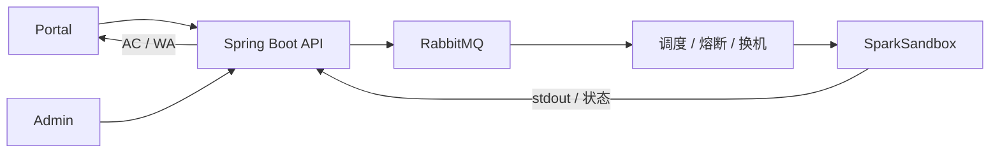
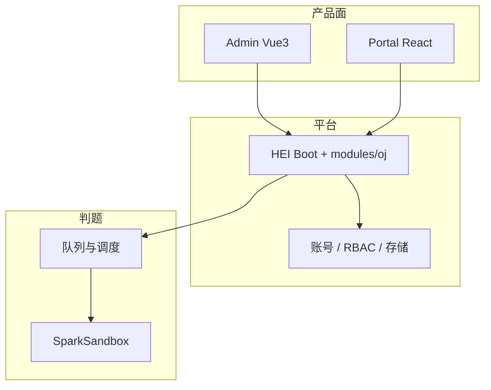

**ACOJ** 是在线评测（OJ）monorepo：在 HEI 脚手架上扩展题库、提交判题与多执行机调度，提供 **Admin**（Vue 3）、**Portal**（React 19）与统一 Spring Boot API。判题执行依赖 [SparkSandbox](https://github.com/jiangbyte/SparkSandbox)：**沙箱只编译与限资源运行，AC / WA 在 ACOJ 裁决**。Apache License 2.0。

相对「沙箱内直接出最终结果」的一体化 OJ，隔离执行与题目语义拆开：执行机加权调度、熔断、排水、租约换机；平台保留测例版本、标签、发布校验与做题统计。`modules/oj` 叠在脚手架之上，而不是从零拼一套账号与存储。

## 特性

- **双端账号**：ADMIN / PORTAL 独立会话（Sa-Token）；密码 RSA、验证码、失败锁定与限流；JustAuth（可配置）
- **RBAC**：账号 / 角色 / 部门 / 用户组 / 岗位；菜单、按钮与 API 授权；会话踢出
- **系统管理**：字典、动态配置（敏感项加密）、Banner、公告、反馈、弱口令库
- **对象存储**：S3 兼容（MinIO / RustFS / OSS），直链或预签名
- **运维**：审计与告警、登录日志、运营工作台、`sys_job` / Lock4j
- **题库**：CRUD、测例 INLINE / OBJECT、标签、参考答案、试跑与发布校验
- **提交与判题**：多语言入队；RabbitMQ；加权调度、熔断 / 排水 / 租约换机；业务侧裁决
- **判题节点**：`oj_judge_node` 登记沙箱；心跳探活；`oj_judge_dispatch` 派发审计
- **个人中心**：公开资料、安全设置、实名认证；做题统计

API 前缀 `/api/v1/admin/*` 与 `/api/v1/portal/*`。子工程：`admin` · `portal` · `server`。

## 技术栈

- 后端：JDK 21 · Spring Boot 4.1 · Maven · 虚拟线程
- 持久化：MySQL / PostgreSQL · MyBatis-Plus · Dynamic Datasource
- 缓存 / 会话 / 队列：Redis · Redisson · Sa-Token · RabbitMQ
- 管理端：Vue 3 · Vite · TypeScript · Naive UI · UnoCSS
- 门户：React 19 · Vite · TypeScript · Ant Design
- 判题：SparkSandbox（HMAC）
- 其他：JustAuth · AWS SDK v2（S3）· Hutool · MapStruct · Knife4j / SpringDoc

## 相关项目

- [SparkSandbox](https://github.com/jiangbyte/SparkSandbox)：隔离编译与运行
- [hei-boot](https://github.com/jiangbyte/hei-boot) · [hei-admin](https://github.com/jiangbyte/hei-admin) · [hei-portal](https://github.com/jiangbyte/hei-portal)：server / 双端同源脚手架
