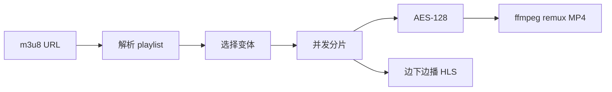

**M3U8 Downloader** 是面向 HLS 的跨平台桌面下载器：解析 master / media playlist，并发拉取 TS 分片，ffmpeg `-c copy` remux 为 MP4。引擎在 Rust，界面 React，壳层 Tauri 2，覆盖 Windows、macOS、Linux。当前版本 `0.1.1`，MIT。

相对「脚本拼接分片」，清晰度选择、AES-128、代理与自定义请求、任务/分片控制、断点续传和边下边播放进同一任务模型。安装包见 [Releases](https://github.com/jiangbyte/M3u8Downloader/releases)。

## 特性

- **清单与变体**：master playlist，下载前选择清晰度
- **加密分片**：明文 HLS 与 `#EXT-X-KEY` AES-128-CBC
- **传输控制**：Headers、Cookie、Referer、HTTP(S) 代理、并发度、输出路径
- **任务队列**：暂停 / 继续 / 取消 / 删除；按已落盘分片续传
- **分片粒度**：详情内单独开始、停止、重试；任务级操作中断在途请求
- **边下边播**：本地 HLS 播放已连续分片；完成后打开 MP4
- **封装输出**：ffmpeg remux；可选清理临时分片

## 技术栈

- 桌面壳：Tauri 2
- 下载引擎：Rust · Tokio · reqwest
- 界面：React 19 · TypeScript · Vite · Ant Design
- 封装：ffmpeg（打包 binaries）
