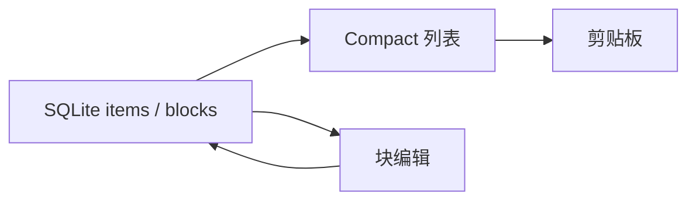
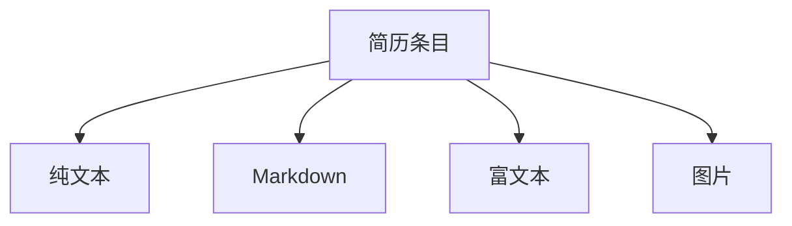

**ResumeFloat** 是跨平台置顶悬浮简历速拷工具：默认 Compact 为「标签 + 一键复制」，可切入编辑。条目由可组合块构成（纯文本 / Markdown / 富文本 / 图片），数据落 SQLite，支持整库导出导入。当前版本 `0.1.1`，MIT。

面试、网申、即时通讯反复粘贴自我介绍、项目要点、联系方式时，置顶窗口减少在文档与聊天之间切换。`v*` 标签触发 Actions 构建三端安装包，见 [Releases](https://github.com/jiangbyte/ResumeFloat/releases)。

## 特性

- **置顶悬浮**：无边框 always-on-top，标题栏拖拽；钉住与下拉菜单
- **Compact 速拷**：标签 + 预览（超长省略）；按块顺序拼装剪贴板
- **主题**：深色 / 浅色，本地记住
- **块编辑**：增删条目；块类型动态添加、排序、删除
- **内容类型**：纯文本 · Markdown（编辑 / 预览）· 富文本（TipTap）· 图片
- **持久化**：`items` / `blocks`；图片在配置目录 `assets/`
- **导出 / 导入**：`resume.db` + `assets/`；导入前确认覆盖

## 技术栈

- 桌面壳：Tauri 2
- 界面：React 19 · TypeScript · Vite · Ant Design
- 内容：TipTap · react-markdown · marked
- 存储：`@tauri-apps/plugin-sql` · clipboard-manager · dialog · fs
