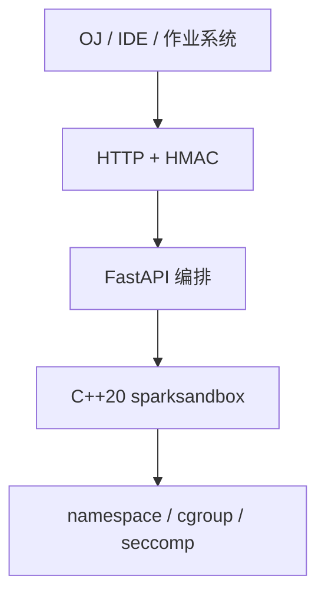
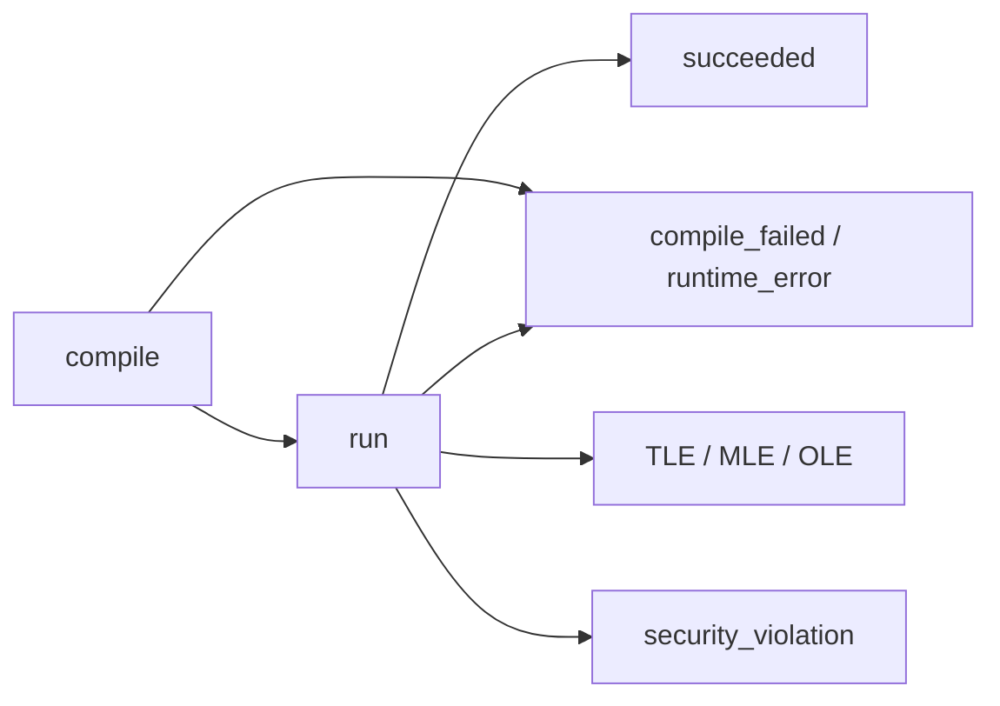

**SparkSandbox** 是 Linux 上的**隔离执行 HTTP 服务**，不是对外 SDK。任意语言发 HTTP 完成编译与运行，HMAC 验签由调用方实现。响应含 stdout、stderr、资源用量与执行状态；支持多测例、checker、interactive pipeline、文件仓与 SSE。仓内 Python 仅供本仓测试。当前版本 `0.1.1`，MIT。

OJ、在线 IDE、作业评测把「跑用户代码」交给本服务；AC / WA 留在业务侧。[ACOJ](https://github.com/jiangbyte/acoj) 判题执行即对接此服务。

## 特性

- **双层实现**：引擎负责隔离与状态分类；编排负责语言表、worker 池、CompileCache、FileStore、多测例并行
- **执行状态**：`succeeded`、`compile_failed`、`runtime_error`、`time_limit_exceeded`、`memory_limit_exceeded`、`output_limit_exceeded`、`security_violation`、`internal_error`；`stage` 区分 compile / run
- **语言表**：默认 C11、C++17、Python 3、Java 17、Go、Node.js；镜像另开 Rust 与 SQLite；YAML 可声明 SQL 客户端语言
- **评测形态**：多测例、checker、interactive、文件仓、SSE
- **容器**：toolchain base 与 server 分层；`--privileged --cgroupns=host`

## 技术栈

- 引擎：C++20 · namespaces · cgroup · seccomp
- 编排：Python 3.10+ · FastAPI
- 交付：Docker 双层镜像
