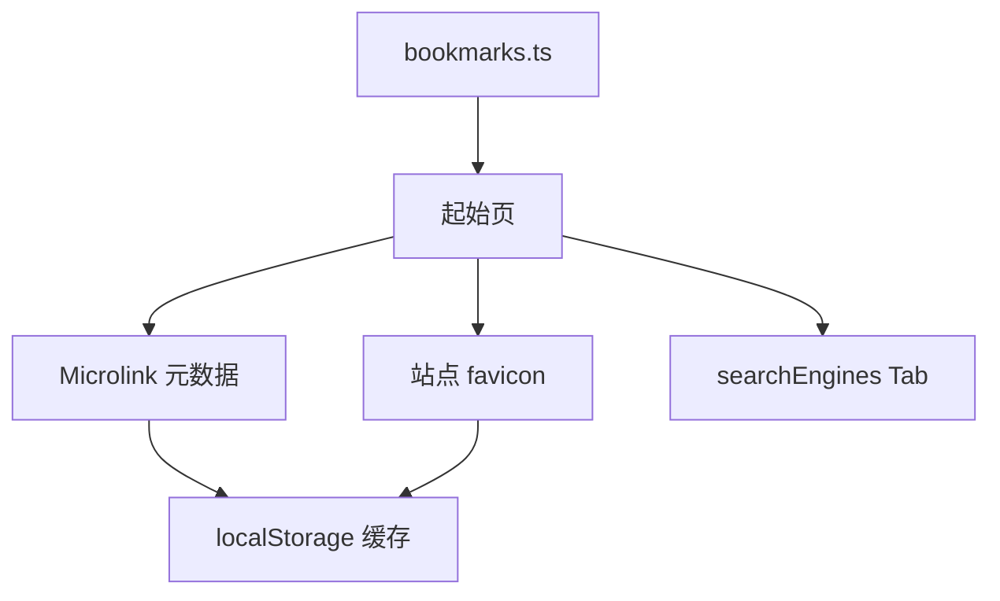

**Startpage** 是静态托管的个人书签导航起始页：无后端、无数据库，书签写在源码。`url` 必填，`title` / `description` 可手写覆盖；未手写则 Microlink 拉元数据，失败回退 hostname。在线：[jiangbyte.github.io/startpage](https://jiangbyte.github.io/startpage/)。

浏览器默认页 + 分类书签 + 多搜索引擎，不引入账号或同步服务。`main` 推送后 Actions 构建 `dist/` 部署 Pages。

## 特性

- **数据即代码**：分类与条目在 `src/data/bookmarks.ts`；字符串简写等价于只填 `url`
- **元数据**：双写 title / description 则不请求外部接口；缓存 2 小时硬过期，超过 1 小时后台刷新
- **图标**：解析站点自身 favicon；失败用字母头像
- **搜索**：`searchEngines` 切换后回车，新标签打开，查询词 `%s` 占位
- **发布**：GitHub Actions → GitHub Pages

## 技术栈

- 构建：Vite
- 界面：React · TypeScript
- 托管：GitHub Pages
