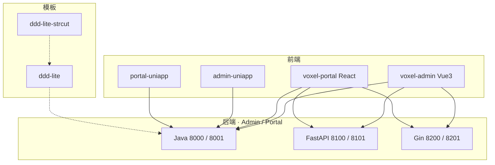
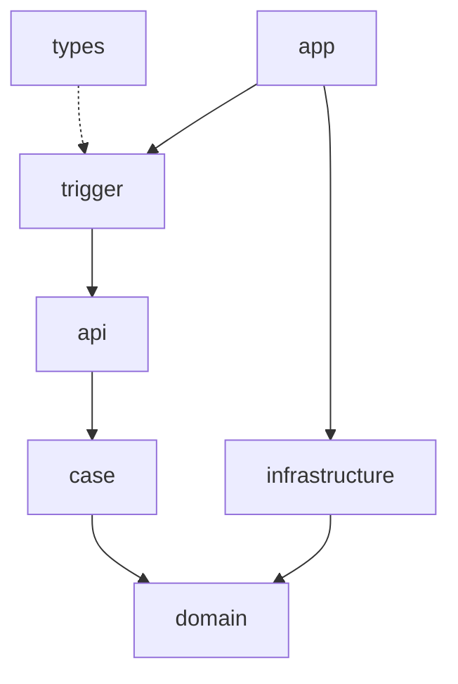

**Voxel** 是一组按同一领域分层重建的全栈脚手架系列：**Portal 与 Admin 独立后端、独立前端**，目录、坐标与包名统一为 `voxel-*` / `io.github.jiangbyte.voxel`。后端对齐 Java（Spring Boot）、Python（FastAPI）、Go（Gin）；前端对齐 Vue 3 管理端、React 门户与 uni-app。另有七层纯骨架与带账户竖切的充实模板，供对照学习，不作业务拷贝范本。协议 Apache License 2.0。

相对「一份单体里切 admin/portal」，端隔离：Admin 只挂管理 API，Portal 只挂门户 API，前端互不引用对方源码。相对单语言脚手架，同一七层在三种运行时对齐。

## 特性

- **端分离**：Admin / Portal 各仓各端口
- **DDD 七层**：`types` · `api` · `domain` · `infrastructure` · `case`/`cases` · `trigger` · `app`
- **依赖方向**：Trigger → API → Case → Domain ← Infrastructure
- **Java**：Maven 多模块 `{project}-types` … `-app`
- **FastAPI**：仓库根扁平包，无 `src/` 包装层
- **Gin**：`internal/{types,api,domain,infrastructure,cases,trigger}` + `cmd/app`
- **Web / 移动**：Vue 3、React 19、uni-app 双端
- **模板仓**：骨架默认注释中间件；充实模板含账户竖切，S3 / Milvus / Spring AI / MCP 注释接入（原 `voxel-ddd-ai-lite` 已合并）

## 技术栈

- 后端：JDK 21 · Python 3.11+ · Go 1.25+
- 前端：Vue 3 · React 19 · uni-app
- 协议：OpenAPI / Apifox（`docs/api/openapi`）

## 系列仓库

**后端**

- [voxel-boot-admin](https://github.com/jiangbyte/voxel-boot-admin) · [voxel-boot-portal](https://github.com/jiangbyte/voxel-boot-portal)
- [voxel-fastapi-admin](https://github.com/jiangbyte/voxel-fastapi-admin) · [voxel-fastapi-portal](https://github.com/jiangbyte/voxel-fastapi-portal)
- [voxel-gin-admin](https://github.com/jiangbyte/voxel-gin-admin) · [voxel-gin-portal](https://github.com/jiangbyte/voxel-gin-portal)

**前端**

- [voxel-admin](https://github.com/jiangbyte/voxel-admin) · [voxel-portal](https://github.com/jiangbyte/voxel-portal)
- [voxel-admin-uniapp](https://github.com/jiangbyte/voxel-admin-uniapp) · [voxel-portal-uniapp](https://github.com/jiangbyte/voxel-portal-uniapp)

**模板**

- [voxel-ddd-lite-strcut](https://github.com/jiangbyte/voxel-ddd-lite-strcut) · [voxel-ddd-lite](https://github.com/jiangbyte/voxel-ddd-lite)
