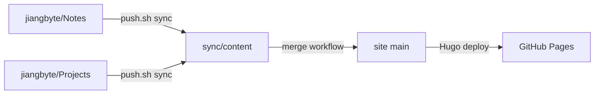
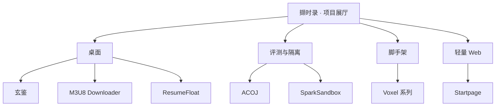

「撷时录」是笔记沉淀与作品展示合一的静态站点：主题 [Hugo Solitude](https://solitude.js.org/)，内容仓与站点仓分离，产物发布到 GitHub Pages（`gh-pages`）。笔记走分类与标签；项目走独立卡片与详情页，本页即其中一篇。

权威源在内容仓。本地 `push.sh` 把 `Notes` / `Projects` 同步到站点仓分支 `sync/content`（先跑 Hugo 校验），站点 Actions 再合并进 `main` 并部署到 Pages。

## 项目集

同一展厅收录桌面工具、隔离执行、OJ、DDD 脚手架与轻量前端。卡片按 `weight` 排列；详情页写定位、特性与示意，不堆安装手册。

## 特性

- **笔记与实践**：运维、框架、工具链、嵌入式与工程实践，分类 + 标签归档
- **项目展厅**：独立 Markdown；仓库入口、演示地址、GitHub 仓库卡片
- **内容同步**：`push.sh` → `sync/content` → merge → deploy；拷贝脚本为 `sync_notes.py` / `sync_projects.py`
- **主题定制**：Solitude 上调整布局、项目网格与样式，保留主题升级路径
- **外链入口**：简历等独立站点走导航与项目卡，不挤占笔记信息架构

## 技术栈

- 静态生成：Hugo
- 主题：Solitude
- 发布：`sync/content` 合并进 `main` → Actions → `gh-pages`
- 内容仓：[jiangbyte/jiangbyte](https://github.com/jiangbyte/jiangbyte)
