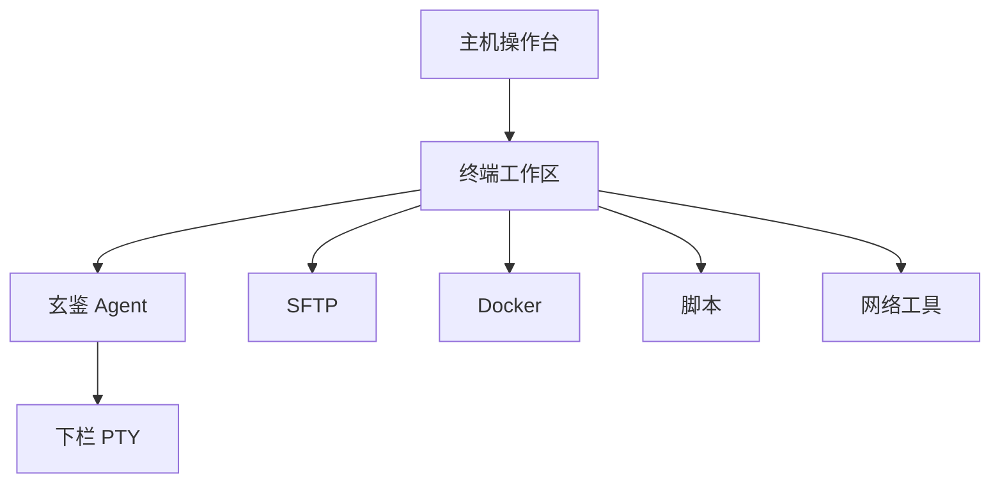
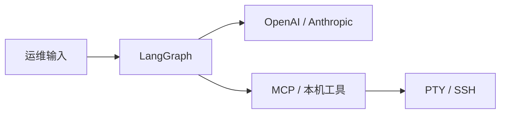

**玄鉴（Xuanjian）** 是面向运维与现场排查的 AI 桌面工作台：主机清单、本地 / SSH / WSL 终端、SFTP、脚本与笔记、会话录制、本机网络工具与 Docker 侧栏，并内置 **玄鉴 Agent**。LangGraph 本地编排，在独立下栏终端可观测执行，按 ReAct 完成排查与运维。数据落 SQLite，跨 Windows / macOS / Linux。当前版本 `1.3.7`，MIT，`io.github.jiangbyte.xuanjian`。

相对「终端 + 散落脚本」，机群、会话、文件、自动化与 Agent 收进同一应用；相对纯云端 Copilot，命令走本机 PTY / SSH，轨迹可回放。

## 特性

- **主机操作台**：分组、标签、排序；口令 AES；一键 SSH 或粘贴 `user@host`
- **终端工作区**：本地 Shell 与 SSH（xterm）；多标签 keep-alive；左侧文件 / 脚本 / 历史 / 概览 / 进程 / 端口 / Docker；右侧 Agent 与笔记
- **玄鉴 Agent**：Orchestrator + SubAgent（巡检 / 终端 / 部署 / 分析）；计划 / 确认 / 完全权限；MCP 动态合并；上下文压缩与用量计量
- **下栏终端**：与主终端分离的独立 PTY；`terminal_run` / `session_exec` 输出可见
- **模型**：自定义供应商；OpenAI 兼容与 Anthropic Messages；思考强度与上下文窗口可配
- **SFTP**：双栏浏览、上传下载、冲突处理、内联编辑
- **Docker**：容器、镜像、网络与卷；实时日志；Agent `docker_*` 工具
- **脚本与笔记**：脚本包、变量占位、多目标执行；Markdown 分类自动保存
- **会话日志**：I/O 录制、筛选、回放、导出
- **网络工具**：Ping / 路由 / DNS、IP 计算、端口、HTTP / TLS、测速、连接与流量
- **自动化**：批量脚本、Cron、告警、机群概览、审计控制台
- **数据安全**：SQLite；工作空间同步与 deploy 配方；备份导出（可选 AES）

## 技术栈

- 桌面壳：Tauri 2 · SQLite / Dialog / Clipboard
- 界面：React 19 · TypeScript · Vite · Tailwind CSS · shadcn/ui · Zustand
- 终端与编辑：xterm.js · Monaco · Markdown · XYFlow · Recharts / ECharts
- Agent：LangGraph（`agent-core`）· Tauri 适配层（`agent-adapters`）· MCP
- 会话与网络：Rust · Tokio · russh / russh-sftp · portable-pty · aes-gcm
